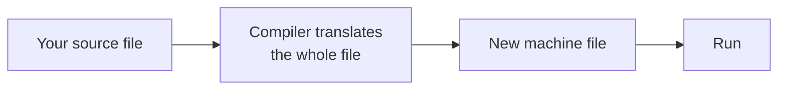
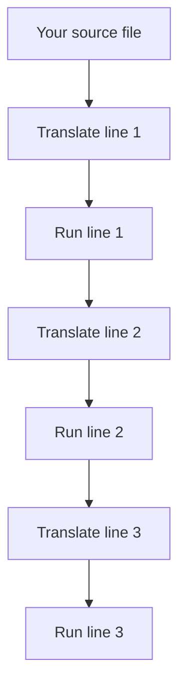

# Foundations of Python Programming

## The Purpose of a Programming Language

A computer looks clever, but underneath it is not. It is a machine that can only work with numbers — add them, compare them, and move them from one place to another. It has no idea what English means. Type *"find the average of three marks"* on the screen and nothing at all happens, because to the machine those are only shapes.

So we meet it halfway. We write our instructions using a small set of words and symbols that have been given one fixed meaning each, and a **translator** turns every one of them into the numbers the machine acts on. That set of words, together with its translator, is what we call a **programming language**. The words are deliberately few and unambiguous — `print` always means the same thing, `+` always means the same thing — so there is nothing left to guess. That is exactly why a machine can follow them.

Python is one such language, and it was built to stay close to English. You can often read a line and work out what it does before anyone explains it:

```python
print("Welcome to Python")
```

This displays `Welcome to Python` on the screen. No setup, no surrounding code, nothing else at all — that one line is already a complete Python program.

## Compilers and Interpreters

Every programming language has to be translated before a machine can act on it, so the interesting question is not *whether* translation happens but **when**. The answer splits languages into two families, and Python sits firmly in one of them.

A **compiler** is a translator that converts the complete program in advance. It reads your whole file, converts all of it, and hands back a new file the machine can run on its own. C and C++ work this way. An **interpreter** is a translator that converts one instruction at a time, while the program is running — it reads a line, carries it out, then moves to the next. **Python is an interpreted language.**

A compiled language translates once, before anything runs:



An interpreted language translates and runs one line at a time, all the way down the file:



| | Compiled | Interpreted |
|---|---|---|
| Translation happens | Once, before running | Line by line, while running |
| Speed of the program | Faster | Slower |
| Wait after changing code | Must translate again | None |
| Needed on the machine | Nothing extra | The interpreter |
| Examples | C, C++ | Python |

Three practical results follow, and all three will shape the way you work:

- **A program can be run the moment you save it.** Nothing stands between writing a line and seeing what it does.
- **Python must be installed on any computer that runs your file.** Your file is a set of instructions, not a finished program.
- **The same file works everywhere** — Windows, macOS or Linux — as long as Python is installed there.

One behaviour surprises every beginner once. Before running a single line, Python reads the **whole file** and checks that it is written correctly, so one missing bracket on the last line stops the entire file, including the correct lines above it. That gives you a rule worth remembering: if nothing is printed at all, something is written wrongly, and if some output appears and then the program stops, the mistake is in the logic. Knowing which of the two you are looking at saves a great deal of searching.

## The Role of Python

All of that describes *how* Python runs. It does not yet explain why this particular language is worth your time rather than any of the hundreds of others, and that answer lies outside the language itself.

Python is not a practice language that you outgrow. The same language is used for real work across many fields.

| Field | What Python does there |
|---|---|
| Data analysis | Cleaning large files of records and summarising them |
| Artificial intelligence | Building and training models that make predictions |
| Web development | Running the part of a website the browser never sees |
| Automation | Doing work a person would otherwise repeat by hand |
| Testing | Checking other software automatically |

Two qualities explain why it is chosen so often. The first is that **very little has to be written around an idea** — printing one line in Java requires a class, a method and a call, while in Python it takes one line. Less to type means fewer places to make a mistake, which matters most while you are learning. The second is that **most of the work is already done for you**: a **library** is code somebody else has written that you are free to use in your own program, and Python has libraries for almost everything — NumPy for numbers, pandas for tables of data, PyTorch for artificial intelligence.

One more point matters right now. Because so many people use Python, almost every problem you hit has already been met by somebody else and written down somewhere. While you are learning, that is worth a great deal.

## Installing Python

The interpreter has to be on your machine before anything else can happen. **On Windows**, open **python.org**, go to **Downloads**, and run the installer. On the very first screen, tick **Add python.exe to PATH**, then click **Install Now** — that one tick is what lets you call Python by name later. **On macOS**, download the macOS installer from the same page and run it. **On Linux**, Python is usually installed already.

To confirm it worked, open **Command Prompt** on Windows, or **Terminal** on macOS and Linux, and type:

```
python --version
```

```
Python 3.13.2
```

On macOS and Linux the command is `python3 --version`. Your version number will differ from the one above, and that is fine — any version beginning with 3 will run every program here. If the reply is `'python' is not recognized`, the PATH option was missed during installation; run the installer again, choose **Modify**, tick **Add python.exe to PATH**, and finish.

## Visual Studio Code

Python is now on your machine, and it will happily run any plain text file you hand it — even one typed into Notepad. Notepad, though, cannot colour your code, cannot warn you about a missing bracket, and cannot run a file for you. A proper **code editor** does all three, and Visual Studio Code is the usual free choice.

1. Download it from **code.visualstudio.com** and install it.
2. Press `Ctrl+Shift+X`, search for **Python**, and install the extension published by Microsoft.
3. Click **File → Open Folder** and open the folder that holds your Python files.

Always open the **folder**, never a single file. Everything you write later assumes the folder is where you are working.

## Google Colab

Both steps above assume you are allowed to install software on the machine in front of you, and many college and office computers are not. If yours is one of them, nothing is lost: open **colab.research.google.com** and sign in with a Google account. Python then runs on Google's computers, so nothing at all is installed on your device. You type code into a box called a **cell**, press `Shift+Enter` to run it, and your work saves to Google Drive on its own.

Two limits are worth knowing before you rely on it. Colab does not give you `.py` files, so the command line cannot be practised there, and the session closes after a period of inactivity. Use Colab when installation is impossible, and set Python up properly when you can.

## The File System

Back on your own machine, running a Python file means using the command line, and before that will make any sense one idea has to be clear. **The file system is the way a computer arranges everything it stores.** Files are kept inside **folders**, also called **directories**, and folders sit inside other folders, which builds a tree:

```
C:\
└── Users
    └── Kavya
        └── Documents
            └── python-basics
                └── hello.py
```

**A path is the full route from the top of that tree down to a file.** Written out, the path of the file above is:

```
C:\Users\Kavya\Documents\python-basics\hello.py
```

Windows separates folder names with a backslash `\`, while macOS and Linux use a forward slash `/`.

Now the part that causes beginners more trouble than anything else on this page. At every moment, the command line is standing inside exactly one folder, and **that folder is called the current working directory**. When you ask Python to run `hello.py`, it looks for that file in the current working directory and nowhere else. If you are standing somewhere else in the tree, it will not find the file — even though the file certainly exists.

## Command Line Basics

With folders, paths and the current working directory clear, the window that uses all three will finally make sense. **The command line is a window where you tell the computer what to do by typing instead of clicking.** It is where Python programs are normally started, and five commands cover everything you need.

| Purpose | Windows | macOS and Linux |
|---|---|---|
| Show the folder you are in | `cd` | `pwd` |
| List what is inside the folder | `dir` | `ls` |
| Go into a folder | `cd python-basics` | `cd python-basics` |
| Go back one folder | `cd ..` | `cd ..` |
| Clear the window | `cls` | `clear` |

Two habits save a lot of typing: type the first few letters of a folder name and press `Tab` to complete it, and press the up arrow to bring back the command you last typed.

One message will greet you more often than any other:

```
can't open file 'hello.py': [Errno 2] No such file or directory
```

Nine times out of ten the file is exactly where you left it and the command line is standing in a different folder. Type `dir` or `ls`, check that `hello.py` appears in the list, then run it again.

## The First Program

Python is installed and the command line makes sense, so it is time to run something.

1. Open Notepad, or a new file in Visual Studio Code.
2. Type this line exactly:

```python
print("Welcome to Python")
```

3. Save it inside a new folder named `python-basics` in your **Documents** folder, with the file name `hello.py`.

If you are using Notepad, change **Save as type** from *Text Documents* to **All Files** before saving. If you do not, Notepad quietly saves the file as `hello.py.txt` and Python will never find it.

Now open Command Prompt and run it. On macOS and Linux the same two commands use a forward slash and `python3`.

```
cd Documents\python-basics
python hello.py
```

```
Welcome to Python
```

Two things in what you just did are worth looking at closely. **The command has two parts** — `python` starts the interpreter, and `hello.py` tells it which file to work on. The file name means nothing to Python itself, so `first.py` would behave exactly the same.

**And `print` is a function.** A **function** is ready-made code that performs one job when you call it by name. The **brackets** are how you call it, and the **quotation marks** turn the words into text so Python displays them instead of trying to understand them. Brackets are required even when empty, so `print()` on its own prints a blank line. Given several values separated by commas, `print` displays them in order with a space between each:

```python
print("Total:", 240, "Average:", 80)
```

```
Total: 240 Average: 80
```

## Comments

That one-line program needs no explaining. Real programs need a great deal, so the next thing worth learning is how to write a line that Python pays no attention to at all.

**A comment is a note written for people, which Python ignores completely.** Anything after a `#` on a line is skipped.

```python
# Marks of three subjects
total = 240
average = total / 3      # divided by three subjects
```

A comment should explain **why** a line exists, not repeat what the line already shows — `total = 240  # set total to 240` helps nobody, but a note explaining where the number 240 came from is worth having. Python has no separate symbol for a comment spread over several lines, so start each line with a `#`. Putting a `#` in front of a working line is also how you switch that line off while testing, without deleting it.

## Variables and Assignment

Comments are written for the reader. A **variable** is written for the program itself.

**A variable is a name that holds a value, so the program can use that value again later.** You create one by writing the name, an equals sign, and the value:

```python
student_name = "Kavya"
marks = 88
```

From that point on, `student_name` stands for the text `Kavya` and `marks` stands for the number 88, anywhere in the program. Four points explain almost everything variables do.

**The equals sign does not mean "is equal to". It means "store this".** Python works out the value on the right first, then attaches the name on the left to it. Read `marks = 88` as *marks takes the value 88*.

**A name can be given a new value at any time.** After the second line below, `marks` holds 91 and the earlier value is gone for good.

```python
marks = 88
marks = 91
```

**A name that was never given a value cannot be used.** Python does not treat it as empty or as zero; it stops and reports the name as unknown.

```python
print(score)
```

```
NameError: name 'score' is not defined
```

**Copying a variable copies only the value it holds at that moment**, and the two names do not stay connected afterwards. Below, `b` was given the value 10 while the second line was running, so changing `a` afterwards cannot reach back into `b`.

```python
a = 10
b = a
a = 25
print(b)
```

```
10
```

## Naming Rules for Variables

The name of a variable is called an **identifier**. Four rules are enforced by Python itself, and breaking any of them stops the program:

- **Only letters, digits and the underscore may be used.** Spaces and symbols such as `-` or `@` are not allowed.
- **A name cannot begin with a digit.** `marks2` is accepted; `2marks` is not.
- **Capital and small letters are different.** `Total`, `total` and `TOTAL` are three separate names.
- **Python's own words cannot be used as names.** `class = "X"` fails, because `class` belongs to Python.

The third rule causes trouble far more often than the others, because the error message never mentions capital letters:

```python
total = 100
print(Total)
```

```
NameError: name 'Total' is not defined. Did you mean: 'total'?
```

When a name you are certain exists is reported as undefined, check its capital letters before anything else. Python's own reserved words can be listed whenever you want, though there is nothing to memorise — a code editor colours them differently, and using one by mistake produces an error immediately.

```python
import keyword
print(keyword.kwlist)
```

Three further points are conventions rather than rules. Python will not object if you ignore them, but every Python programmer follows them, and code that ignores them is treated as careless work:

- **Write names in small letters, joining words with an underscore** — `student_name`, `total_marks`. This style is called **snake_case**.
- **Let the name state what it holds.** `average` tells the reader something; `a` tells them nothing.
- **Never reuse a name Python already uses.** Writing `print = 5` removes your ability to print for the rest of that program.

## Data Types

A name is one half of a variable; the value is the other half, and every value belongs to a category. **The data type of a value is the category it belongs to.** This is not a label kept for the reader's benefit — Python reads the type to decide what may be done with the value, and the same symbol can mean two different things depending on it:

```python
print(5 + 3)
print("5" + "3")
```

```
8
53
```

The first `+` added two numbers. The second joined two pieces of text, because text cannot be added. Python did not guess; it read the types and acted accordingly. Four types cover everything needed at this stage.

**Integer (`int`) — a whole number, written without a decimal point.** There is no limit on how large an integer can be, and even `2 ** 200` is worked out exactly, which is unusual among programming languages.

```python
roll_number = 24
temperature = -5
```

**Float (`float`) — a number with a decimal point.** The name is short for *floating point*, which describes the way the value is stored.

```python
percentage = 88.5
```

Floats are held in a fixed binary form, and a few decimal values cannot be stored exactly in it:

```python
print(0.1 + 0.2)
```

```
0.30000000000000004
```

This is not a fault in Python. Every major language behaves the same way, because `0.1` in binary repeats endlessly — just as one-third does in decimal — and has to be cut off somewhere. The cure is the `round` function, which takes the value and the number of decimal places you want. Use it on any calculated decimal before displaying it.

```python
print(round(0.1 + 0.2, 2))
print(round(86.3333, 2))
```

```
0.3
86.33
```

**String (`str`) — text, written inside quotation marks.** Single and double quotes work equally well, as long as you close what you opened. Digits inside quotes are text and not numbers, which is why `"25" + "30"` gives `"2530"` and not 55.

```python
name = "Anitha"
city = 'Chennai'
```

**Boolean (`bool`) — a value that is either `True` or `False`, with nothing in between.** Both are written with a capital first letter, and a Boolean is the answer to a yes-or-no question such as *is this mark above forty*.

```python
is_present = True
```

## Type Checking

Since the type decides what may be done with a value, there will be moments when you need to ask Python what you are actually holding. One function answers exactly that. The `type()` function reports the category of any value:

```python
print(type(24))
print(type(88.5))
print(type("Chennai"))
print(type(True))
```

```
<class 'int'>
<class 'float'>
<class 'str'>
<class 'bool'>
```

The word `class` is Python's general word for a kind of thing, so read `<class 'int'>` simply as *this is an integer*.

Now notice something you have never once had to do: state in advance what type a variable will hold. In many languages you must, and the variable can then hold nothing else for the rest of its life. **Python is a dynamically typed language, which means the type belongs to the value rather than to the name, and is worked out while the program is running.** A name is only a label — attach it to `88` and it labels an integer, attach it to `"Kavya"` and it labels a string.

`type()` is above all a tool for finding mistakes. When a program gives a wrong answer or refuses to run, printing the types involved is usually the quickest way to the cause, and the cause is very often a number that turned out to be text.

## Reading Input from the Keyboard

Every program so far has contained its own values, which makes it useful to nobody but you. A program becomes worth running when it asks. **The `input` function stops the program, waits for the person to type something and press Enter, and returns what they typed.**

```python
name = input("Enter your name: ")
print("Welcome,", name)
```

```
Enter your name: Kavya
Welcome, Kavya
```

The text inside the brackets is the **prompt**, and you should always write one. Without it the screen simply waits, and the person sitting in front of it has no idea that anything is expected.

Now the single most important warning in this file. **`input` always returns text, even when the person types digits.** Adding two such values does not add anything:

```python
first = input("First number: ")
second = input("Second number: ")
print(first + second)
```

```
First number: 10
Second number: 20
1020
```

No error appeared. Python was asked to join two pieces of text and did exactly that, and a mistake that produces a wrong answer silently is far harder to find than one that stops the program. The cure is to convert the value the moment it arrives, by wrapping the whole `input` inside `int` or `float`:

```python
first = int(input("First number: "))
second = int(input("Second number: "))
print(first + second)
```

```
First number: 10
Second number: 20
30
```

Read that line from the inside outwards: `input` collects the text, `int` converts it to a whole number, and `=` stores the result. Use `int` for things that are **counted**, such as an age or a number of people, and `float` for things that are **measured**, such as marks, prices or temperature. When you are unsure, `float` is the safer choice, because it accepts both `85` and `85.5`.

## Arithmetic Operators

Reading values in and printing them out becomes useful only when something happens in between. Python has seven arithmetic operators.

| Operator | Meaning | Example | Result |
|---|---|---|---|
| `+` | Addition | `7 + 2` | `9` |
| `-` | Subtraction | `7 - 2` | `5` |
| `*` | Multiplication | `7 * 2` | `14` |
| `/` | Division | `7 / 2` | `3.5` |
| `//` | Division, keeping the whole part only | `7 // 2` | `3` |
| `%` | The remainder after division | `7 % 2` | `1` |
| `**` | Raised to the power of | `7 ** 2` | `49` |

The first three hold no surprises. Three of the others have habits worth knowing before they cost you marks:

- **`/` always produces a decimal number**, even when the division is exact. `10 / 5` gives `2.0`, not `2`.
- **`//` discards the fractional part instead of rounding.** `9 // 2` gives `4`.
- **`//` and `%` are used together to split a quantity into units.** 7385 seconds is `7385 // 60` whole minutes with `7385 % 60` seconds left over — that is 123 minutes and 5 seconds.

Brackets are worked out first, then powers, then multiplication and division, then addition and subtraction. Wherever a reader might have to stop and think about the order, add brackets; they cost nothing and remove all doubt about what you meant. One operation has no answer at all, and Python says so plainly rather than guessing:

```python
print(10 / 0)
```

```
ZeroDivisionError: division by zero
```

## Version Control with Git

You can now write a program that asks for values, calculates with them and reports an answer. The very next thing that happens to such a program is that you change it — to fix something, or to make it do a little more.

That is where the trouble starts. A program that works today will be changed tomorrow, and sooner or later a change will break something that used to work fine. **Git is a version control system — a tool that records the state of your project each time you ask it to, so you can see exactly what changed and go back to an earlier version if you need to.** Every professional software team uses one, and the habit is worth building from your very first program.

Download Git from **git-scm.com** and install it with the default options, then tell Git who you are, because it writes your name into every record it keeps:

```
git --version
git config --global user.name "Kavya Menon"
git config --global user.email "kavya@example.com"
git config --global init.defaultBranch main
```

The three `config` commands print nothing, which is normal, and they are needed only once on a machine rather than once per project. The last of them names the starting line of history `main`, which is what GitHub and every current project uses.

Now go into your project folder and start keeping history. `git init` creates the storage Git needs, and `git status` reports what has changed and usually names the command you need next — run it whenever you are unsure of anything.

```
cd Documents\python-basics
git init
git status
```

Saving your work then takes two commands rather than one, because Git first asks you to choose *what* to record and then writes the record itself. A single saved record is called a **commit**.

```
git add hello.py
git commit -m "Add first Python program"
```

```
[main (root-commit) 4f2a1c9] Add first Python program
 1 file changed, 1 insertion(+)
```

Always include `-m` and a message. Leave it out and Git opens a text editor inside the command window, which is a confusing place to be stranded on your first day. The short code `4f2a1c9` is the name Git gave this record, and yours will be different.

From then on the routine is three commands, run every time something works rather than saved up and done in one batch. `git add .` means *record every changed file in this folder*, and messages should state what changed — `Add rectangle area program` will still make sense to you in a month, while `update` will not.

```
git status
git add .
git commit -m "Add rectangle area program"
```

## Practice Problems

Everything needed is now in place: a working Python, an editor, a command line you can steer, values read in from the keyboard, arithmetic to work on them, output to show the result, and a safe record of every step along the way.

Reading teaches very little; writing these five programs teaches most of it. Keep each one in its own file inside `python-basics`, and commit each one when it works.

**Area and perimeter of a rectangle.** Ask for the length and the breadth, and report both figures.

```
Enter length: 12.5
Enter breadth: 8
Area      : 100.0
Perimeter : 41.0
```

**Seconds into hours and minutes.** Ask for a whole number of seconds and break it into hours, minutes and seconds. This is what `//` and `%` are for.

```
Enter total seconds: 7385
2 hours, 3 minutes, 5 seconds
```

**Simple interest.** Ask for the principal, the yearly rate and the number of years. Interest is the principal multiplied by the rate and the time, divided by 100.

```
Principal amount: 25000
Annual rate (%): 7.5
Time (years): 3
Interest        : 5625.0
Total repayable : 30625.0
```

**Celsius into Fahrenheit.** Convert using nine fifths of the temperature plus thirty-two, rounded to two decimal places.

```
Temperature in Celsius: 36.6
36.6 C = 97.88 F
```

**Splitting a bill.** Ask for a bill in whole rupees and the number of people sharing it. Report what each person pays and how many rupees cannot be divided evenly.

```
Total bill: 2470
Number of people: 4
Each person pays: 617
Remaining: 2
```

## Common Errors

You will not get all five right at the first attempt, and nobody does. Errors are the ordinary condition of writing programs, not a sign that something has gone badly wrong. Read the **last line first** — it names what went wrong — and the line above it names the file and line number where Python stopped.

| Message | Cause | What to do |
|---|---|---|
| `'python' is not recognized` | Windows cannot find Python | Run the installer again, choose Modify, tick Add python.exe to PATH |
| `can't open file` | The command line is in a different folder from the file | Run `dir` or `ls`, then `cd` into the right folder |
| `SyntaxError: invalid syntax` | A bracket or quotation mark was never closed, often on the line above the one reported | Check the previous line |
| `NameError: name 'x' is not defined` | A spelling mistake, a wrong capital letter, or a name used before it was given a value | Check the spelling and the capitals |
| `TypeError: can only concatenate str` | Text and a number joined with `+` | Convert the number with `str()` |
| `ValueError: invalid literal for int()` | `int` was given text containing a decimal point or letters | Use `float` instead |
| `ZeroDivisionError` | Something was divided by zero | Check the divisor before dividing |
| Two typed numbers joined instead of added | `input` was never converted | Wrap it in `int` or `float` |

Every one of these has caught somebody before you, and each becomes familiar the second or third time you meet it. An error message is not a punishment — it is Python telling you exactly where it stopped and why, which is far more help than silence would be.

## Reference Links

Everything above is drawn from the official documentation. These three places will answer almost any question this material leaves you with.

**[The Python Tutorial](https://docs.python.org/3/tutorial/index.html)** — the official introduction to Python, written for people learning it. Chapters 1 to 3 cover the interpreter, running a file, numbers, text and variables.

**[Built-in Functions](https://docs.python.org/3/library/functions.html)** — the exact definition of every function used in this file: `print`, `input`, `type`, `int`, `float`, `str` and `round`.

**[Pro Git, Chapter 1](https://git-scm.com/book/en/v2/Getting-Started-About-Version-Control)** — the official Git book, free to read online. Chapter 1 explains what version control is and covers the first setup.
