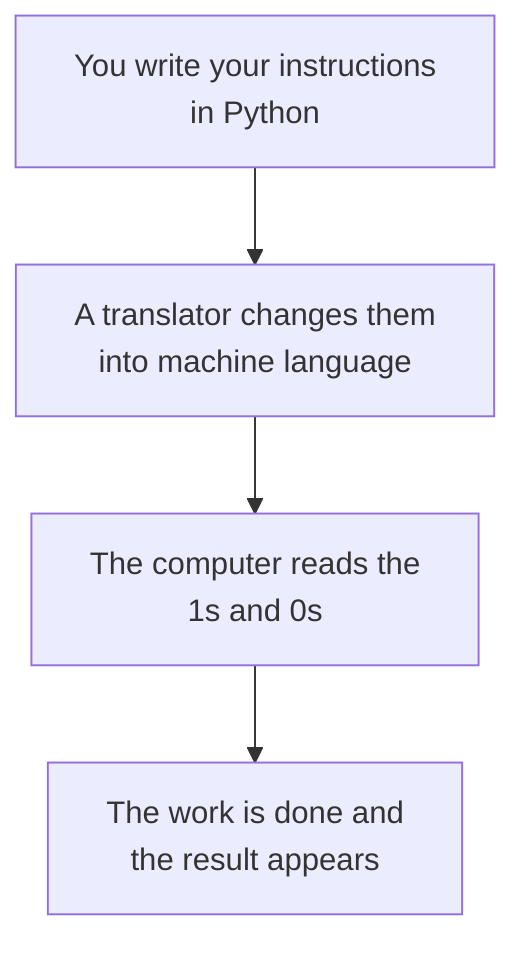
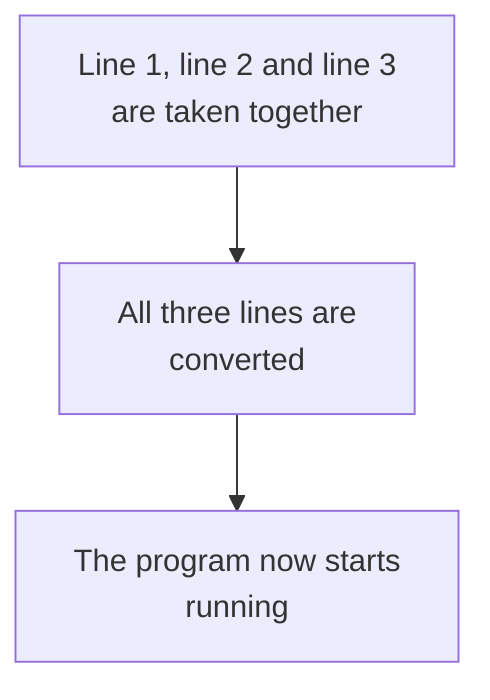
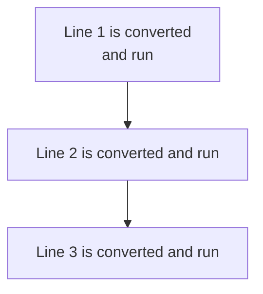

# Introduction to Programming and Python

A computer cannot think for itself. It does only what we tell it. The order of our instructions also matters. A group of such instructions is called a **program**. Writing a program is called **programming**.

We write programs in a **programming language**. Python is one such language.

## Machine Language and Translation

A computer does not understand English. It does not understand Python either. Inside a computer there are only two signals, on and off. We write on as 1 and off as 0.

Instructions written in 1s and 0s are called **machine language**. This is the only language a computer understands.

A person cannot write a full program in 1s and 0s. It would take far too long, and a single wrong digit would break everything. So we write in Python instead, and a **translator** does the hard part for us. It changes our Python into machine language, and only then can the computer act on it.

## Compilers and Interpreters

A translator can work in two ways, and the difference is simply when the translating happens.

A **compiler** translates first and runs later. It takes the full program, converts every line into machine language, and keeps that ready. Only then does the program start. So if any line has a mistake, the compiler finds it before the program has run at all.

An **interpreter** does both together. It takes the first line, converts it, and runs it straight away. Then it moves to the second line and does the same. It carries on like this to the end of the program.

## Python and Its Interpreter

Python uses an interpreter. A Python program therefore runs from top to bottom, one line at a time.

Suppose your program has ten lines. The interpreter reads the first line and runs it, then moves on to the second. It never waits for the rest of the program to be ready. And if the fourth line has a mistake, the first three lines have already done their work. The interpreter stops at the fourth line and tells you about it.

This is a real help while you are learning. You do not need a finished program to see something happen. Write a single line, run it, and the result appears at once. When something goes wrong, you also know exactly where to look, because the interpreter stopped at that very line.

## Reasons for Choosing Python

- Python words are close to English, so the code is easy to read.
- A task takes fewer lines than in most other languages.
- Python is free. It works on Windows, Mac and Linux.
- Companies use it for websites, data work and artificial intelligence.
- Millions of people use it, so help is easy to find.

You now know what a program is. You also know how Python reaches the machine. Next, you will write a line of Python and run it yourself.
