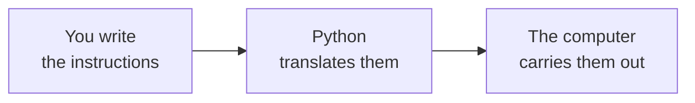
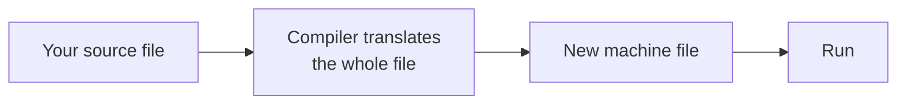
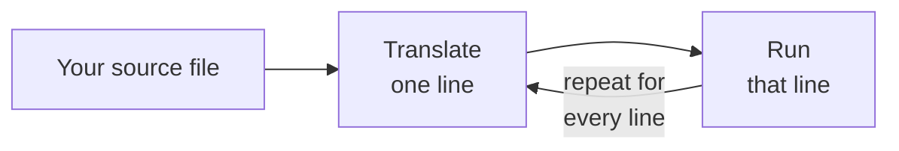

# Introduction to Python and Environment Setup

Imagine you want a computer to do something simple, such as showing a message on the screen or adding two numbers. You might expect to be able to tell it in plain English. You cannot, and that single fact is why programming languages exist.

## Translation and the Interpreter

### The Need for Translation

A computer works only with numbers. It adds them, compares them, and moves them from one place to another. Type *"find the average of three marks"* and nothing happens, because the machine cannot act on any part of that sentence.

A **programming language** does two things at once. It gives you words and symbols that a person can read, each carrying one fixed meaning, and another program, called the **interpreter**, turns them into the form the machine works with. Because `print` always means the same thing and `+` always means the same thing, neither you nor the computer has to guess what a line means.

Python's designers also chose words taken from English, so a line usually reads close to plain English:

```python
print("Welcome to Python")
```

**Output**

```
Welcome to Python
```

You can read that line and know what it does: show a message. You will type and run this line yourself in the last section of this chapter.

Every program you write from here on works the same way:



### Two Kinds of Translator

The middle step is where programming languages differ, and the dividing question is *when* the translation happens.

A **compiler** does all of it in advance. It translates the whole program before anything runs and gives back a new file that the machine can run on its own. C and C++ work this way.



An **interpreter** translates one instruction at a time, while the program is running. **Python is an interpreted language.**



| Aspect | Compiled | Interpreted |
|---|---|---|
| Translation happens | Once, before running | Line by line, while running |
| Speed of the program | Faster | Slower |
| Wait after changing code | Must translate again | None |
| Needed on the machine | Nothing extra | The interpreter |
| Examples | C, C++ | Python |

### Consequences of Interpretation

Three consequences shape the way you work:

- **You can run a program as soon as you save it.** There is nothing to translate first.
- **Python must be installed on any machine that runs your file.** Your file holds instructions, not something the machine can run by itself.
- **The same file works on Windows, macOS and Linux**, provided Python is installed there.

One behaviour surprises everyone once. Python reads the **whole file** and checks that it is written correctly *before* running a single line. A missing bracket on the last line therefore stops the entire file, including the correct lines above it.

That gives you a rough diagnostic rule worth keeping from your first day:

| What you see | What it usually means |
|---|---|
| No output at all | Something is written wrongly, which is a syntax problem |
| Output starts, then stops | The syntax is fine. Something went wrong while the file was running |

Treat this as a first guess rather than a certainty. A file with no `print` line in it also produces no output.

So a twelve-line file that prints on lines 1, 2 and 3, but is missing a closing bracket on line 12, prints **nothing at all**. Python checked the whole file first, found the fault, and refused to run any of it.

---

## The Case for Python

### Fields of Use

Python is not a practice language you outgrow. The same language is used for real work across many fields.

| Field | What Python does there |
|---|---|
| Data analysis | Cleaning large files of records and summarising them |
| Artificial intelligence | Building and training models that make predictions |
| Web development | Running the part of a website that a visitor does not see |
| Automation | Doing work a person would otherwise repeat by hand |
| Testing | Checking other software automatically |

### Reasons for Its Popularity

**You write less code to say the same thing.** Java needs several lines of setup before it can print anything. Python needs one. Less typing means fewer places to make a mistake, which matters most while you are learning.

**Ready-made code already exists for most tasks.** A **library** is code somebody else has written that you are free to use: NumPy for numbers, pandas for tables of data, PyTorch for artificial intelligence.

**Somebody has already faced the same problem.** Because so many people use Python, almost every problem you run into has already been solved and written about somewhere.

---

## Environment Setup

### Python Installation

| Platform | What to do |
|---|---|
| Windows | Download the installer from **python.org → Downloads**, then follow the four steps below |
| macOS | Download the macOS installer from the same page and run it |
| Linux | Usually installed already. Check before installing anything |

On Windows, after the download finishes:

1. Run the installer.
2. On the first screen, tick **Add python.exe to PATH**.
3. Click **Install Now**.
4. Wait for the installer to finish, then close it.

**PATH** is the list of places your computer searches when you type a command. Ticking that box adds Python to the list, which is what lets you call Python by name later. The tick is easy to miss, and the problem only shows up later.

**Try it.** Open **Command Prompt** on Windows, or **Terminal** on macOS and Linux. A terminal is a window where you type commands instead of clicking. Run:

```
python --version
```

**Output**

```
Python 3.13.2
```

On macOS and Linux the command is `python3 --version`. Your version number will differ. Any version numbered 3.10 or newer runs everything in this course.

If the reply is `'python' is not recognized`, the PATH option was missed. Run the installer again, choose **Modify**, tick **Add python.exe to PATH**, and finish. Do not continue until this command prints a version number, because nothing later will work without it.

### Visual Studio Code

Python does not care which program you used to type the code, so even Notepad will do. Notepad, though, cannot colour your code, warn you about a missing bracket, or run a file for you. A **code editor** does all three, and Visual Studio Code is the usual free choice.

1. Download it from **code.visualstudio.com** and install it.
2. Press `Ctrl+Shift+X`, search for **Python**, and install the extension published by Microsoft.
3. Click **File → Open Folder** and open the folder that holds your Python files.

**Watch out.** Always open the **folder**, never a single file. An editor opened on one file cannot see the rest of your work, and everything you write later assumes the folder is where you are working.

### Google Colab as a Fallback

Many college and office computers do not allow software to be installed. If yours is one of them, open **colab.research.google.com** and sign in with a Google account. Python then runs on Google's computers and nothing is installed on your device. You type code into a box called a **cell**, press `Shift+Enter` to run it, and your work saves to Google Drive automatically.

| Aspect | Local installation | Google Colab |
|---|---|---|
| Produces `.py` files | Yes | No |
| Command line practice | Yes | Not possible |
| Survives being left alone | Yes | Session closes after inactivity |
| Needs permission to install | Yes | No |

Use Colab when installation is impossible, and set Python up properly when you can.

**If you are working in Colab**, the next two sections cover the terminal and the `.py` file, neither of which Colab gives you. Read them once so that the ideas are familiar, and leave the exercises that need a terminal for later. Work through both sections properly on the first machine where you are able to install Python. You will need them from the next chapter onward.

---

## File System Navigation

### Folders, Paths and the Working Directory

The **file system** is the way a computer arranges everything it stores. Files sit inside **folders**, also called **directories**, and folders sit inside other folders, which builds a tree:

```
C:\
└── Users
    └── Kavya
        └── Documents
            └── python-basics
                └── hello.py
```

`hello.py` is the file you will create in the last section of this chapter. Every example from here on refers to it, so it helps to know where it will sit before you make it.

A **path** is the full route from the top of that tree down to a file:

```
C:\Users\Kavya\Documents\python-basics\hello.py
```

Windows separates folder names with a backslash `\`; macOS and Linux use a forward slash `/`.

This next idea causes beginners more trouble than anything else on this page. At every moment, a terminal is standing inside exactly one folder. That folder is the **current working directory**. When you ask Python to run `hello.py`, it looks in the current working directory and nowhere else. Stand somewhere else in the tree and it will not find the file, even though the file is still there.

### The Five Commands

You need a terminal for one job, and that job has two steps: stand in the folder that holds your `.py` file, then give that file to Python. The first step is the one people skip.

| Purpose | Windows | macOS and Linux |
|---|---|---|
| Show which folder you are standing in | `cd` | `pwd` |
| List the files in it | `dir` | `ls` |
| Go into a folder | `cd python-basics` | `cd python-basics` |
| Go back one folder | `cd ..` | `cd ..` |
| Clear the window | `cls` | `clear` |

A terminal usually opens in your home folder, so a typical sequence looks like this:

```
cd Documents
cd python-basics
dir
```

**Output**

```
hello.py
```

That `dir` has a purpose. It confirms two things at once: that you are standing in the right folder, and that the file is named what you think it is named.

Two habits save a great deal of typing: type the first few letters of a folder name and press `Tab` to complete it, and press the up arrow to bring back the last command.

Moving up the tree works the same way. From `python-basics`, one `cd ..` reaches `Documents` and a second reaches `Kavya`. A `dir` there lists `Documents` but not `hello.py`, because that file is now two levels below you, and `python hello.py` would fail even though the file exists and you have not touched it.

### The File Not Found Error

One message will appear more often than any other:

```
can't open file 'hello.py': [Errno 2] No such file or directory
```

Nine times out of ten the file is exactly where you left it and the terminal is standing in a different folder. Python looked in the current working directory and found nothing. The fix is always the same three steps:

1. Run `dir` or `ls`.
2. Look for `hello.py` in the list.
3. If it is not there, `cd` until it is.

---

## Your First Program

### The File and Its Location

1. Open Notepad, or a new file in Visual Studio Code.
2. Type this line exactly:

    ```python
    print("Welcome to Python")
    ```

3. Save it inside a new folder named `python-basics` in your **Documents** folder, with the file name `hello.py`.

**Watch out.** In Notepad, change **Save as type** from *Text Documents* to **All Files** before saving. Otherwise Notepad quietly saves the file as `hello.py.txt`, and Python will never find it. If `dir` shows `hello.py.txt`, this is what happened, which is why the listing is worth reading.

### The Run Command

Move into the folder, then give the file to Python. On macOS and Linux, use a forward slash and `python3`.

```
cd Documents\python-basics
python hello.py
```

**Output**

```
Welcome to Python
```

The second command has two parts. `python` starts the interpreter; `hello.py` names the file to work on. Python does not care what you call the file, so `first.py` would work the same way.

### Anatomy of the print Line

`print` is a **function**, which is ready-made code that performs one job when you call it by name.

| Part of `print("Welcome to Python")` | What it is for |
|---|---|
| `print` | The name of the function being called |
| `(` `)` | The brackets tell Python to run the function, and they hold whatever you want printed |
| `"` `"` | The quotation marks make the words text, so Python displays them instead of treating them as code |

Brackets are required even when there is nothing inside them, so `print()` prints a blank line.

Given several values separated by commas, `print` displays them in order with a single space between them:

```python
print("Total:", 240, "Average:", 80)
```

**Output**

```
Total: 240 Average: 80
```

The numbers needed no quotation marks. `print` handles text and numbers alike.

---

## Practice

Work through these four exercises at the machine, in order, keeping every file inside the `python-basics` folder.

**1. Confirm the installation.** Run `python --version` and write down the version you were given. If the command is not recognised, fix the PATH before going further.

**2. Find your way around.** From a terminal, move into `Documents`, then into `python-basics`, then back up one level, then in again. Run `dir` (or `ls`) at each stop and check that what you see matches where you think you are.

**3. Run the first program.** Create `hello.py` with the single `print` line, run it from the terminal, and confirm the output.

**4. Write a three-line program.** Create `about_me.py` that prints your name, your college, and your course on three separate lines. Run it from the terminal.

**Example output**, using your own details:

```
Kavya Menon
KVCET
B.E. Computer Science
```

---

## Reference

**[Using the Python Interpreter](https://docs.python.org/3/tutorial/interpreter.html)** — how the interpreter is started and how a source file is handed to it.

**[Python Setup and Usage](https://docs.python.org/3/using/index.html)** — installation and command-line details for Windows, macOS and Linux, including the PATH setting.

**[Getting Started with Python in VS Code](https://code.visualstudio.com/docs/python/python-tutorial)** — the editor's own walkthrough of the extension and the run button.
