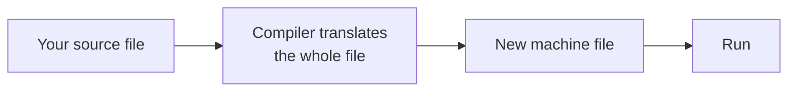
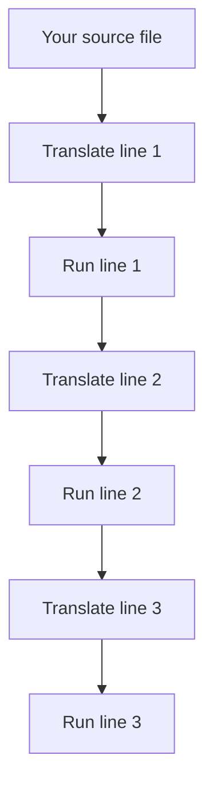

# Introduction to Python and Environment Setup

A Python program is a plain text file. A second program, called the **interpreter**, reads that file and carries out what it says.

---

## How a Program Reaches the Machine

### Why Anything Has to Be Translated

A computer works only with numbers. It can add them, compare them, and move them from one place to another. It does not understand English, so typing *"find the average of three marks"* achieves nothing.

A **programming language** is a small set of words and symbols, each given one fixed meaning, together with a **translator** that turns them into the numbers the machine acts on. Because `print` always means the same thing and `+` always means the same thing, nothing is left to guess. That is why a machine can follow them.

Python stays close to English, so a line often explains itself:

```python
print("Welcome to Python")
```

That single line is already a complete Python program. It displays `Welcome to Python` and needs nothing around it.

### Two Kinds of Translator

Every language must be translated before a machine can act on it. The question is *when*, and the answer splits languages into two families.

A **compiler** translates the whole program in advance and hands back a new file the machine can run on its own. C and C++ work this way.



An **interpreter** translates one instruction at a time, while the program is running. **Python is an interpreted language.**



| | Compiled | Interpreted |
|---|---|---|
| Translation happens | Once, before running | Line by line, while running |
| Speed of the program | Faster | Slower |
| Wait after changing code | Must translate again | None |
| Needed on the machine | Nothing extra | The interpreter |
| Examples | C, C++ | Python |

### What Being Interpreted Means for You

Three consequences shape the way you work:

- **A program runs the moment you save it.** There is no translation step to wait for.
- **Python must be installed on any machine that runs your file.** Your file is a set of instructions, not a finished program.
- **The same file works on Windows, macOS and Linux**, provided Python is installed there.

One behaviour surprises everyone once. Python reads the **whole file** and checks that it is written correctly *before* running a single line. A missing bracket on the last line therefore stops the entire file, including the correct lines above it.

That gives you a diagnostic rule worth keeping from your first day:

| What you see | What it means |
|---|---|
| No output at all | Something is written wrongly — a syntax problem |
| Output starts, then stops | The syntax is fine; the logic is wrong |

So a twelve-line file that prints on lines 1, 2 and 3, but is missing a closing bracket on line 12, prints **nothing at all**. Python checked the whole file first, found the fault, and refused to run any of it.

---

## Why Python

### Where It Is Used

Python is not a practice language you outgrow. The same language is used for real work across many fields.

| Field | What Python does there |
|---|---|
| Data analysis | Cleaning large files of records and summarising them |
| Artificial intelligence | Building and training models that make predictions |
| Web development | Running the part of a website the browser never sees |
| Automation | Doing work a person would otherwise repeat by hand |
| Testing | Checking other software automatically |

### Why It Gets Chosen

**Little has to be written around an idea.** Printing one line in Java needs a class, a method and a call; Python needs one line. Less typing means fewer places to make a mistake, which matters most while you are learning.

**Most of the work is already done.** A **library** is code somebody else has written that you are free to use — NumPy for numbers, pandas for tables of data, PyTorch for artificial intelligence.

**Somebody has already hit your problem.** Because so many people use Python, almost every difficulty you meet has been met before and written down somewhere.

---

## Setting Up Your Machine

### Installing Python

| Platform | What to do |
|---|---|
| Windows | Open **python.org → Downloads**, run the installer, tick **Add python.exe to PATH** on the first screen, then **Install Now** |
| macOS | Download the macOS installer from the same page and run it |
| Linux | Usually installed already — check before installing anything |

That PATH tick is what lets you call Python by name later. It is easy to miss and awkward to notice.

**Try it.** Open **Command Prompt** on Windows, or **Terminal** on macOS and Linux, and run:

```
python --version
```

**Output**

```
Python 3.13.2
```

On macOS and Linux the command is `python3 --version`. Your version number will differ; any version beginning with 3 runs everything in this course.

If the reply is `'python' is not recognized`, the PATH option was missed. Run the installer again, choose **Modify**, tick **Add python.exe to PATH**, and finish. Do not continue until this command answers — nothing later will work.

### Visual Studio Code

Python will run any plain text file, even one typed into Notepad. Notepad, though, cannot colour your code, warn you about a missing bracket, or run a file for you. A **code editor** does all three, and Visual Studio Code is the usual free choice.

1. Download it from **code.visualstudio.com** and install it.
2. Press `Ctrl+Shift+X`, search for **Python**, and install the extension published by Microsoft.
3. Click **File → Open Folder** and open the folder that holds your Python files.

**Watch out.** Always open the **folder**, never a single file. An editor opened on one file cannot see the rest of your work, and everything you write later assumes the folder is where you are working.

### Google Colab, When Installation Is Blocked

Many college and office computers do not allow software to be installed. If yours is one of them, open **colab.research.google.com** and sign in with a Google account. Python then runs on Google's computers and nothing is installed on your device. You type code into a box called a **cell**, press `Shift+Enter` to run it, and your work saves to Google Drive automatically.

| | Local installation | Google Colab |
|---|---|---|
| Produces `.py` files | Yes | No |
| Command line practice | Yes | Not possible |
| Survives being left alone | Yes | Session closes after inactivity |
| Needs permission to install | Yes | No |

Use Colab when installation is impossible, and set Python up properly when you can.

---

## Finding Your Way to a File

### Folders, Paths and the Working Directory

**The file system is the way a computer arranges everything it stores.** Files sit inside **folders**, also called **directories**, and folders sit inside other folders, which builds a tree:

```
C:\
└── Users
    └── Kavya
        └── Documents
            └── python-basics
                └── hello.py
```

**A path is the full route from the top of that tree down to a file:**

```
C:\Users\Kavya\Documents\python-basics\hello.py
```

Windows separates folder names with a backslash `\`; macOS and Linux use a forward slash `/`.

Now the idea that causes beginners more trouble than any other on this page. At every moment, a terminal is standing inside exactly one folder. **That folder is the current working directory.** When you ask Python to run `hello.py`, it looks in the current working directory and nowhere else. Stand somewhere else in the tree and it will not find the file, even though the file certainly exists.

### The Five Commands

You need a terminal for one reason: to stand in the folder that holds your `.py` file and hand that file to Python. Running a program is always those two steps, and the first is the one people skip.

| Purpose | Windows | macOS and Linux |
|---|---|---|
| Show which folder you are standing in | `cd` | `pwd` |
| List the files in it | `dir` | `ls` |
| Go into a folder | `cd python-basics` | `cd python-basics` |
| Go back one folder | `cd ..` | `cd ..` |
| Clear the window | `cls` | `clear` |

A terminal usually opens in your home folder, so a typical walk looks like this:

```
cd Documents
cd python-basics
dir
```

**Output**

```
hello.py
```

That `dir` is not decoration. It confirms two things at once: that you are standing in the right folder, and that the file is named what you think it is named.

Two habits save a great deal of typing: type the first few letters of a folder name and press `Tab` to complete it, and press the up arrow to bring back the last command.

Moving up has the same effect in reverse. From `python-basics`, one `cd ..` reaches `Documents` and a second reaches `Kavya`. A `dir` there lists `Documents` but not `hello.py`, because that file is now two levels below you — and `python hello.py` would fail, even though the file exists and you have not touched it.

### When Python Cannot Find Your File

One message will greet you more often than any other:

**Output**

```
can't open file 'hello.py': [Errno 2] No such file or directory
```

Nine times out of ten the file is exactly where you left it and the terminal is standing in a different folder — Python looked in the current working directory and found nothing. The fix is always the same three steps:

1. Run `dir` or `ls`.
2. Look for `hello.py` in the list.
3. If it is not there, `cd` until it is.

---

## Your First Program

### Write and Save It

1. Open Notepad, or a new file in Visual Studio Code.
2. Type this line exactly:

```python
print("Welcome to Python")
```

3. Save it inside a new folder named `python-basics` in your **Documents** folder, with the file name `hello.py`.

**Watch out.** In Notepad, change **Save as type** from *Text Documents* to **All Files** before saving. Otherwise Notepad quietly saves the file as `hello.py.txt`, and Python will never find it. A `dir` that shows `hello.py.txt` instead of `hello.py` is this mistake, which is why the listing is worth reading.

### Run It

Walk to the folder, then hand the file over. On macOS and Linux, use a forward slash and `python3`.

```
cd Documents\python-basics
python hello.py
```

**Output**

```
Welcome to Python
```

**The second command has two parts.** `python` starts the interpreter; `hello.py` names the file to work on. The file name means nothing to Python itself, so `first.py` would behave identically.

### What That Line Actually Does

`print` is a **function** — ready-made code that performs one job when you call it by name.

| Part of `print("Welcome to Python")` | What it is for |
|---|---|
| `print` | The name of the function being called |
| `(` `)` | The brackets are how you call it |
| `"` `"` | The quotation marks make the words text, so Python displays them instead of trying to understand them |

Brackets are required even when there is nothing inside them, so `print()` prints a blank line.

Given several values separated by commas, `print` displays them in order with a single space between each:

```python
print("Total:", 240, "Average:", 80)
```

**Output**

```
Total: 240 Average: 80
```

The numbers needed no quotation marks — `print` handles text and numbers alike.

---

## Practice

Work through these four at the machine, in order, keeping every file inside the `python-basics` folder.

**1. Confirm the installation.** Run `python --version` and write down the version you were given. If the command is not recognised, fix the PATH before going further.

**2. Find your way around.** From a terminal, move into `Documents`, then into `python-basics`, then back up one level, then in again. Run `dir` (or `ls`) at each stop and check that what you see matches where you think you are.

**3. Run the first program.** Create `hello.py` with the single `print` line, run it from the terminal, and confirm the output.

**4. Write a three-line program.** Create `about_me.py` that prints your name, your college, and your course on three separate lines. Run it from the terminal.

**Expected output**

```
Kavya Menon
KVCET
B.E. Computer Science
```

---

## Reference

**[Using the Python Interpreter](https://docs.python.org/3/tutorial/interpreter.html)** — how the interpreter is started and how a source file is handed to it.

**[Python Setup and Usage](https://docs.python.org/3/using/index.html)** — installation and command-line details for Windows, macOS and Linux, including the PATH setting.

**[Getting Started with Python in VS Code](https://code.visualstudio.com/docs/python/python-tutorial)** — the editor's own walkthrough of the extension and the run button.
