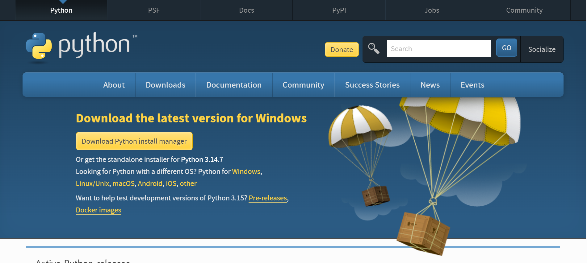
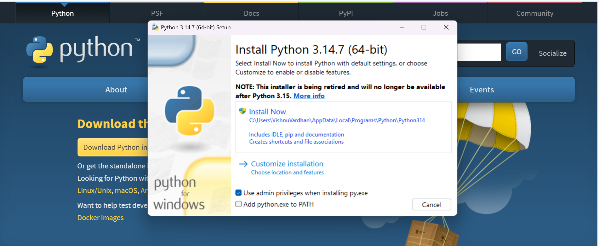
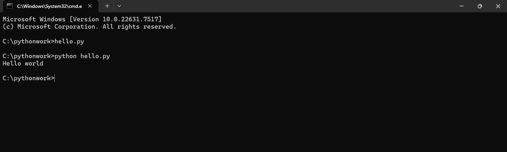
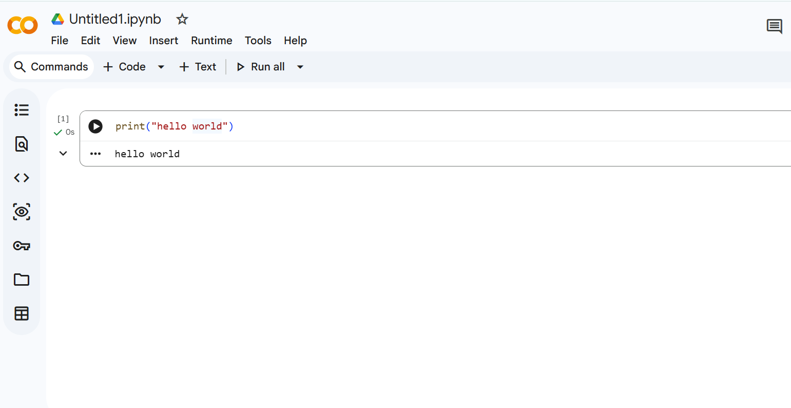

# Program Setup and Execution

To run Python you need two things. You need a place to type your code, and you need Python itself to read that code and act on it. There are three common ways to arrange this, and each one suits a different moment.

## The Online Editor

The quickest way to start is a website that already has Python inside it. You type your code in the browser and press a button. Nothing is installed, so nothing can break.

Open the editor and type this one line:

```python
print("Hello")
```

Press the run button. The word `Hello` appears below your code. That is a complete Python program.

The `print` command shows something on the screen. Whatever sits inside the quotation marks is what appears.


An online editor is fine for a first try. But it needs internet, and your files stay on someone else's website. For regular work, Python belongs on your own computer.

## Python on Your Computer

Python is free. On Windows, download the installer from this link and open it:

**https://www.python.org/ftp/python/3.14.7/python-3.14.7-amd64.exe**



On the first screen, tick the box that says **Add Python to PATH**. It sits near the bottom. This lets your computer find Python from any folder. Then click install.



To check the install, open the Command Prompt and type this:

```
python --version
```

A version number appears, such as `Python 3.14.7`. Python is ready.

What you installed is the translator from the last topic. It reads Python code and gets the work done. It does not give you a place to write that code. Any text editor can do that part, even Notepad.

## Writing and Running Your Own File

A Python program is a plain text file ending in `.py`. That ending tells the computer the file holds Python code.

You can make one in Notepad and run it in five steps:

1. Open the `C:` drive and create a folder named `pythonwork`.
2. In Notepad, type `print("Hello")`. Choose Save As, open `C:\pythonwork`, set the file type box to **All Files**, and save the file as `hello.py`.
3. Open the Command Prompt and type `cd C:\pythonwork` to move into that folder.
4. Type `dir` to list the folder. `hello.py` should be in the list.
5. Type `python hello.py`. The word `Hello` appears.

Two things are worth knowing here. `C:\pythonwork` is called a **path**, the full address of a folder. And the Command Prompt only sees one folder at a time, which is why step 3 exists.



## Code Editors and IDEs

Notepad works, but it does nothing to help you. It cannot tell code from ordinary words, and it cannot run anything.

A tool built for the job is called an **IDE**, short for Integrated Development Environment. The name is long but the idea is simple. It is one window where you write your code, run it, and fix your mistakes, instead of moving between Notepad and the Command Prompt.

**VS Code** is the most widely used one, and it is free. Set it up like this:

1. Download it from **https://code.visualstudio.com** and install it.
2. Open VS Code. Click the **Extensions** icon in the bar on the left, search for `Python`, and install the one published by Microsoft. This is what lets VS Code run Python files.
3. Choose **File**, then **Open Folder**, and select `C:\pythonwork`. The folder name now appears in the panel on the left.
4. Click the **New File** icon beside the folder name. Name the file `greet.py`.
5. Type `print("Hello there")` and press **Ctrl + S** to save.
6. Click the **run arrow** at the top right of the window.

`Hello there` appears in a panel at the bottom. Look closely at that panel and you will see the command `python greet.py` sitting above the output. VS Code ran the same five steps you did by hand, in one click.


**Google Colab** works in the browser and needs no install. Your code sits in small blocks called cells, and each cell has its own run button, so you can run one part without running the rest. Your work saves into your Google account and opens on any computer. It needs internet and a Google account.




Use Colab when you are away from your own machine or want to share work quickly. Use VS Code for anything you plan to keep and build on.

Your program says the same thing every time it runs. Next, you will store values inside a program and let it ask the person using it a question.
