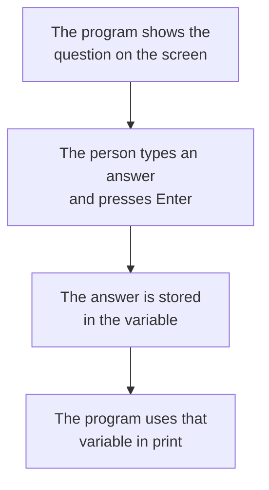

# Variables, Values and Output

A program works with pieces of information. A name, a mark, a price. Each such piece is called a **value**, and a program needs a way to hold on to a value so it can use it later. That way is a **variable**. A variable is a name that holds a value.

## Storing a Value

You create a variable by choosing a name and giving it a value:

```python
name = "Arjun"
age = 12
```

There are now two variables. `name` holds the text `Arjun`, and `age` holds the number `12`. The `=` sign here does not mean "is equal to". It means "put this value into this name", so the value on the right goes into the name on the left.

Once a variable exists, you use its name in place of the value:

```python
age = 12
print(age)
```

**Output:**

```
12
```

A variable can be given a new value at any time, and the old value is simply replaced:

```python
age = 12
age = 13
print(age)
```

**Output:**

```
13
```

The variable holds only its latest value.

## Naming Convention

A variable name can use letters, digits and the underscore sign `_`.

- A name cannot begin with a digit. `mark1` is allowed, `1mark` is not.
- A name cannot contain a space. Use an underscore instead, as in `total_marks`.
- Capital letters matter. `Age` and `age` are two different variables.
- Good names describe what they hold. `total_marks` tells you far more than `t` does.

## Data Types

Every value belongs to a kind, called a **data type**. Four types cover almost everything you will use at first.

- **`int`** — a whole number, with no decimal point, such as `12` or `500`.
- **`float`** — a decimal number, such as `98.5` or `3.14`.
- **`str`** — text, written inside quotation marks, such as `"Arjun"` or `"Class 7"`. The name is short for string.
- **`bool`** — a true-or-false value, either `True` or `False`, written with a capital first letter and no quotation marks.

```python
marks = 87
average = 72.5
student = "Meera"
passed = True
```

Here `marks` is an `int`, `average` is a `float`, `student` is a `str`, and `passed` is a `bool`.

Quotation marks are what make a value text. So `12` is a number, but `"12"` is text. They look alike on the screen and behave differently inside a program.

## Checking a Data Type

You do not have to work out a type by looking at it. The `type` command tells you, and it is used like `print`, with the value inside the brackets:

```python
marks = 87
print(type(marks))
```

**Output:**

```
<class 'int'>
```

The answer looks strange at first. `class` is the word Python uses for a kind of value, so read the whole thing as "this is an `int`". The part inside the quotation marks is the type name, and that is the part you care about.

It works on any value:

```python
average = 72.5
student = "Meera"
passed = True
print(type(average))
print(type(student))
print(type(passed))
```

**Output:**

```
<class 'float'>
<class 'str'>
<class 'bool'>
```

The command earns its keep on values that look like one type but are another:

```python
first = 12
second = "12"
print(type(first))
print(type(second))
```

**Output:**

```
<class 'int'>
<class 'str'>
```

Both show as `12` when printed, and `type` is what tells them apart. Whenever a program behaves in a way you cannot explain, print the type of the value first. It is the fastest way to find the cause.

## Showing Values on the Screen

The `print` command puts something on the screen. Text goes inside quotation marks, and a variable name goes without them:

```python
marks = 87
print("Result")
print(marks)
```

**Output:**

```
Result
87
```

Each `print` starts a new line. You can print several things together by separating them with commas:

```python
marks = 87
print("Marks:", marks)
```

**Output:**

```
Marks: 87
```

Python leaves one space where each comma sits.

A `print` with nothing inside the brackets prints an empty line, which is how you space out output:

```python
print("Marks")
print()
print("Attendance")
```

**Output:**

```
Marks

Attendance
```

## Choosing the Separator

The space Python puts at each comma is a setting called `sep`, and you can change it to anything you like:

```python
print("2026", "09", "08", sep="-")
print("total", "87", sep=": ")
print("a", "b", "c", sep="")
```

**Output:**

```
2026-09-08
total: 87
abc
```

`sep=""` joins the values with nothing between them. `sep` applies between values only, never before the first or after the last.

## Ending a Line Differently

Each `print` ends by moving to a new line. That ending is a setting called `end`, and changing it keeps the next `print` on the same line:

```python
print("Loading", end="")
print("...", end="")
print("done")
```

**Output:**

```
Loading...done
```

This is what you use when several `print` commands need to build one line of output together.

## Escape Sequences

Some characters cannot be typed directly inside quotation marks. An **escape sequence** is a backslash `\` followed by a letter, and it stands for one such character.

- `\n` — a new line
- `\t` — a tab, useful for lining up columns
- `\"` — a quotation mark that does not end the text
- `\\` — a single backslash

```python
print("Name\tMarks")
print("Arjun\t87")
print("Line one\nLine two")
print("She said \"yes\"")
```

**Output:**

```
Name	Marks
Arjun	87
Line one
Line two
She said "yes"
```

One `print` can therefore produce several lines, because `\n` inside the text starts a new line wherever it sits.

## Joining Text with +

The `+` sign joins two pieces of text into one:

```python
first = "Arjun"
last = "Kumar"
print("Name: " + first + " " + last)
```

**Output:**

```
Name: Arjun Kumar
```

Nothing is inserted for you here, so every space you want must be written into the text. And `+` joins text to text only. Putting a number on one side of it fails:

```python
marks = 87
print("Marks: " + marks)
```

**Output:**

```
TypeError: can only concatenate str (not "int") to str
```

Python will not guess whether you meant to join text or add numbers, so it stops instead.

## Formatted Strings

Writing the values into the sentence directly is easier to read than joining pieces. Put an `f` immediately before the opening quotation mark, and then any variable name inside `{ }` is replaced by its value:

```python
name = "Arjun"
marks = 87
print(f"{name} scored {marks} marks")
```

**Output:**

```
Arjun scored 87 marks
```

Such a piece of text is called an **f-string**, short for formatted string. The `f` is what activates the braces. Without it, the braces are printed as they are:

```python
name = "Arjun"
print("{name} is here")
```

**Output:**

```
{name} is here
```

The braces can hold a calculation as well as a name:

```python
marks = 87
total = 100
print(f"Percentage: {marks / total * 100}")
```

**Output:**

```
Percentage: 87.0
```

f-strings are the way output is written in modern Python. Use them unless you have a reason not to.

## Controlling Decimal Places

A division often produces a long decimal that nobody wants to read:

```python
print(f"Average: {245 / 3}")
```

**Output:**

```
Average: 81.66666666666667
```

Inside the braces, a colon followed by `.2f` rounds the value to two decimal places:

```python
print(f"Average: {245 / 3:.2f}")
```

**Output:**

```
Average: 81.67
```

Read `.2f` as "two decimal places, fixed". The digit is the count you want, so `.3f` gives three and `.0f` gives none:

```python
price = 49.5
print(f"{price:.0f}")
print(f"{price:.3f}")
```

**Output:**

```
50
49.500
```

The rounding affects the printed text only. The variable still holds its full value.

## The Ways to Print, Side by Side

| Way | Looks like | Use it when |
| --- | --- | --- |
| Values with commas | `print("Marks:", marks)` | A quick line with a space between values |
| `sep` | `print(a, b, sep="-")` | You want a separator other than a space |
| `end` | `print(a, end="")` | Several prints must share one line |
| Escape sequence | `print("A\tB")` | You need a tab, a new line, or a quotation mark |
| Joining with `+` | `print("Name: " + name)` | Both pieces are already text |
| f-string | `print(f"{name}: {marks}")` | Almost always, and for any real sentence |
| Format specification | `print(f"{value:.2f}")` | A number needs a fixed number of decimals |

## Taking a Value from the User

So far every value has been fixed inside the program. The `input` command lets the program ask instead.

```python
name = input("What is your name? ")
print("Welcome,", name)
```

The question appears on the screen and the program waits. Whatever the person types goes into the variable `name`, and the next line uses it.

**Output:**

```
What is your name? Arjun
Welcome, Arjun
```



One point matters here. Whatever `input` collects is always text, even when the person types digits. So a typed `12` arrives as the text `"12"`, not the number `12`.

You can prove this to yourself now:

```python
age = input("Age: ")
print(type(age))
```

**Output:**

```
Age: 12
<class 'str'>
```

The person typed digits, and the type still came back as `str`.

## Comments in Code

A **comment** is a line of writing meant for people, not for Python. It starts with a `#`, and Python ignores everything after that sign on the line.

A comment can sit on its own line, or at the end of a line of code:

```python
# store the student details
name = "Arjun"
age = 12    # age in years
```

**Output:**

```

```

Nothing appears, because neither line prints anything and the comments were skipped.

Comments are used to say why a line exists, not what it does. `age = 12` already shows what is happening. A note such as `# age in years` adds the part the code cannot say. You will thank yourself for them when you open your own program a month later.

## Further Reading

- **Variables, numbers, strings and booleans** — https://www.pythontutorial.net/python-basics/

You now know how to hold a value, show it, and ask for one. But a typed `12` is still text, so the program cannot yet add it or compare it. Next, you will turn text into numbers and put those numbers to work.
