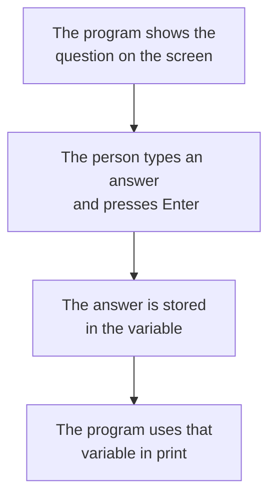

# Variables, Values and Output

A program works with pieces of information. A name, a mark, a price. Each such piece is called a **value**, and a program needs a way to hold on to a value so it can use it later. That way is a **variable**. A variable is a name that holds a value.

## Storing a Value

You create a variable by choosing a name and giving it a value:

```python
name = "Arjun"
age = 12
```

There are now two variables. `name` holds the text `Arjun`, and `age` holds the number `12`. The `=` sign here does not mean "is equal to". It means "put this value into this name", so the value on the right goes into the name on the left.

Once a variable exists, you use its name in place of the value:

```python
age = 12
print(age)
```

**Output:**

```
12
```

A variable can be given a new value at any time, and the old value is simply replaced:

```python
age = 12
age = 13
print(age)
```

**Output:**

```
13
```

The variable holds only its latest value.

## Rules for Names

A variable name can use letters, digits and the underscore sign `_`.

- A name cannot begin with a digit. `mark1` is allowed, `1mark` is not.
- A name cannot contain a space. Use an underscore instead, as in `total_marks`.
- Capital letters matter. `Age` and `age` are two different variables.
- Good names describe what they hold. `total_marks` tells you far more than `t` does.

## Kinds of Values

Every value belongs to a kind, called a **data type**. Four types cover almost everything you will use at first.

- **`int`** — a whole number, with no decimal point, such as `12` or `500`.
- **`float`** — a decimal number, such as `98.5` or `3.14`.
- **`str`** — text, written inside quotation marks, such as `"Arjun"` or `"Class 7"`. The name is short for string.
- **`bool`** — a true-or-false value, either `True` or `False`, written with a capital first letter and no quotation marks.

```python
marks = 87
average = 72.5
student = "Meera"
passed = True
```

Here `marks` is an `int`, `average` is a `float`, `student` is a `str`, and `passed` is a `bool`.

Quotation marks are what make a value text. So `12` is a number, but `"12"` is text. They look alike on the screen and behave differently inside a program.

## Showing Values on the Screen

The `print` command puts something on the screen. Text goes inside quotation marks, and a variable name goes without them:

```python
marks = 87
print("Result")
print(marks)
```

**Output:**

```
Result
87
```

Each `print` starts a new line. You can print several things together by separating them with commas:

```python
marks = 87
print("Marks:", marks)
```

**Output:**

```
Marks: 87
```

Python leaves one space where each comma sits.

## Taking a Value from the User

So far every value has been fixed inside the program. The `input` command lets the program ask instead.

```python
name = input("What is your name? ")
print("Welcome,", name)
```

The question appears on the screen and the program waits. Whatever the person types goes into the variable `name`, and the next line uses it.

**Output:**

```
What is your name? Arjun
Welcome, Arjun
```



One point matters here. Whatever `input` collects is always text, even when the person types digits. So a typed `12` arrives as the text `"12"`, not the number `12`.

## Comments in Code

A **comment** is a line of writing meant for people, not for Python. It starts with a `#`, and Python ignores everything after that sign on the line.

A comment can sit on its own line, or at the end of a line of code:

```python
# store the student details
name = "Arjun"
age = 12    # age in years
```

**Output:**

```

```

Nothing appears, because neither line prints anything and the comments were skipped.

Comments are used to say why a line exists, not what it does. `age = 12` already shows what is happening. A note such as `# age in years` adds the part the code cannot say. You will thank yourself for them when you open your own program a month later.

## Further Reading

- **Variables** — https://www.w3schools.com/python/python_variables.asp
- **Data types** — https://www.w3schools.com/python/python_datatypes.asp
- **User input** — https://www.w3schools.com/python/python_user_input.asp

Each page has a Try it Yourself button, so you can change the example and run it in the browser.

You now know how to hold a value, show it, and ask for one. But a typed `12` is still text, so the program cannot yet add it or compare it. Next, you will turn text into numbers and put those numbers to work.
