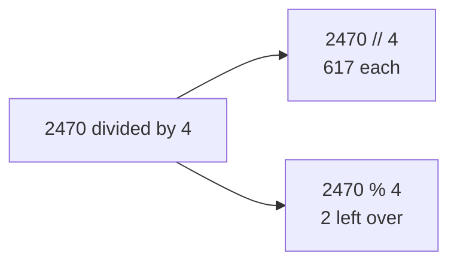
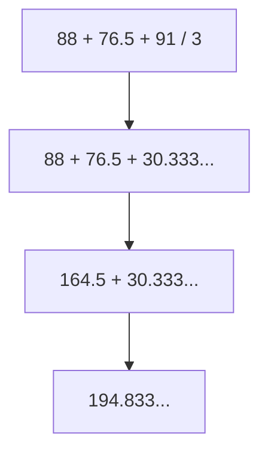
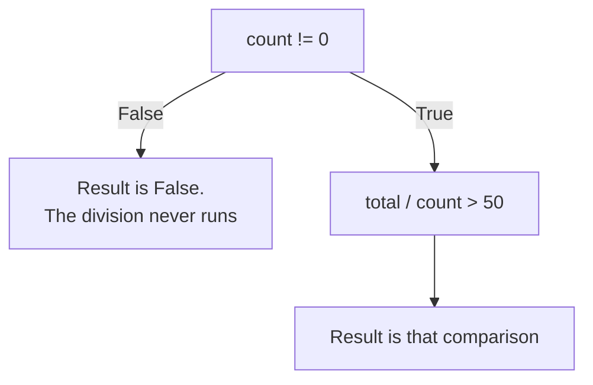

# Operators and Expressions

An **operator** is a symbol that combines values into a new value. The values it works on are its **operands**. An **expression** is any piece of code that produces a value.

```python
average = (88 + 76.5 + 91) / 3
print(average)
```

**Output**

```
85.16666666666667
```

In that line, `+` and `/` are the operators, the four numbers are the operands, and `(88 + 76.5 + 91) / 3` is an expression. So is plain `88`.

The answer is correct, but the long tail of sixes is not what anyone would write on a mark sheet. Python's arithmetic has several behaviours like this, and they are the subject of this chapter.

---

## Arithmetic Operators

Seven operators do arithmetic.

| Operator | Meaning | Example | Result |
|---|---|---|---|
| `+` | Addition | `7 + 2` | `9` |
| `-` | Subtraction | `7 - 2` | `5` |
| `*` | Multiplication | `7 * 2` | `14` |
| `/` | True division | `7 / 2` | `3.5` |
| `//` | Floor division | `7 // 2` | `3` |
| `%` | Remainder | `7 % 2` | `1` |
| `**` | Power | `7 ** 2` | `49` |

### Two Kinds of Division

`/` always produces a decimal number, even when the division comes out exact:

```python
print(10 / 5)
```

**Output**

```
2.0
```

`//` divides and rounds the result **down**, so it produces whole units:

```python
print(2470 // 4)
```

**Output**

```
617
```

Dividing ₹2470 among four people shows where each one is used. `2470 / 4` is `617.5`, which is exact but cannot be handed over. `2470 // 4` is `617`, the whole rupees each person receives.

Use `/` for the exact value, and `//` for whole units: complete minutes, complete boxes, complete rupees.

**Try this now.** Print `137 // 20`. The result is `6`, the number of ₹20 notes in a ₹137 balance.

### Remainder

`%` gives what remains after floor division. `7 % 2` is `1`, because 2 goes into 7 three times and 1 is left over.

`//` and `%` answer two halves of one question, so they usually appear together:



Splitting 7385 seconds into minutes and seconds uses both in one line:

```python
total_seconds = 7385
print(total_seconds // 60, "minutes and", total_seconds % 60, "seconds")
```

**Output**

```
123 minutes and 5 seconds
```

`%` has a second use. `n % 2 == 0` tests whether a number is even, because an even number leaves nothing behind when divided by two. The same test with `% 5` finds multiples of five.

**Try this now.** Print `137 % 20`. The result is `17`, the amount left after six ₹20 notes.

### Power

`**` raises a number to a power. It accepts a fractional exponent, so `0.5` gives a square root without importing anything:

```python
print(2 ** 10)
print(9 ** 0.5)
```

**Output**

```
1024
3.0
```

### Division by Zero

Division has no answer when the right operand is zero. All three division operators raise `ZeroDivisionError`, though the wording after the colon differs depending on which one was used:

```python
print(10 / 0)
```

**Error**

```
ZeroDivisionError: division by zero
```

This matters whenever the divisor comes from data rather than from the program. An attendance percentage divides by the number of classes held, which is zero for a student who joined before any class took place. The Stopping Early section later in this chapter shows how to guard that calculation.

---

## Precedence and Round Brackets

**Precedence** is the order in which operators are applied when one line contains more than one. Python works down this order:

| Order | Operators | Group |
|---|---|---|
| 1 | `()` | Round brackets |
| 2 | `**` | Power |
| 3 | `-x` | Negative sign |
| 4 | `*` `/` `//` `%` | Multiplication and division |
| 5 | `+` `-` | Addition and subtraction |
| 6 | `<` `<=` `>` `>=` `==` `!=` | Comparison |
| 7 | `not` | Logical not |
| 8 | `and` | Logical and |
| 9 | `or` | Logical or |

Two consequences follow. All arithmetic is grouped before any comparison is applied, and all comparisons are grouped before `and` or `or` is applied.

### The Cost of Missing Brackets

The average from the start of this chapter, with the brackets removed:

```python
print(88 + 76.5 + 91 / 3)
print((88 + 76.5 + 91) / 3)
```

**Output**

```
194.83333333333334
85.16666666666667
```

Only the chemistry mark was divided, because `/` is applied before `+`:



Python printed no warning and reported no error. The line is legal, so it ran and produced a wrong average.

The rule that prevents this: **write the brackets wherever a reader would have to work out the order.** They cost nothing and they cannot be wrong.

### One Exception to Left-to-Right

Equal-precedence operators are applied left to right, so `10 - 2 - 3` means `(10 - 2) - 3`, which is `5`. `**` is the one exception, because it groups right to left:

```python
print(2 ** 3 ** 2)
```

**Output**

```
512
```

The line means `2 ** (3 ** 2)`, which is `2 ** 9`. Applied left to right it would have been `8 ** 2`, or 64.

### The Negative Sign Before a Power

Row 2 of the precedence table outranks row 3, so `**` is applied before the negative sign:

```python
print(-2 ** 2)
print((-2) ** 2)
```

**Output**

```
-4
4
```

The first line means `-(2 ** 2)`, which is `-(4)`. To square a negative number itself, put the negative number in round brackets, as the second line does.

---

## Comparison Operators

A comparison operator asks a question about two values and produces `True` or `False`, and nothing else.

| Operator | Asks | Example | Result |
|---|---|---|---|
| `==` | Are they equal? | `5 == 5` | `True` |
| `!=` | Are they different? | `5 != 4` | `True` |
| `>` | Is the left one bigger? | `5 > 9` | `False` |
| `<` | Is the left one smaller? | `5 < 9` | `True` |
| `>=` | Bigger, or the same? | `5 >= 5` | `True` |
| `<=` | Smaller, or the same? | `9 <= 5` | `False` |

`=` and `==` are different symbols with different jobs. `=` stores a value; `==` asks whether two values are equal. Writing `=` where a comparison belongs is a syntax error:

```python
print(5 = 5)
```

**Error**

```
SyntaxError: expression cannot contain assignment, perhaps you meant "=="?
```

The exact wording depends on where in the line the mistake sits, but every version names `==` as the likely intention.

### Chaining

A range can be written the way it appears on paper, which most other languages do not allow:

```python
marks = 75
print(40 <= marks <= 100)
```

**Output**

```
True
```

Python reads that as `40 <= marks and marks <= 100`.

### Comparing Decimals

Decimals cannot be tested for exact equality:

```python
print(0.1 + 0.2 == 0.3)
```

**Output**

```
False
```

Chapter 2 covered the reason. `0.1` cannot be stored exactly in binary, in the same way that one-third cannot be written exactly as a decimal, so a small error is left behind in the sum, and `==` notices that error.

Compare decimals with a tolerance instead:

```python
import math
print(math.isclose(0.1 + 0.2, 0.3))
```

**Output**

```
True
```

`import` makes extra ready-made functions available, and `math.isclose` means the `isclose` function from the `math` collection. Both are covered properly in a later chapter.

### Comparing Text

Comparison works on text as well as numbers, but the ordering is not alphabetical. Strings are compared character by character in Unicode order, and in that ordering every capital letter comes before every small letter:

```python
print("apple" < "banana")
print("Zoe" < "adam")
```

**Output**

```
True
True
```

The first result matches ordinary alphabetical order. The second does not, because `Z` ranks before `a`. Sorting or comparing names that people have typed themselves is affected by this.

---

## Logical Operators

One comparison answers one question. Joining two or three answers into a single rule needs a logical operator.

| Operator | Result is `True` when |
|---|---|
| `and` | Both sides are `True` |
| `or` | At least one side is `True` |
| `not` | The single operand is `False` |

```python
marks = 82
attendance = 71

print(marks >= 40 and attendance >= 75)
print(marks >= 40 or attendance >= 75)
print(not marks >= 40)
```

**Output**

```
False
True
False
```

The first line prints `False` even though the marks are high, because `and` requires both sides to be `True`. Those two conditions joined by `and` are a complete examination-eligibility rule.

**Try this now.** Run `print(45 >= 40 and 62 >= 75)`, which prints `False`. Change 62 to 80 and it prints `True`.

### Step-by-Step Evaluation

When a line has several operators, work through it one operator at a time, highest precedence first. Take `average >= 40 and attendance >= 75`, with `average` as `85.17` and `attendance` as `82`:

| Step | Expression | What was applied |
|---|---|---|
| 1 | `85.17 >= 40 and 82 >= 75` | Starting point |
| 2 | `True and 82 >= 75` | The first comparison |
| 3 | `True and True` | The second comparison |
| 4 | `True` | `and`, last of all |

Each comparison is grouped tightly enough that `and` is applied last, which is why that line needs no brackets. The next subsection covers one way in which the real order of events differs from this table.

### Stopping Early

`and` stops at the first `False`; `or` stops at the first `True`. Whatever comes after that point is never worked out at all.



This is what guards the attendance calculation from the Division by Zero section:

```python
count = 0
total = 340
print(count != 0 and total / count > 50)
```

**Output**

```
False
```

`count != 0` is `False`, so the result is already decided and the division on the right never runs.

Swapping the two sides changes the outcome. The division is then applied first, with nothing before it to stop it, and the program halts with `ZeroDivisionError`. Same operator, same values, opposite result, so **the order of operands around `and` is part of the logic, not a matter of style.** Write the test that protects first.

---

## Truthy and Falsy Values

Any value can be used where `True` or `False` is expected. Values that count as `False` are called **falsy**; everything else is **truthy**. The falsy list is short, and nothing else in this course belongs on it:

| Falsy value | Meaning |
|---|---|
| `False` | The Boolean itself |
| `None` | The absence of a value, covered properly in a later chapter |
| `0`, `0.0` | Zero, in either numeric type |
| `""` | The empty string |
| `[]`, `()`, `{}` | Empty collections |

`bool()` reports which side any value falls on:

```python
print(bool(0), bool(""), bool([]))
print(bool(-1), bool("0"), bool("False"), bool(" "))
```

**Output**

```
False False False
True True True True
```

`"0"`, `"False"` and `" "` are all truthy, including the last, which holds only a space. Python does not read the words inside a string; it only asks whether the string holds any characters. `"0"` holds one, `"False"` holds five, and a space is a character, so `" "` is not empty.

The number `0` is falsy. The text `"0"` is not. A check on whether a form field was filled in depends on that difference.

`and` and `or` do not hand back `True` or `False`. They hand back one of the values they were given, so `1 and 2` gives `2` and `"" or "Unknown"` gives `"Unknown"`. Where the result is used only as a decision this makes no difference, because the value counts as truthy or falsy in the same way.

---

## Operators on Real Input

Chapter 2 established that `input` always hands back text, and that the cure is to convert at the boundary. What changes here is how the operators react when that conversion is missing. There are three behaviours, in increasing order of how hard they are to notice.

**Some operators stop the program.** `-`, `/`, `//`, `%` and `**` have no meaning for text:

```python
first = input("First number: ")
second = input("Second number: ")
print(first - second)
```

**Error**

```
TypeError: unsupported operand type(s) for -: 'str' and 'str'
```

**Some operators produce a wrong answer without complaint.** `+` joins two strings and `*` repeats one, so both return a value:

```python
print(first + second)
```

**Output**

```
1020
```

Python did not add anything. It joined `"10"` and `"20"`, because nothing in the line indicated addition. The `TypeError` above is the more useful failure of the two, since it names both the problem and the line.

**Comparison produces a wrong answer and no error at all.**

```python
print("9" > "10")
```

**Output**

```
True
```

Python compares the first characters, `9` and `1`, finds `9` ranks higher, and stops there. As numbers, `9 > 10` is `False`. A ranking built on string comparison is wrong throughout and reports nothing.

All three are prevented by the same habit: convert the value on the line where it arrives, using `int` for counted quantities and `float` for measured ones.

```python
maths = float(input("Mathematics: "))
```

---

## Practice

Write each one in its own file inside `python-basics`, or one cell per program in Google Colab. Prompt for every value, convert it as it arrives, and use f-strings for all output.

**1. Seconds converter.** Read a whole number of seconds and report it as hours, minutes and seconds.

**Expected output**

```
Enter total seconds: 7385
2 hours, 3 minutes, 5 seconds
```

**Hint.** `//` and `%` are each needed twice. Hours come from dividing by 3600. What is left after the whole hours is `total % 3600`, and the minutes come out of that leftover.

**2. Splitting a bill.** Read a bill in whole rupees and a number of people. Report each share and the amount that cannot be divided evenly.

**Expected output**

```
Total bill: 2470
Number of people: 4
Each person pays: 617
Remaining: 2
```

**Hint.** Both values are counted quantities, so `int` is the converter. The two answers come from `//` and `%` on the same pair of numbers.

**3. Simple interest.** Read the principal, the yearly rate and the number of years. Interest is the principal multiplied by the rate and the time, divided by 100.

**Expected output**

```
Principal amount: 25000
Annual rate (%): 7.5
Time (years): 3
Interest        : 5625.00
Total repayable : 30625.00
```

**Hint.** All three are measured quantities, so read them with `float`. `*` and `/` share a precedence level and are applied left to right, so `p * r * t / 100` is correct, though brackets around the multiplication make the intention clearer. The two decimal places need `:.2f` in the f-string, because the value itself is `5625.0` and would otherwise print with one.

**4. Number report.** Read one whole number and print four Boolean answers: whether it is even, whether it is divisible by five, whether it lies between 100 and 999 inclusive, and whether it is below 0 or above 1000.

**Expected output**

```
Enter a number: 250
Even             : True
Divisible by 5   : True
Three digits     : True
Outside 0 to 1000: False
```

**Hint.** Each line is one expression that produces a `bool`, so nothing here needs an `if`. Evenness is a remainder test, the three-digit line is a chained comparison, and the last line is the one place `or` is needed.

**5. Eligibility.** Read three marks and an attendance percentage. A student is eligible when every mark is 40 or more and attendance is at least 75. Print the average to two decimal places and the eligibility as a single Boolean, written as one expression.

**Expected output**

```
Mathematics: 88
Physics: 76.5
Chemistry: 91
Attendance (%): 82
Average  : 85.17
Eligible : True
```

**Hint.** Four comparisons joined by three `and` operators, stored in one variable. No brackets are needed, because comparison outranks `and`. For the two decimal places use `{average:.2f}` rather than `round`, so that a value like 85.1 still shows two digits. After it works, change the attendance to 60: the eligibility must turn `False` while the average stays the same.

---

## Readiness Check

- You can state what `/` gives that `//` does not.
- You have run a line where a missing bracket changed the answer, and confirmed that no error appeared.
- You can explain why `count != 0 and total / count > 50` is safe and the reversed version is not.
- You can explain why `"9" > "10"` is `True`.
- All five practice programs run and match the output shown.

---

## Reference

**[Operator Precedence](https://docs.python.org/3/reference/expressions.html#operator-precedence)** — the complete precedence table from the Python Language Reference.

**[Numeric Types — int, float, complex](https://docs.python.org/3/library/stdtypes.html#numeric-types-int-float-complex)** — the exact definition of every arithmetic operator.

**[Truth Value Testing](https://docs.python.org/3/library/stdtypes.html#truth-value-testing)** — the authoritative list of falsy values.
