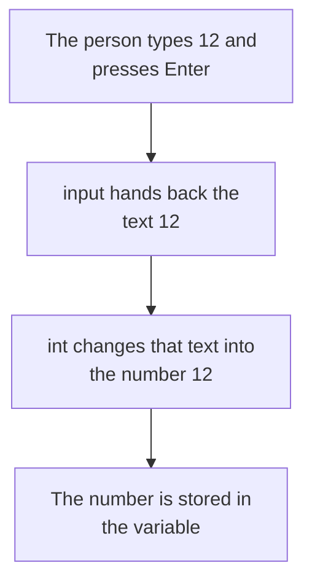

# Type Conversion

Every value in a program has a data type, and a value can only be used in ways its type allows. Two numbers can be added. Two pieces of text cannot. **Type conversion** is the act of changing a value from one type into another, so that it can be used the way you need.

## The Problem with Typed Numbers

The `input` command always hands back text, even when the person types digits. Adding two of them does not give what you expect:

```python
first = input("First number: ")
second = input("Second number: ")
print(first + second)
```

**Output:**

```
First number: 12
Second number: 5
125
```

The answer should be `17`. Python gave `125` instead, because it joined two pieces of text end to end. The `+` sign adds numbers, but it joins text.

The values must become numbers before the addition can work.

## Conversion to Numeric Types

Two commands do this job.

- **`int()`** — changes a value into a whole number.
- **`float()`** — changes a value into a decimal number.

You place the value inside the brackets:

```python
marks = int("87")
average = float("72.5")
print(marks)
print(average)
```

**Output:**

```
87
72.5
```

The quotation marks are gone from the output, because these are now numbers and not text.

`int()` also works on a decimal number, but it does not round. It simply drops everything after the decimal point:

```python
print(int(9.8))
```

**Output:**

```
9
```

So `9.8` becomes `9`, not `10`. This surprises people, and it is worth remembering.

## Conversion to Text

The `str()` command works the other way, turning a number into text. This is needed when you want to join a number onto a sentence with `+`:

```python
age = 12
print("Age: " + str(age))
```

**Output:**

```
Age: 12
```

Without `str()`, Python would refuse the line, because `+` cannot join text to a number.

There is an easier way to reach the same result. A comma inside `print` needs no conversion at all:

```python
age = 12
print("Age:", age)
```

**Output:**

```
Age: 12
```

Use commas for everyday printing. Keep `str()` for the times you must build one single piece of text.

## Numeric Input in a Single Step

Now the first problem can be fixed. Wrap the `input` command inside `int()`:

```python
first = int(input("First number: "))
second = int(input("Second number: "))
print(first + second)
```

**Output:**

```
First number: 12
Second number: 5
17
```

Two brackets sitting inside each other look confusing at first. Read them from the inside out.



The inner command runs first, then the outer one works on its result. Use `float()` in place of `int()` when the answer may have a decimal point, such as a price or a percentage.

## Invalid Conversions

A conversion only works if the value makes sense as that type. Ask `int()` to change a word and the program stops:

```python
number = int("hello")
```

**Output:**

```
ValueError: invalid literal for int() with base 10: 'hello'
```

Python is saying it cannot read `hello` as a whole number. The same happens with `int("12.5")`, because `12.5` is not a whole number. Use `float("12.5")` for that value instead.

This matters in real programs. If your program expects a number and the person types a word, the program will stop at that line. Handling that safely comes later, in the topic on errors.

## Further Reading

- **Type conversion, with worked examples** — https://www.programiz.com/python-programming/type-conversion-and-casting
- **Official reference for `int()`, `float()` and `str()`** — https://docs.python.org/3/library/functions.html

Your program can now hold real numbers instead of text. Next, you will do more than add them, using the full set of arithmetic operators.
