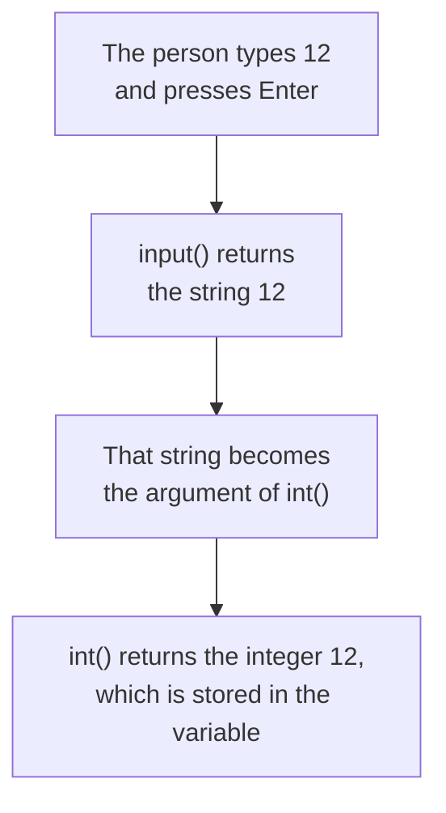

# Type Conversion

Every value in Python has a data type, and its type decides what an operator does to it. The `+` operator between two integers gives their sum. The same `+` between two strings joins them end to end. One operator, two different results, decided entirely by the data type.

**Type conversion**, also called **type casting**, changes a value from one data type into another, so that it behaves the way you need.

## Strings from the input Function

The `input()` function always **returns** a string, even when the person types digits:

```python
first = input("First number: ")
second = input("Second number: ")
print(first + second)
```

**Output:**

```
First number: 12
Second number: 5
125
```

The answer should be `17`. Both values are strings, so `+` did not perform addition. It performed **concatenation**, joining `"12"` and `"5"` into `"125"`.

Nothing is broken here. Python did exactly what the data types told it to do. To get addition instead, the operands must first become numbers.

## Conversion to Integer and Float

Two **built-in functions** do this job. A built-in function is one that comes ready-made with Python, needing nothing added.

- **`int()`** — converts a value to the `int` type, an integer.
- **`float()`** — converts a value to the `float` type, a floating-point number.

The value you want converted is placed inside the parentheses. A value passed to a function this way is called an **argument**.

```python
marks = int("87")
average = float("72.5")
print(marks)
print(average)
```

**Output:**

```
87
72.5
```

The quotation marks are gone from the output, because these are now numbers and not strings.

`int()` also accepts a float, but it does not round. It **truncates** the value, meaning it cuts off the fractional part:

```python
print(int(9.8))
```

**Output:**

```
9
```

So `9.8` becomes `9`, not `10`. This surprises people, and it is worth remembering.

## Conversion to String

The `str()` function works the other way, converting a number to the `str` type. This is needed when you want to concatenate a number onto a string:

```python
age = 12
print("Age: " + str(age))
```

**Output:**

```
Age: 12
```

Without `str()`, Python would stop with an error. The `+` operator can add two numbers, and it can concatenate two strings, but it cannot combine one of each. It has no way to decide which of the two jobs you meant.

A comma inside `print()` reaches the same result with no conversion at all:

```python
age = 12
print("Age:", age)
```

**Output:**

```
Age: 12
```

Use commas for everyday printing. Keep `str()` for the times you must build one single string.

## Numeric Input

Now the first problem can be fixed. Place the call to `input()` inside a call to `int()`:

```python
first = int(input("First number: "))
second = int(input("Second number: "))
print(first + second)
```

**Output:**

```
First number: 12
Second number: 5
17
```

The operands are integers now, so `+` performs addition.

One function call sitting inside another is called a **nested function call**. Two sets of parentheses look confusing at first, so read them from the inside out.



The inner call runs first, and the value it returns becomes the argument of the outer call. Use `float()` in place of `int()` when the answer may have a fractional part, such as a price or a percentage.

## Invalid Conversions and ValueError

A conversion only works if the value makes sense as that type. Ask `int()` to convert a word and the program stops:

```python
number = int("hello")
```

**Output:**

```
ValueError: invalid literal for int() with base 10: 'hello'
```

`ValueError` is the name Python gives this error. It means the argument was of the right type, a string, but its content could not be read as an integer.

The same happens with `int("12.5")`, because `12.5` is not an integer. Use `float("12.5")` for that value instead.

This matters in real programs. If your program expects a number and the person types a word, the program stops at that line. Handling it safely comes later, in the topic on exceptions.

## Further Reading

- **Type conversion, with worked examples** — https://www.programiz.com/python-programming/type-conversion-and-casting
- **Official reference for `int()`, `float()` and `str()`** — https://docs.python.org/3/library/functions.html

Your program can now hold real numbers instead of strings. Next, you will do more than add them, using the full set of arithmetic operators.
