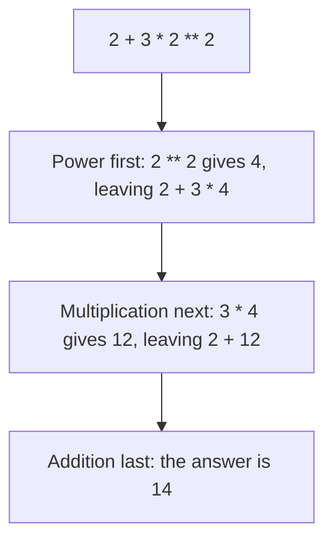

# Arithmetic Operators

An **operator** is a sign that tells Python to do something with values. Python has seven arithmetic operators, and five of them are the ones you already use in maths class. The other two are new.

## The Seven Operators

| Operator | Meaning | Example | Result |
|---|---|---|---|
| `+` | addition | `7 + 2` | `9` |
| `-` | subtraction | `7 - 2` | `5` |
| `*` | multiplication | `7 * 2` | `14` |
| `/` | division | `7 / 2` | `3.5` |
| `//` | whole-number division | `7 // 2` | `3` |
| `%` | remainder | `7 % 2` | `1` |
| `**` | power | `7 ** 2` | `49` |

The first three behave exactly as expected:

```python
print(7 + 2)
print(7 - 2)
print(7 * 2)
```

**Output:**

```
9
5
14
```

## Two Kinds of Division

The `/` operator divides and keeps the decimal part:

```python
print(7 / 2)
```

**Output:**

```
3.5
```

One detail catches everyone. `/` always gives a decimal number, even when the division is exact:

```python
print(10 / 5)
```

**Output:**

```
2.0
```

The answer is `2.0`, not `2`. Division in Python always produces a `float`.

The `//` operator divides and keeps only the whole-number part. Nothing is rounded, so the part after the decimal point is simply dropped:

```python
print(7 // 2)
```

**Output:**

```
3
```

Seven divided by two is `3.5`, so `//` gives `3`. Use `//` when a decimal answer makes no sense. Sixteen students filling cars that seat five each means three full cars, not `3.2` cars.

## The Remainder Operator

The `%` operator gives what is left over after a division:

```python
print(7 % 2)
```

**Output:**

```
1
```

Two goes into seven three times, which uses up six, and `1` is left over. That leftover is the remainder.

The two divide operators work as a pair. `//` tells you how many times the division went in, and `%` tells you what was left behind:

```python
print(17 // 5)
print(17 % 5)
```

**Output:**

```
3
2
```

Five goes into seventeen three times, and two remain. A remainder of `0` means the division was exact, which is how programs test whether a number divides evenly.

## The Power Operator

The `**` operator raises a number to a power. It means the number multiplied by itself, that many times:

```python
print(2 ** 3)
print(5 ** 2)
```

**Output:**

```
8
25
```

So `2 ** 3` is 2 × 2 × 2, which is `8`. Note that a single `*` multiplies, while two together make a power. They are easy to mix up.

## Order of Operations

A line can hold several operators. Python does not work through them from left to right. It follows a fixed order:

1. Brackets `( )`
2. Power `**`
3. Multiplication `*`, division `/`, whole-number division `//`, remainder `%`
4. Addition `+`, subtraction `-`

Operators on the same level are done left to right.

Take one line as an example:

```python
print(2 + 3 * 2 ** 2)
```

**Output:**

```
14
```

The three operators were used in the order of the list, not the order they appear on the line:



Brackets sit at the top of the list, so anything inside them is done before everything else. Adding a pair to the same line changes the answer:

```python
print((2 + 3) * 2 ** 2)
```

**Output:**

```
20
```

Now `2 + 3` runs first and gives `5`, then `2 ** 2` gives `4`, and `5 * 4` gives `20`. Same numbers, same operators, different answer.

When a line has more than two operators, add brackets even where the order would already be correct. They cost nothing, and they show your reader exactly what you meant.

## Further Reading

- **Whole-number division explained** — https://www.geeksforgeeks.org/floor-division-in-python/
- **The remainder operator in depth** — https://realpython.com/python-modulo-operator/

You can now calculate with numbers. Next, you will compare them, and get back an answer of true or false.
