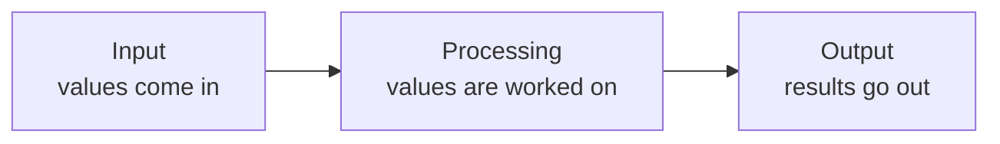
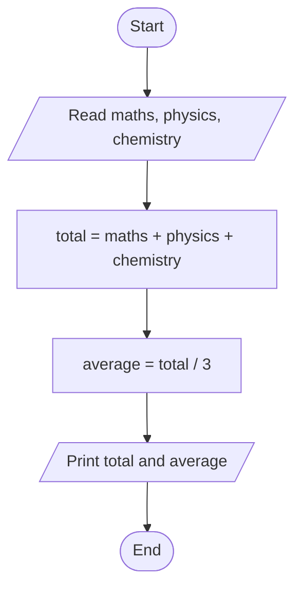
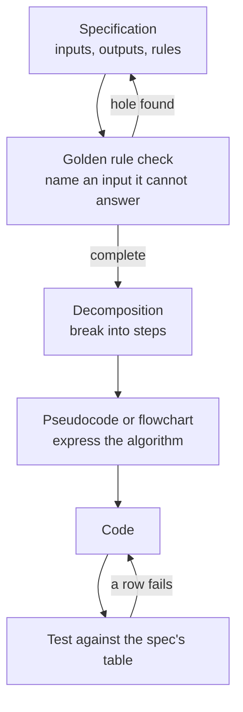
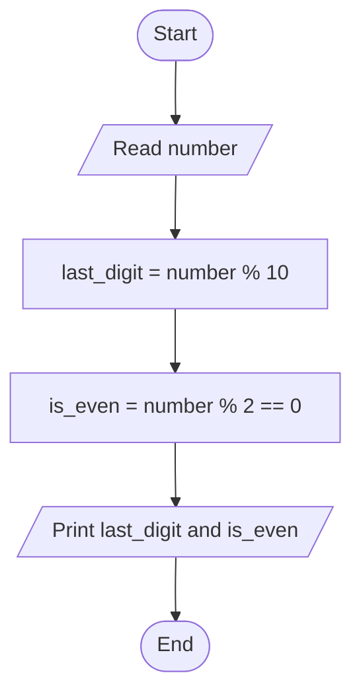

# Computational Thinking and Problem Specification

Here is a request of the kind you will actually be handed one day, by a teacher or a department head who does not write code:

> *"Write me something that tells me which students can sit the examination."*

Nothing in it is difficult. Every operator it needs fits on a single page — a few comparisons, an `and`, a division. And yet a room full of learners who can each explain `%`, `and` and `float()` perfectly will sit in front of an empty file for twenty minutes.

The reason is not missing syntax. It is that the request is a **sentence**, not a program. Somebody has to turn it into inputs, outputs and rules before a line can be typed, and nobody has said what "can sit the examination" means, what happens to a student with no attendance recorded, or what the thing should print.

Turning a sentence into a program is a skill of its own, and it is four habits applied in order. This page walks the request above through all four, and by the end you will have a document precise enough that writing the code becomes the easy part.

Keep paper beside you rather than an editor. Nothing on this page is typed into Python.

---

## Decomposition

The first habit is the one that makes an empty file stop being frightening, and it is the only one you can start on knowing nothing more about the request than the sentence you were given.

**Decomposition is breaking a problem into steps small enough that each one is obviously codeable.**

"Tell me which students can sit the examination" is not a step. It is the whole job, restated. Broken up, it becomes six:

1. Read the marks for three subjects.
2. Read the attendance percentage.
3. Add the three marks to get the total.
4. Divide the total by three to get the average.
5. Decide eligibility from the marks and the attendance.
6. Print the total, the average and the decision.

Six lines, and the empty file is no longer frightening — you could write four of them right now.

### How Small Is Small Enough

The test is mechanical: **one sentence, one verb, and something you could write and check on its own.**

| Step | Small enough? | Why |
|---|---|---|
| "Read the attendance percentage" | Yes | One verb, one value, testable by itself |
| "Add the three marks" | Yes | One calculation with an answer you can check by hand |
| "Decide eligibility" | Not yet | Hides a set of rules nobody has written down |
| "Handle the student record" | No | No single verb, and no way to tell when it is finished |

Look at step 5 again. It passes the "one verb" test and fails the real one, because *decide* is doing a lot of quiet work. Decide **how**? Is 40 the pass mark in every subject or only on average? Does 75% attendance mean before or after medical leave?

That is not a flaw in your decomposition. It is your decomposition doing its job — it has found the exact place where the request was vague. Mark that step and carry it forward; the whole second half of this page exists to fix it.

### Three Kinds of Step, Always

Every step you will ever write falls into one of three groups:



Sorting your steps this way takes a minute and catches the thing you forgot to ask for:

| Kind | Steps from the eligibility request |
|---|---|
| Input | Three marks; the attendance percentage |
| Processing | Total; average; the eligibility decision |
| Output | Total, average and decision, printed |

**Try this now.** On paper, decompose this and sort it into the three groups: *"Read a bill in whole rupees and a number of people, and report what each person pays and how much cannot be divided evenly."*

<details>
<summary>Show one correct answer</summary>

| Kind | Steps |
|---|---|
| Input | Read the bill; read the number of people |
| Processing | Divide to get each share; take the remainder |
| Output | Print the share; print the remainder |

Six steps. Notice that the share and the remainder are listed separately even though they come from the same two numbers — they use different operators, they can be wrong independently, and you would test them separately. That is the signal that they are two steps and not one.

</details>

---

## Pseudocode

You now have six steps in the right order. The next temptation is to open an editor, and the next twenty minutes are then spent fighting brackets instead of thinking. Pseudocode is how you avoid that.

**Pseudocode is a description of an algorithm written in structured English, using no programming language's syntax.** It is never run. Its only purpose is to let you get the logic right while the cost of being wrong is one crossed-out line.

### How It Is Written

There is no official standard, and textbooks differ. What matters is that it is unambiguous and that you stay consistent with yourself:

| Convention | Example |
|---|---|
| One instruction per line | `SET total = a + b` |
| Keywords in capitals | `START`, `END`, `READ`, `SET`, `PRINT`, `IF`, `ELSE`, `WHILE` |
| Indentation shows what sits inside a block | Lines under an `IF` are indented |
| Names match what you will call them in code | `total`, not "the sum thing" |

Steps 1 to 4 and step 6 of the eligibility problem, written out:

```
START
READ maths, physics, chemistry
READ attendance
SET total = maths + physics + chemistry
SET average = total / 3
PRINT total
PRINT average
END
```

Each line has exactly one Python counterpart, which is the point of writing it:

| Pseudocode | Python |
|---|---|
| `READ maths` | `maths = float(input("Mathematics: "))` |
| `SET total = maths + physics + chemistry` | `total = maths + physics + chemistry` |
| `SET average = total / 3` | `average = total / 3` |
| `PRINT average` | `print(f"Average : {average:.2f}")` |

### What You Deliberately Leave Out

Read the two columns again and notice what the left one does not mention: the prompt text, the `float()` conversion, the two-decimal formatting, the quotation marks.

Those are Python's concerns, not the algorithm's. **Pseudocode that specifies them is Python with the punctuation removed, and it has stopped saving you anything.** If your pseudocode is as long as your program, you have written the program twice.

### Where It Runs Out

You may have noticed that step 5 is missing from the block above. That is not an oversight — try to write it:

```
IF every mark >= 40 AND attendance >= 75
    SET eligible = True
ELSE
    SET eligible = False
```

It works, and it is already harder to see than the lines around it. The program now has **two paths through it** instead of one, and a flat list of lines is a poor way to show a fork in a road. For that, a picture is better.

---

## Flowcharts

**A flowchart is a diagram of an algorithm in which each shape means one kind of step.** Pseudocode is faster to write; a flowchart is faster to *read*, and it makes a branch visible at a glance.

The symbols are standardised — ISO 5807:1985, *Information processing — Documentation symbols and conventions for data, program and system flowcharts* — and five of them cover everything at this level.

| Shape | Name | Meaning |
|---|---|---|
| Rounded box | Terminator | Start or End |
| Parallelogram | Data | Input or output |
| Rectangle | Process | A calculation or an assignment |
| Diamond | Decision | A question with exactly two exits |
| Arrow | Flow line | The order steps are carried out in |

Steps 1 to 4 and 6, the part that has no decision in it, run straight down the page:



Now add the step that pseudocode struggled with. The path splits, and the two halves must meet again:


Put the two diagrams side by side and the difference jumps out in a way it never did in the text: there are now **two ways through this program**. Running it once and seeing "Pass" proves nothing about the other half.

### Two Rules You Can Check With a Finger

- **A diamond has one arrow in and exactly two out**, each labelled — `Yes` and `No`, or `True` and `False`. A diamond with one exit is not a decision. A diamond with three is two decisions drawn as one.
- **Every path must reach End.** Trace each branch. A path that stops in mid-air, or loops back with no way out, is a bug you have caught before writing any code.

A common fault looks like this: Start → Read `mark` → `mark >= 40 ?` → **Yes** → Print Pass → End, with no other arrow anywhere. The diamond has one exit, so nothing at all is defined for a mark of 35 — that student falls off the diagram.

And here is the part worth pausing on. The diagram did not merely fail to handle 35. It **asked you a question you had never been asked**: what should happen to a failing student? Nobody in the original request said. You have just found a hole in the requirement, with a pen, before writing anything.

That is a good way to find one hole. The next section is how you find all of them on purpose.

---

## Writing a Specification

Decomposition, pseudocode and flowcharts all describe *how*. Not one of them can tell you whether 40 is the right threshold, because that was never yours to decide — it was in the request, unstated.

**A specification states what a program must do before any of it is written: its inputs, its outputs, and the rules that connect them.** It comes first, because you cannot decompose a problem you have not finished defining.

Four sections are enough at this level:

| Section | Contains |
|---|---|
| Purpose | One sentence saying what the program is for |
| Inputs | Every value taken, with its type and valid range |
| Outputs | Every value produced, with the format it is printed in |
| Rules | How each output is derived, and what happens for every input that is not ordinary |

### The Eligibility Request, Written Properly

**Purpose.** Report a student's total and average across three subjects, and whether the student may sit the examination.

**Inputs**

| Name | Type | Valid range | Source |
|---|---|---|---|
| `maths` | `float` | 0 to 100 | Keyboard |
| `physics` | `float` | 0 to 100 | Keyboard |
| `chemistry` | `float` | 0 to 100 | Keyboard |
| `attendance` | `float` | 0 to 100 | Keyboard |

**Outputs**

| Name | Type | Printed as |
|---|---|---|
| `total` | `float` | `Total    : 255.50` |
| `average` | `float` | `Average  : 85.17` |
| `eligible` | `bool` | `Eligible : True` |

**Rules**

- `total` is the sum of the three marks.
- `average` is `total / 3`, displayed to two decimal places.
- `eligible` is `True` when **every** mark is 40 or above **and** `attendance` is 75 or above.
- A mark outside 0 to 100 is invalid: the program reports the problem and stops.
- Input that is not a number is invalid: the program reports the problem and stops.

Read the third rule and notice what it settled. "Every mark 40 or above" — not the average. That was the ambiguity step 5 uncovered, and it is now decided in writing, where a teacher can disagree with it before it costs you an evening.

### The Test Table

**A specification is finished when you can write its test table — every row a case, every row an answer — before the program exists.**

| `maths` | `physics` | `chemistry` | `attendance` | `average` | `eligible` |
|---|---|---|---|---|---|
| 88 | 76.5 | 91 | 82 | 85.17 | `True` |
| 88 | 76.5 | 91 | 60 | 85.17 | `False` |
| 88 | 35 | 91 | 90 | 71.33 | `False` |
| 40 | 40 | 40 | 75 | 40.00 | `True` |
| 0 | 0 | 0 | 100 | 0.00 | `False` |

Row 2 and row 3 exist because the flowchart showed two paths and you now know to test both. Row 4 is the interesting one: it sits exactly on both thresholds, and it is the row that catches a program written with `>` where the spec said `>=`.

If you cannot fill in a row, the spec has a hole. Which raises the obvious question — how do you know when you have found the last one?

---

## The Golden Rule

You do not, by staring at the spec. You need something to test it with, and there is one statement that does the job.

> **A computer does exactly what you tell it to do — nothing more, and nothing less.**

It sounds too obvious to be useful, and it is not, because it means the machine supplies **none** of the judgement a human reader supplies without noticing. Hand your spec to a colleague and they will silently fill in twenty gaps from common sense. Hand it to a machine and every gap becomes a crash or a wrong answer.

Turned around, the rule becomes three warnings:

- **Every input you did not name is an input the program will mishandle.**
- **Every rule you left implicit is a rule the program does not have.**
- **"Obviously it should…" is not in the spec, so it is not in the program.**

And it becomes one question, asked over and over until it stops producing answers:

> *Can I name an input for which this spec does not state an output?*

### Running It on the Spec Above

Take the specification as it stood **before** its last two rules were added, and start naming inputs:

| Input you can name | Does the spec answer it? |
|---|---|
| 88, 76.5, 91, 82 | Yes |
| 88, 76.5, **150**, 82 | **No** — a mark above 100 was not covered |
| 88, 76.5, **-10**, 82 | **No** — a negative mark was not covered |
| 88, 76.5, `abc`, 82 | **No** — non-numeric input was not covered |
| 88, 76.5, 91, **120** | **No** — attendance above 100 was not covered |
| 88, 76.5, 91, *(blank)* | **No** — pressing Enter without typing was not covered |

Five holes in a specification that looked finished. Each one is a program that crashes or lies in front of a real user, and each one has just cost you a line of writing instead of an evening of debugging. Add the missing rules, ask the question again, and stop when you genuinely cannot name a new input.

**Try this now.** The completed spec says a mark must be between 0 and 100. Give yourself two minutes and name an input it still does not answer for.

<details>
<summary>Show two that are still open</summary>

**A student with no classes held yet.** Attendance is calculated by dividing by the number of classes. If that number is zero the spec says nothing, and the program divides by zero.

**The same mark typed as `88.0000001`.** The spec says `float` and 0 to 100, so this is legal — but nothing says how many decimal places an input may carry, or whether `39.999` counts as reaching 40.

Neither is exotic, and neither would have occurred to you while writing the Rules section. That is precisely why the question is asked repeatedly rather than once.

</details>

### The Order It All Goes In



The short loop on the left is the one everybody skips, and it is the cheapest loop in the diagram. Every step to its right costs more to go round again.

---

## Practice

The first three ask for a specification, pseudocode and a flowchart **before** any code. Write them in a file beside the program and keep them — they are as much the deliverable as the code is.

**1. Rectangle report.** A program reads a length and a breadth and reports the area and the perimeter to two decimal places. Write the four-section spec, the test table, the pseudocode and the flowchart. Then write the program and check it against every row of your table.

<details>
<summary>Hint</summary>

The Rules section is where the work is. Both inputs are measured, so `float`. Now apply the golden rule before you code: what should happen for a breadth of 0, for a negative length, and for the word `wide`? Your table needs a row for each.

</details>

**2. Bill splitter.** A program reads a bill in whole rupees and a number of people, and reports each share and the undividable remainder.

<details>
<summary>Hint</summary>

Three rules decide this one, and none of them is the division: what happens when the number of people is zero, what happens when the bill is smaller than the number of people, and what happens when somebody types `2470.50`. Answer all three in writing first.

</details>

**3. Grade calculator.** A program reads three marks and reports the average and a grade: 90 and above is A, 75 to 89 is B, 40 to 74 is C, below 40 is F. Write the spec and draw the flowchart. Stop there — the code needs conditionals, and this flowchart is what you will build it from.

<details>
<summary>Hint</summary>

Three diamonds, chained: the `No` exit of the first becomes the arrow into the second. Check the boundaries as you draw — a mark of exactly 75 must land in B and nowhere else, and every one of the four paths has to reach End.

</details>

**4. Find the holes.** Apply the golden rule to the specification below and list every input it fails to answer for. Aim for at least four, then rewrite it so that none remain.

> **Purpose.** Convert a temperature from Celsius to Fahrenheit.
> **Inputs.** `celsius`, a number, from the keyboard.
> **Outputs.** The temperature in Fahrenheit, to two decimal places.
> **Rules.** `fahrenheit = celsius * 9 / 5 + 32`.

<details>
<summary>Hint</summary>

Start with input that is not a number, then input that is blank. Then ask what "a number" is allowed to mean — is `-500` acceptable, given that nothing can be colder than -273.15? Then check the Outputs section: it never says what the line actually looks like on screen.

</details>

**5. Read a flowchart.** Write the pseudocode for the diagram below, then the Python.



<details>
<summary>Hint</summary>

Four lines of pseudocode between `START` and `END`, and one Python line for each. There is no diamond, so there is no `IF` — the second rectangle stores the *answer* to a comparison rather than branching on it.

</details>

---

## Before You Move On

Work through this honestly. It separates having read the page from being able to use it.

- You can state the test for a step being small enough to code, and apply it to a step somebody hands you.
- You have written pseudocode that is genuinely shorter than the program it describes.
- You can look at a flowchart and say within ten seconds whether every path reaches End.
- You have written a four-section spec, and its Rules section covers at least one input that is not ordinary.
- You applied the golden rule to your own spec and it produced at least one hole you had missed.
- Your test table was written before the program, not after it.

The last two are the ones that matter. Anything else on this page can be looked up; the habit of hunting for the input you have not handled is the one thing that has to become yours.

---

## Reference

**[Jeannette M. Wing, "Computational Thinking", *Communications of the ACM* 49(3), March 2006](https://dl.acm.org/doi/10.1145/1118178.1118215)** — the three-page paper that named the subject and defined it as reformulating a problem into one a machine can solve.

**ISO 5807:1985** — *Information processing — Documentation symbols and conventions for data, program and system flowcharts*, the international standard the flowchart symbols come from. Available from the ISO catalogue at iso.org.

**[PEP 20 — The Zen of Python](https://peps.python.org/pep-0020/)** — nineteen lines on what makes a Python solution a good one. "Explicit is better than implicit" is the one that describes a specification.
