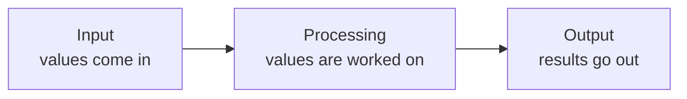
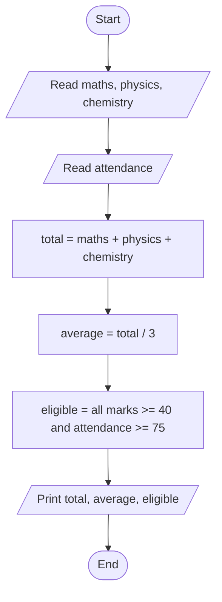
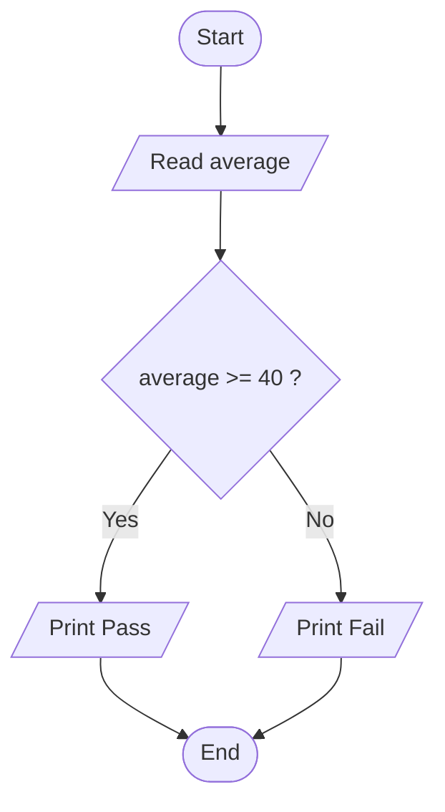
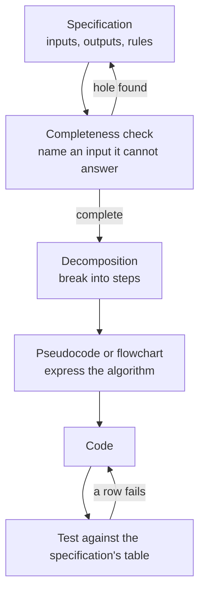

# Computational Thinking and Problem Specification

A request written in English is not a program. *"Tell me which students can sit the examination"* names no inputs, no outputs and no rules, so there is nothing to type.

Four tools turn a request like that into something codeable, and they are used in this order:

- A **specification** states what the program must do.
- **Decomposition** breaks that into steps small enough to code.
- **Pseudocode** writes each step in structured English.
- A **flowchart** draws the same steps, so that branches are visible.

That one request is the worked example throughout. The chapter ends with the finished Python program, which uses nothing beyond chapters 1 to 3.

---

## Specification

A **specification** states what a program must do before any of it is written: its inputs, its outputs, and the rules that connect them. It comes first, because a problem cannot be broken into steps until it has been fully defined.

### The Four Sections

| Section | Contains |
|---|---|
| Purpose | One sentence saying what the program is for |
| Inputs | Every value taken, with its type and valid range |
| Outputs | Every value produced, with the format it is printed in |
| Rules | How each output is derived, and what happens for every input that is not ordinary |

### The Eligibility Specification

**Purpose.** Report a student's total and average across three subjects, and whether the student may sit the examination.

**Inputs**

| Name | Type | Valid range | Source |
|---|---|---|---|
| `maths` | `float` | 0 to 100 | Keyboard |
| `physics` | `float` | 0 to 100 | Keyboard |
| `chemistry` | `float` | 0 to 100 | Keyboard |
| `attendance` | `float` | 0 to 100 | Keyboard |

**Outputs**

| Name | Type | Printed as |
|---|---|---|
| `total` | `float` | `Total    : 255.50` |
| `average` | `float` | `Average  : 85.17` |
| `eligible` | `bool` | `Eligible : True` |

**Rules**

- `total` is the sum of the three marks.
- `average` is `total / 3`, displayed to two decimal places.
- `eligible` is `True` when **every** mark is 40 or above **and** `attendance` is 75 or above.
- A mark or attendance value outside 0 to 100 is invalid: the program reports the problem and stops.
- Input that is not a number is invalid: the program reports the problem and stops.

The third rule settles something the original request left open. The 40 threshold applies to every mark, not to the average. Written down, that decision can be checked with the teacher before any code exists.

### The Completeness Check

One statement tests a specification:

> A computer does exactly what you tell it to do, nothing more and nothing less.

A person reading a specification fills gaps from common sense without noticing. A machine fills none. So the check is a single question, asked until it stops producing answers:

> Can I name an input for which this specification does not state an output?

Applied to the specification above **before** its last two rules were added:

| Input | Does the specification answer it? |
|---|---|
| 88, 76.5, 91, 82 | Yes |
| 88, 76.5, **150**, 82 | No. A mark above 100 was not covered |
| 88, 76.5, **-10**, 82 | No. A negative mark was not covered |
| 88, 76.5, **abc**, 82 | No. Non-numeric input was not covered |
| 88, 76.5, 91, **120** | No. Attendance above 100 was not covered |
| 88, 76.5, 91, *(blank)* | No. Pressing Enter without typing was not covered |

Each hole becomes a rule, which is where the last two rules of the specification came from. Two holes remain even now: attendance divided by zero classes held, and how many decimal places an input may carry, given that `39.999 >= 40` is `False`. The question is asked repeatedly for that reason, not once.

### The Cost of a Missing Rule

A missing rule shows up in Python in one of two ways.

**The program stops.** Non-numeric input reaches `float()` and raises an error:

```python
maths = float(input("Mathematics: "))
```

**Error**

```
ValueError: could not convert string to float: 'abc'
```

Pressing Enter without typing anything produces the same error with an empty string in the message.

**The program does not stop.** An out-of-range mark is a perfectly valid `float`, so every calculation runs and every result is wrong:

```python
total = 88 + 76.5 + 150
average = total / 3
eligible = 88 >= 40 and 76.5 >= 40 and 150 >= 40 and 82 >= 75
print(f"Average  : {average:.2f}")
print(f"Eligible : {eligible}")
```

**Output**

```
Average  : 104.83
Eligible : True
```

An average of 104.83 out of 100, and an eligible student, from a single mark that should have been rejected. Nothing objected, because nothing in the program was ever told that 150 is impossible. Of the two failures, the `ValueError` is the more useful one, since it names the problem and the line.

Neither invalid-input rule can be coded yet, because rejecting an input needs a conditional, which is the next chapter. The specification records the rule now; the code follows.

### The Test Table

A specification is finished when its test table can be filled in before the program exists: one row per case, with the expected answer written out.

| `maths` | `physics` | `chemistry` | `attendance` | `average` | `eligible` |
|---|---|---|---|---|---|
| 88 | 76.5 | 91 | 82 | 85.17 | `True` |
| 88 | 76.5 | 91 | 60 | 85.17 | `False` |
| 88 | 35 | 91 | 90 | 71.33 | `False` |
| 40 | 40 | 40 | 75 | 40.00 | `True` |
| 0 | 0 | 0 | 100 | 0.00 | `False` |

Row 4 sits exactly on both thresholds. It is the row that catches a program written with `>` where the specification says `>=`, because with `>` that row would produce `False`.

A row you cannot fill in means the specification still has a hole.

---

## Decomposition

**Decomposition** is breaking a problem into steps small enough that each one is obviously codeable.

"Report which students can sit the examination" is not a step; it is the whole job restated. The specification turns it into six:

1. Read the marks for three subjects.
2. Read the attendance percentage.
3. Add the three marks to get the total.
4. Divide the total by three to get the average.
5. Work out eligibility from the marks and the attendance.
6. Print the total, the average and the decision.

### The Test for a Good Step

The test is mechanical: one sentence, one verb, and something that could be written and checked on its own.

| Step | Small enough | Reason |
|---|---|---|
| Read the attendance percentage | Yes | One verb, one value, testable by itself |
| Add the three marks | Yes | One calculation with an answer you can check by hand |
| Work out eligibility | Yes | Rule 3 of the specification states the exact test |
| Handle the student record | No | No single verb, and no way to tell when it is finished |

The third row is the reason a specification comes first. Without rule 3, "work out eligibility" would hide a decision nobody had made, and the step could not be coded or tested.

### Input, Processing and Output

Every step falls into one of three groups:



Sorting the steps this way catches a value nobody asked for:

| Kind | Steps from the eligibility problem |
|---|---|
| Input | Three marks; the attendance percentage |
| Processing | Total; average; the eligibility decision |
| Output | Total, average and decision, printed |

**Try this now.** On paper, decompose this and sort it into the three groups: *"Read a bill in whole rupees and a number of people, and report what each person pays and how much cannot be divided evenly."*

| Kind | Steps |
|---|---|
| Input | Read the bill; read the number of people |
| Processing | Divide to get each share; take the remainder |
| Output | Print the share; print the remainder |

The share and the remainder are separate steps even though they come from the same two numbers, because they use different operators, they can be wrong independently, and they are tested separately.

---

## Pseudocode

**Pseudocode** is a description of an algorithm written in structured English, using no programming language's syntax. It is never run. Its purpose is to get the logic right while the cost of being wrong is one crossed-out line.

### Conventions

There is no official standard and textbooks differ. What matters is that it is unambiguous and internally consistent:

| Convention | Example |
|---|---|
| One instruction per line | `SET total = a + b` |
| Keywords in capitals | `START`, `END`, `READ`, `SET`, `PRINT`, `IF`, `ELSE`, `WHILE` |
| Indentation shows what sits inside a block | Lines under an `IF` are indented |
| Names match what they will be called in code | `total`, not "the sum thing" |

The six decomposed steps, written out:

```
START
READ maths, physics, chemistry
READ attendance
SET total = maths + physics + chemistry
SET average = total / 3
SET eligible = (maths >= 40) AND (physics >= 40) AND (chemistry >= 40) AND (attendance >= 75)
PRINT total, average, eligible
END
```

### Pseudocode to Python

Each line has one Python counterpart, which is the point of writing it:

| Pseudocode | Python |
|---|---|
| `READ maths` | `maths = float(input("Mathematics: "))` |
| `SET total = maths + physics + chemistry` | `total = maths + physics + chemistry` |
| `SET average = total / 3` | `average = total / 3` |
| `SET eligible = (maths >= 40) AND ...` | `eligible = maths >= 40 and ...` |
| `PRINT average` | `print(f"Average  : {average:.2f}")` |

### Deliberate Omissions

The left column above does not mention the prompt text, the `float()` conversion, the two-decimal formatting or the quotation marks. Those are Python's concerns, not the algorithm's.

Pseudocode that specifies them is Python with the punctuation removed, and it saves nothing. If pseudocode is as long as the program, the program has been written twice.

---

## Flowcharts

A **flowchart** is a diagram of an algorithm in which each shape means one kind of step. Pseudocode is faster to write; a flowchart is faster to read, and it makes a branch visible at a glance.

The symbols are standardised in ISO 5807:1985, and five of them cover everything at this level.

### The Five Symbols

| Shape | Name | Meaning |
|---|---|---|
| Rounded box | Terminator | Start or End |
| Parallelogram | Data | Input or output |
| Rectangle | Process | A calculation or an assignment |
| Diamond | Decision | A question with exactly two exits |
| Arrow | Flow line | The order steps are carried out in |

### A Straight-Line Path

The eligibility program has no branch, because the eligibility test stores the answer to a comparison rather than choosing between two actions. It runs straight down the page:



### A Path with a Decision

A program that prints *Pass* or *Fail* instead of storing `True` or `False` does branch. The path splits at the diamond and the two halves meet again:



There are now two ways through this program. Running it once and seeing *Pass* leaves the other path untested, which is why a test table needs a row for each branch.

### Two Rules to Check

**A diamond has one arrow in and exactly two out**, each labelled `Yes` and `No`, or `True` and `False`. A diamond with one exit is not a decision. A diamond with three is two decisions drawn as one.

**Every path must reach End.** Trace each branch. A path that stops in mid-air, or loops back with no way out, is a fault caught before any code is written.

A common faulty diagram runs Start → Read `mark` → `mark >= 40 ?` → Yes → Print Pass → End, with no arrow leaving the `No` side. Nothing is defined for a mark of 35, so that student has no path through the program. The missing arrow is a missing rule, found with a pen.

---

## From Specification to Program

Every line of the pseudocode maps onto Python that uses nothing beyond chapters 1 to 3:

```python
maths = float(input("Mathematics: "))
physics = float(input("Physics: "))
chemistry = float(input("Chemistry: "))
attendance = float(input("Attendance (%): "))

total = maths + physics + chemistry
average = total / 3
eligible = maths >= 40 and physics >= 40 and chemistry >= 40 and attendance >= 75

print(f"Total    : {total:.2f}")
print(f"Average  : {average:.2f}")
print(f"Eligible : {eligible}")
```

**Output**

```
Mathematics: 88
Physics: 76.5
Chemistry: 91
Attendance (%): 82
Total    : 255.50
Average  : 85.17
Eligible : True
```

That is row 1 of the test table. Run the program four more times with rows 2 to 5 and compare each result against the table. The two invalid-input rules are not in this program, because rejecting an input needs a conditional.

---

## The Working Order



The loop on the left is the cheapest one in the diagram. Every stage to its right costs more to repeat.

---

## Practice

The first three ask for a specification, pseudocode and a flowchart **before** any code. Write them in a file beside the program and keep them; they are as much the deliverable as the code.

**1. Rectangle report.** A program reads a length and a breadth and reports the area and the perimeter to two decimal places. Write the four-section specification, the test table, the pseudocode and the flowchart. Then write the program and check it against every row of the table.

**Hint.** The Rules section is where the work is. Both inputs are measured, so `float`. Apply the completeness check before coding: what should happen for a breadth of 0, for a negative length, and for the word `wide`? The table needs a row for each.

**2. Bill splitter.** A program reads a bill in whole rupees and a number of people, and reports each share and the remainder that cannot be divided.

**Hint.** Three rules decide this, and none of them is the division: what happens when the number of people is zero, what happens when the bill is smaller than the number of people, and what happens when somebody types `2470.50`. Answer all three in writing first.

**3. Grade calculator.** A program reads three marks and reports the average and a grade: 90 and above is A, 75 to 89 is B, 40 to 74 is C, below 40 is F. Write the specification and draw the flowchart, then stop. The code needs conditionals, and this flowchart is what it will be built from.

**Hint.** Three diamonds, chained, with the `No` exit of each feeding the next. Check the boundaries as you draw: a mark of exactly 75 must land in B and nowhere else, and all four paths have to reach End.

**4. Finding the holes.** Apply the completeness check to the specification below and list every input it fails to answer for. Find at least four, then rewrite it so that none remain.

> **Purpose.** Convert a temperature from Celsius to Fahrenheit.
> **Inputs.** `celsius`, a number, from the keyboard.
> **Outputs.** The temperature in Fahrenheit, to two decimal places.
> **Rules.** `fahrenheit = celsius * 9 / 5 + 32`.

**Hint.** Start with input that is not a number, then input that is blank. Then ask what "a number" is allowed to mean, given that nothing can be colder than -273.15. Then read the Outputs section again: it never states what the printed line looks like.

**5. Reading a flowchart.** Write the pseudocode for the diagram below, then the Python.


**Hint.** Four lines of pseudocode between `START` and `END`, and one Python line for each. There is no diamond, so there is no `IF`. The second rectangle stores the answer to a comparison rather than branching on it.

---

## Readiness Check

- You can state the test for a step being small enough to code, and apply it to a step somebody hands you.
- You have written pseudocode that is shorter than the program it describes.
- You can look at a flowchart and say whether every path reaches End.
- You have written a four-section specification whose Rules section covers at least one input that is not ordinary.
- You applied the completeness check to your own specification and it produced a hole you had missed.
- Your test table was written before the program, not after it.

---

## Reference

**[Jeannette M. Wing, "Computational Thinking", *Communications of the ACM* 49(3), March 2006](https://dl.acm.org/doi/10.1145/1118178.1118215)** — the three-page paper that named the subject and defined it as reformulating a problem into one a machine can solve.

**ISO 5807:1985** — *Information processing — Documentation symbols and conventions for data, program and system flowcharts, program network charts and system resources charts*, the standard the flowchart symbols come from. Listed in the ISO catalogue at iso.org.

**[PEP 20 — The Zen of Python](https://peps.python.org/pep-0020/)** — nineteen lines on what makes a Python solution a good one. "Explicit is better than implicit" is the one that describes a specification.
