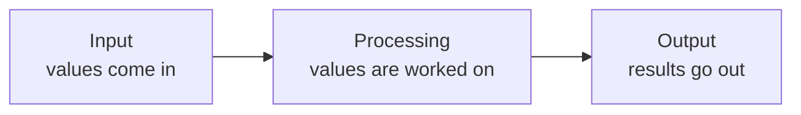

# Computational Thinking and Problem Specification

A request written in English is not a program. *"Tell me which students can sit the examination"* names no inputs, no outputs and no rules, so there is nothing to type.

Four tools turn a request like that into something codeable, and they are used in this order:

- A **specification** states what the program must do.
- **Decomposition** breaks that into steps small enough to code.
- **Pseudocode** writes each step in structured English.
- A **flowchart** draws the same steps, so that branches are visible.

That one request is the worked example throughout.

---

## Specification

A **specification** states what a program must do before any of it is written: its inputs, its outputs, and the rules that connect them.

It comes first for two reasons. A problem cannot be broken into steps until it has been defined, and most requests arrive with a decision still missing. *"Which students can sit the examination"* does not say whether the 40 mark threshold applies to every subject or only to the average. Written into a specification, that decision can be settled with the person who asked before any code exists. Left unwritten, it gets decided by accident, somewhere in the middle of a program.

### The Four Sections

| Section | Contains |
|---|---|
| Purpose | One sentence saying what the program is for |
| Inputs | Every value taken, with its type and valid range |
| Outputs | Every value produced, with the format it is printed in |
| Rules | How each output is derived, and what happens for every input that is not ordinary |

The Rules section is the one that gets left incomplete. Deriving the average is easy to write down; saying what happens when a mark arrives as `150`, as `-10`, as `abc`, or as nothing at all is the work.

### The Completeness Check

One statement tests a specification:

> A computer does exactly what you tell it to do, nothing more and nothing less.

A person reading a specification fills gaps from common sense without noticing. A machine fills none. So the check is a single question, asked until it stops producing answers:

> Can I name an input for which this specification does not state an output?

Applied to a specification for the eligibility request that covers only the ordinary case:

| Input | Does the specification answer it? |
|---|---|
| 88, 76.5, 91, 82 | Yes |
| 88, 76.5, **150**, 82 | No. A mark above 100 was not covered |
| 88, 76.5, **-10**, 82 | No. A negative mark was not covered |
| 88, 76.5, **abc**, 82 | No. Non-numeric input was not covered |
| 88, 76.5, 91, **120** | No. Attendance above 100 was not covered |
| 88, 76.5, 91, *(blank)* | No. Pressing Enter without typing was not covered |

Each hole becomes a rule. Two of them survive even a careful first pass: attendance divided by zero classes held, and how many decimal places an input may carry, given that `39.999 >= 40` is `False`. The question is asked repeatedly for that reason, not once.

---

## Decomposition

**Decomposition** is breaking a problem into steps small enough that each one is obviously codeable.

"Report which students can sit the examination" is not a step; it is the whole job restated. The specification turns it into six:

1. Read the marks for three subjects.
2. Read the attendance percentage.
3. Add the three marks to get the total.
4. Divide the total by three to get the average.
5. Work out eligibility from the marks and the attendance.
6. Print the total, the average and the decision.

### The Test for a Good Step

The test is mechanical: one sentence, one verb, and something that could be written and checked on its own.

| Step | Small enough | Reason |
|---|---|---|
| Read the attendance percentage | Yes | One verb, one value, testable by itself |
| Add the three marks | Yes | One calculation with an answer you can check by hand |
| Work out eligibility | Yes | The specification states the exact test: every mark 40 or above, and attendance 75 or above |
| Handle the student record | No | No single verb, and no way to tell when it is finished |

The third row is the reason a specification comes first. Without that rule written down, "work out eligibility" would hide a decision nobody had made, and the step could be neither coded nor tested.

### Input, Processing and Output

Every step falls into one of three groups:



Sorting the steps this way catches a value nobody asked for:

| Kind | Steps from the eligibility problem |
|---|---|
| Input | Three marks; the attendance percentage |
| Processing | Total; average; the eligibility decision |
| Output | Total, average and decision, printed |

**Try this now.** On paper, decompose this and sort it into the three groups: *"Read a bill in whole rupees and a number of people, and report what each person pays and how much cannot be divided evenly."*

| Kind | Steps |
|---|---|
| Input | Read the bill; read the number of people |
| Processing | Divide to get each share; take the remainder |
| Output | Print the share; print the remainder |

The share and the remainder are separate steps even though they come from the same two numbers, because they use different operators, they can be wrong independently, and they are tested separately.

---

## Pseudocode

**Pseudocode** is a description of an algorithm written in structured English, using no programming language's syntax. It is never run. Its purpose is to get the logic right while the cost of being wrong is one crossed-out line.

### Conventions

There is no official standard and textbooks differ. What matters is that it is unambiguous and internally consistent:

| Convention | Example |
|---|---|
| One instruction per line | `SET total = a + b` |
| Keywords in capitals | `START`, `END`, `READ`, `SET`, `PRINT`, `IF`, `ELSE`, `WHILE` |
| Indentation shows what sits inside a block | Lines under an `IF` are indented |
| Names match what they will be called in code | `total`, not "the sum thing" |

The six decomposed steps, written out:

```
START
READ maths, physics, chemistry
READ attendance
SET total = maths + physics + chemistry
SET average = total / 3
SET eligible = (maths >= 40) AND (physics >= 40) AND (chemistry >= 40) AND (attendance >= 75)
PRINT total, average, eligible
END
```

### Pseudocode to Python

Each line has one Python counterpart, which is the point of writing it:

| Pseudocode | Python |
|---|---|
| `READ maths` | `maths = float(input("Mathematics: "))` |
| `SET total = maths + physics + chemistry` | `total = maths + physics + chemistry` |
| `SET average = total / 3` | `average = total / 3` |
| `SET eligible = (maths >= 40) AND ...` | `eligible = maths >= 40 and ...` |
| `PRINT average` | `print(f"Average  : {average:.2f}")` |

### Deliberate Omissions

The left column above does not mention the prompt text, the `float()` conversion, the two-decimal formatting or the quotation marks. Those are Python's concerns, not the algorithm's.

Pseudocode that specifies them is Python with the punctuation removed, and it saves nothing. If pseudocode is as long as the program, the program has been written twice.

---

## Flowcharts

A **flowchart** is a diagram of an algorithm in which each shape means one kind of step. Pseudocode is faster to write; a flowchart is faster to read, and it makes a branch visible at a glance.

The symbols are standardised in ISO 5807:1985, and five of them cover everything at this level.

### The Five Symbols

| Shape | Name | Meaning |
|---|---|---|
| Rounded box | Terminator | Start or End |
| Parallelogram | Data | Input or output |
| Rectangle | Process | A calculation or an assignment |
| Diamond | Decision | A question with exactly two exits |
| Arrow | Flow line | The order steps are carried out in |

### A Straight-Line Path

The eligibility program has no branch, because the eligibility test stores the answer to a comparison rather than choosing between two actions. It runs straight down the page:


### A Path with a Decision

A program that prints *Pass* or *Fail* instead of storing `True` or `False` does branch. The path splits at the diamond and the two halves meet again:


There are now two ways through this program. Running it once and seeing *Pass* leaves the other path untested, so a test needs a case for each branch.

### Two Rules to Check

**A diamond has one arrow in and exactly two out**, each labelled `Yes` and `No`, or `True` and `False`. A diamond with one exit is not a decision. A diamond with three is two decisions drawn as one.

**Every path must reach End.** Trace each branch. A path that stops in mid-air, or loops back with no way out, is a fault caught before any code is written.

A common faulty diagram runs Start → Read `mark` → `mark >= 40 ?` → Yes → Print Pass → End, with no arrow leaving the `No` side. Nothing is defined for a mark of 35, so that student has no path through the program. The missing arrow is a missing rule, found with a pen.

---

## Reference

**[Jeannette M. Wing, "Computational Thinking", *Communications of the ACM* 49(3), March 2006](https://dl.acm.org/doi/10.1145/1118178.1118215)** — the three-page paper that named the subject and defined it as reformulating a problem into one a machine can solve.

**ISO 5807:1985** — *Information processing — Documentation symbols and conventions for data, program and system flowcharts, program network charts and system resources charts*, the standard the flowchart symbols come from. Listed in the ISO catalogue at iso.org.

**[PEP 20 — The Zen of Python](https://peps.python.org/pep-0020/)** — nineteen lines on what makes a Python solution a good one. "Explicit is better than implicit" is the one that describes a specification.
