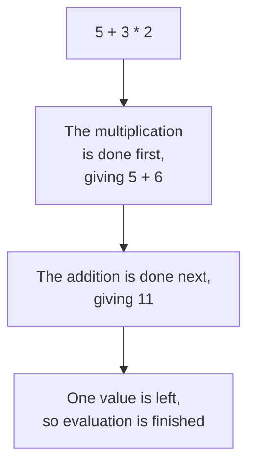

# Operators, Operands and Expressions

The next three topics are about operators. Each one introduces a different group of them, and all three use the same handful of words to explain what is happening. This topic settles those words first, so that nothing later has to stop and define them.

## Operators and Operands

An **operator** is a symbol or keyword that performs an **operation** on values. The values it works on are called its **operands**.

Take the simplest possible piece of Python:

```python
print(7 + 2)
```

**Output:**

```
9
```

That short line has three named parts:

| Part | Name |
|---|---|
| `7` | the left operand |
| `+` | the operator |
| `2` | the right operand |

The operator decides what happens. The operands decide what it happens to. You have already used operators without the name: `+` in the last topic, and `=` since the very first program.

## Unary and Binary Operators

Most operators take two operands, one on each side. These are called **binary** operators. The `+` above is one.

A few take a single operand. These are called **unary** operators. The minus sign in front of a negative number is one:

```python
temperature = -5
print(temperature)
```

**Output:**

```
-5
```

Here the `-` has nothing on its left. It works on the single operand `5` and turns it negative. You will meet one more unary operator, `not`, two topics from now.

## Expressions and Evaluation

An **expression** is any piece of code that produces a value. `7 + 2` is an expression. So is a single value like `9`, and so is a variable name on its own.

Working out the value of an expression is called **evaluation**. Python evaluates an expression by reducing it, step by step, until one value is left:

```python
print(5 + 3 * 2)
```

**Output:**

```
11
```



Notice that the multiplication went first, even though it appears second. When one expression holds several operators, the order is not left to right. It is fixed by a set of rules called **operator precedence**, and those rules are covered later, once the operators themselves are familiar.

An expression can be used anywhere a value can be used. It can be printed, or stored in a variable:

```python
total = 5 + 3 * 2
print(total)
```

**Output:**

```
11
```

The expression on the right was evaluated first, and only its final value, `11`, was stored. The expression itself is not kept.

## Conditions

A **condition** is an expression whose value is either `True` or `False`. Nothing else. It is the form a program needs whenever it has to choose between two courses of action.

```python
marks = 87
print(marks > 35)
```

**Output:**

```
True
```

`marks > 35` is a condition. Its value is `True`, because 87 is above 35.

Conditions are built from comparison operators such as `>`, and joined together with logical operators such as `and`. Those are the subjects of the two topics after next, so the details can wait. What matters here is the shape of the idea: a condition asks a question and its value is the answer, `True` or `False`.

## Categories of Operators

Python groups its operators by the kind of work they do. There are seven categories in all.

| Category | Operators | What they do |
|---|---|---|
| Arithmetic | `+` `-` `*` `/` `//` `%` `**` | calculate with numbers |
| Comparison | `==` `!=` `>` `<` `>=` `<=` | compare two operands and return `True` or `False` |
| Logical | `and` `or` `not` | combine `True` and `False` values into one |
| Assignment | `=` `+=` `-=` `*=` `/=` `//=` `%=` `**=` | store a value in a variable |
| Membership | `in` `not in` | check whether a value appears inside a sequence |
| Bitwise | `&` `\|` `^` `~` `<<` `>>` | work on the individual bits of a number |
| Identity | `is` `is not` | check whether two names refer to the same object |

The first six categories are covered in the topics that follow, in the order listed above.

Identity operators are the exception, and they come later. They deal with **objects**, which is how Python stores values in memory, and that has not been covered yet. Without it, `is` and `is not` cannot be shown doing anything that `==` does not already do. They return once objects have been introduced.

## Further Reading

- **All seven categories with examples** — https://www.geeksforgeeks.org/python/python-operators/
- **Python operators reference** — https://www.programiz.com/python-programming/operators

You now have the vocabulary that the next three topics rest on: operator, operand, expression, evaluation and condition. Next, you will use the first group of them, and start calculating with numbers.
