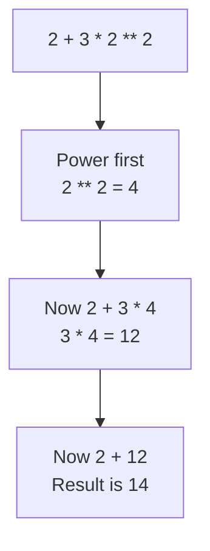

# Arithmetic Operators

You now know what an operator and an operand are. This topic covers the first category of them, the **arithmetic operators**, which perform calculations on numbers.

Python has seven. Four behave exactly as they do in mathematics. The other three need a closer look.

## The Seven Arithmetic Operators

| Operator | Name | Example | Result |
|---|---|---|---|
| `+` | addition | `7 + 2` | `9` |
| `-` | subtraction | `7 - 2` | `5` |
| `*` | multiplication | `7 * 2` | `14` |
| `/` | division | `7 / 2` | `3.5` |
| `//` | floor division | `7 // 2` | `3` |
| `%` | modulus | `7 % 2` | `1` |
| `**` | exponentiation | `7 ** 2` | `49` |

The first three need no explanation:

```python
print(7 + 2)
print(7 - 2)
print(7 * 2)
```

**Output:**

```
9
5
14
```

## The Division Operator

The `/` operator performs division and keeps the fractional part:

```python
print(7 / 2)
```

**Output:**

```
3.5
```

One detail catches everyone. `/` always returns a `float`, even when the division is exact:

```python
print(10 / 5)
```

**Output:**

```
2.0
```

The result is `2.0`, not `2`. Both operands were integers, and the result is still a floating-point number. Division in Python always works this way.

## The Floor Division Operator

The `//` operator performs **floor division**. It divides, then takes the **floor** of the result, which means the nearest whole number below it. For positive operands this simply removes the fractional part:

```python
print(7 // 2)
```

**Output:**

```
3
```

Seven divided by two is `3.5`, so floor division returns `3`. Nothing is rounded up, whatever the fractional part happens to be.

Use `//` when a fractional answer would be meaningless. Sixteen students filling cars that seat five each means three full cars, not `3.2` cars.

## The Modulus Operator

The `%` operator performs the **modulus** operation, which returns the remainder left over after a division:

```python
print(7 % 2)
```

**Output:**

```
1
```

Work through what happened. You are dividing seven by two:

- Two goes into seven **three** times. That accounts for 3 × 2 = 6.
- Seven minus six leaves **1**.
- Nothing more can be taken out, because 1 is smaller than 2.

That leftover `1` is the remainder, and it is what `%` returns.

Floor division and modulus work as a pair. `//` returns how many times the divisor went in, and `%` returns what was left behind:

```python
print(17 // 5)
print(17 % 5)
```

**Output:**

```
3
2
```

Five goes into seventeen **three** times, which accounts for 15. Seventeen minus fifteen leaves **2**, and 2 is too small for another five. So `//` returned the three, and `%` returned the two.

A modulus result of `0` means the division was exact. This is how a program tests whether one number divides evenly into another:

```python
print(10 % 2)
print(11 % 2)
```

**Output:**

```
0
1
```

Ten is divisible by two, so nothing is left over and the remainder is `0`. Eleven is not, so it leaves `1`.

## The Exponentiation Operator

The `**` operator performs **exponentiation**, raising the left operand to the power of the right:

```python
print(2 ** 3)
print(5 ** 2)
```

**Output:**

```
8
25
```

So `2 ** 3` is 2 × 2 × 2, which is `8`.

A single `*` performs multiplication, while two together perform exponentiation. They are easy to mix up, and Python will not warn you, because both are valid.

## Integer and Float Operands

An arithmetic operator can take one integer and one float. Python converts the integer to a float first, then does the work:

```python
print(7 + 2.0)
```

**Output:**

```
9.0
```

Both operands had to be the same type before addition could happen, so `7` became `7.0`. The result is a `float`.

This is called **implicit type conversion**, because Python performs it on its own. The conversions in the earlier topic, using `int()` and `float()`, are **explicit type conversion**, because you asked for them.

The rule to remember is short. Mix a `float` into a calculation and the result is a `float`.

## Division by Zero

No division operator can divide by zero, and all three stop the program if asked to:

```python
print(10 / 0)
```

**Output:**

```
ZeroDivisionError: division by zero
```

`ZeroDivisionError` is the name Python gives this error. The same happens with `//` and `%`, since both also divide.

This is worth knowing because the divisor is often a value from the person using the program, or the result of an earlier calculation, and either could turn out to be zero. Handling that safely comes later, in the topic on exceptions.

## Operator Precedence

A single expression can hold several operators. Python does not evaluate it from left to right. It follows a fixed order called **operator precedence**:

1. Parentheses `( )`
2. Exponentiation `**`
3. Multiplication `*`, division `/`, floor division `//`, modulus `%`
4. Addition `+`, subtraction `-`

Within levels 3 and 4, operators are evaluated from left to right.

Take one expression as an example:

```python
print(2 + 3 * 2 ** 2)
```

**Output:**

```
14
```

The three operators were applied in order of precedence, not in the order they appear:



Parentheses sit at the top of the list, so anything inside them is evaluated before everything else. Adding a pair to the same expression changes the result:

```python
print((2 + 3) * 2 ** 2)
```

**Output:**

```
20
```

Now `2 + 3` is evaluated first and gives `5`, then `2 ** 2` gives `4`, and `5 * 4` gives `20`. Same operands, same operators, different result.

When an expression holds more than two operators, add parentheses even where precedence would already give the right answer. They cost nothing, and they show your reader exactly what you meant.

## Further Reading

- **Floor division explained** — https://www.geeksforgeeks.org/floor-division-in-python/
- **The modulus operator in depth** — https://realpython.com/python-modulo-operator/

You can now calculate with numbers. Next, you will compare them, and get back a Boolean result.
