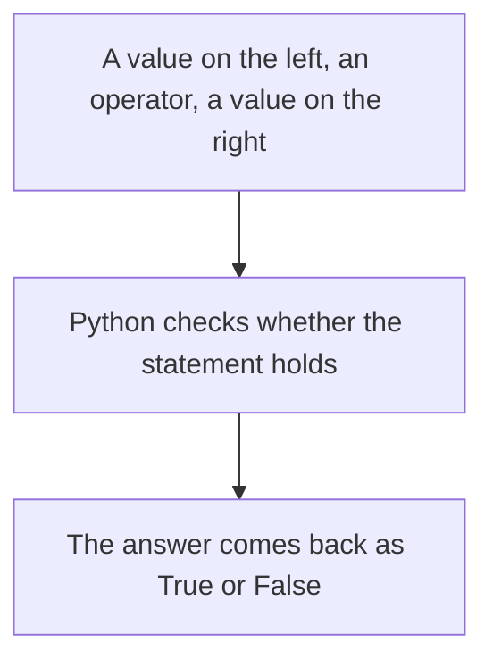

# Comparison Operators

A **comparison operator** compares two values and answers a single question: is this true or not? The answer is never a number. It is always `True` or `False`, the `bool` type you met earlier.

## The Six Comparison Operators

| Operator | Meaning | Example | Result |
|---|---|---|---|
| `==` | equal to | `7 == 7` | `True` |
| `!=` | not equal to | `7 != 7` | `False` |
| `>` | greater than | `7 > 2` | `True` |
| `<` | less than | `7 < 2` | `False` |
| `>=` | greater than or equal to | `7 >= 7` | `True` |
| `<=` | less than or equal to | `7 <= 2` | `False` |

Each one is written with two characters, and the order of those characters matters. `>=` is correct, and `=>` is not.

## Boolean Results

Put a comparison inside `print` and you see the answer:

```python
print(10 > 5)
print(10 < 5)
```

**Output:**

```
True
False
```

`True` and `False` are written with a capital first letter and no quotation marks. They are values in their own right, and a comparison is simply a way of producing one.



The answer can be stored in a variable, like any other value:

```python
marks = 87
passed = marks >= 35
print(passed)
```

**Output:**

```
True
```

The variable `passed` now holds `True`. Nothing has been decided or acted on yet. The comparison only produced an answer.

## Assignment and Equality

The single `=` and the double `==` look alike and do completely different jobs.

- `=` **stores** a value. `age = 12` puts `12` into `age`.
- `==` **asks** a question. `age == 12` asks whether `age` holds `12`.

```python
age = 12
print(age == 12)
print(age == 15)
```

**Output:**

```
True
False
```

The first line stored a value and printed nothing. The next two asked questions and printed answers.

Swapping these two is the most common mistake a beginner makes. Read `=` as "gets" and `==` as "is equal to", and the two stay separate in your mind.

## Comparison of Text Values

Text can be compared as well as numbers. Two pieces of text are equal only when they match exactly:

```python
print("apple" == "apple")
print("apple" == "Apple")
```

**Output:**

```
True
False
```

The second answer is `False` because a capital `A` and a small `a` are different characters to Python. This catches people when they compare a typed answer against a fixed word.

## Comparison of Input Values

The `input` command hands back text, and text is never equal to a number, even when the digits match:

```python
age = input("Age: ")
print(age == 18)
```

**Output:**

```
Age: 18
False
```

The person typed `18` and the answer is still `False`, because `"18"` is text and `18` is a number. Convert the value first and the comparison works:

```python
age = int(input("Age: "))
print(age == 18)
```

**Output:**

```
Age: 18
True
```

Whenever a comparison gives an answer you did not expect, check the types of both values before checking anything else.

## Further Reading

- **The six operators with worked examples** — https://www.pythontutorial.net/python-basics/python-comparison-operators/
- **Comparison operators across different data types** — https://www.geeksforgeeks.org/python/relational-operators-in-python/

Every comparison here asked one question. Next, you will join two or more questions together and get a single answer from them.
