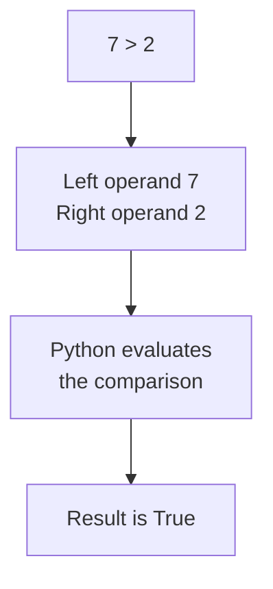

# Comparison Operators

This is the second category of operators. A **comparison operator**, also called a relational operator, compares two operands and returns a **Boolean** value: either `True` or `False`. The result is never a number.

That makes these operators the tools that build **conditions**, since a condition is simply an expression whose value is `True` or `False`.

## The Six Comparison Operators

| Operator | Name | Example | Result |
|---|---|---|---|
| `==` | equal to | `7 == 7` | `True` |
| `!=` | not equal to | `7 != 7` | `False` |
| `>` | greater than | `7 > 2` | `True` |
| `<` | less than | `7 < 2` | `False` |
| `>=` | greater than or equal to | `7 >= 7` | `True` |
| `<=` | less than or equal to | `7 <= 2` | `False` |

Four of these are written with two characters, and the order of those characters matters. `>=` is correct, and `=>` is not.

## Boolean Results

Place a comparison expression inside `print()` and you see its value:

```python
print(10 > 5)
print(10 < 5)
```

**Output:**

```
True
False
```

Every comparison follows the same three steps, whichever operator it uses:



`True` and `False` are the only two values of the `bool` type. They are written with a capital first letter and no quotation marks.

## The Equality and Inequality Operators

`==` asks whether two operands hold the same value. `!=` asks the opposite, whether they differ. Exactly one of the two is always `True`:

```python
marks = 87
print(marks == 87)
print(marks != 87)
```

**Output:**

```
True
False
```

The mark is 87, so `==` returned `True` and `!=` returned `False`. Change the mark to anything else and both results swap.

`!=` saves you from writing a comparison the long way round. Asking whether a value is not 87 needs one operator, not two.

## The Greater Than and Less Than Operators

`>` and `<` compare size. Both are strict, meaning equal operands give `False`:

```python
marks = 35
print(marks > 35)
print(marks < 35)
```

**Output:**

```
False
False
```

Both are `False`, and there is no mistake here. The mark is neither above 35 nor below it. It is exactly 35, and neither operator counts that as a match.

## The Greater Than or Equal To and Less Than or Equal To Operators

`>=` and `<=` are the same two comparisons with the equal case included. This is the difference that decides whether a boundary value is inside or outside:

```python
marks = 35
print(marks > 35)
print(marks >= 35)
```

**Output:**

```
False
True
```

Same mark, same direction, opposite results. If a pass mark of 35 counts as a pass, `>=` is the correct operator and `>` is a bug.

Choosing between them is worth a moment's thought every time. Ask yourself whether the boundary value belongs in or out.

## Storing a Boolean Result

The value of a comparison expression can be stored in a variable, like any other value:

```python
marks = 87
passed = marks >= 35
print(passed)
```

**Output:**

```
True
```

The variable `passed` now holds `True`. Nothing has been decided or acted on. The expression was evaluated and its value stored, and the variable can be used later in place of the whole comparison.

## Assignment and Equality Operators

The single `=` and the double `==` look alike and do completely different jobs. Each has its own name.

- `=` is the **assignment operator**. It stores a value. `age = 12` assigns `12` to `age`.
- `==` is the **equality operator**. It compares. `age == 12` asks whether `age` holds `12`.

```python
age = 12
print(age == 12)
print(age == 15)
```

**Output:**

```
True
False
```

The first line stored a value and produced nothing. The next two evaluated comparison expressions, and `print()` displayed each result.

Confusing these two is the most common mistake a beginner makes. Read `=` as "gets" and `==` as "is equal to", and the two stay separate in your mind.

## Further Reading

- **The six operators with worked examples** — https://www.pythontutorial.net/python-basics/python-comparison-operators/
- **Comparison operators across data types** — https://www.geeksforgeeks.org/python/relational-operators-in-python/

Every expression here compared one pair of operands and produced one Boolean value. Next, you will combine several of those Boolean values into a single result.
