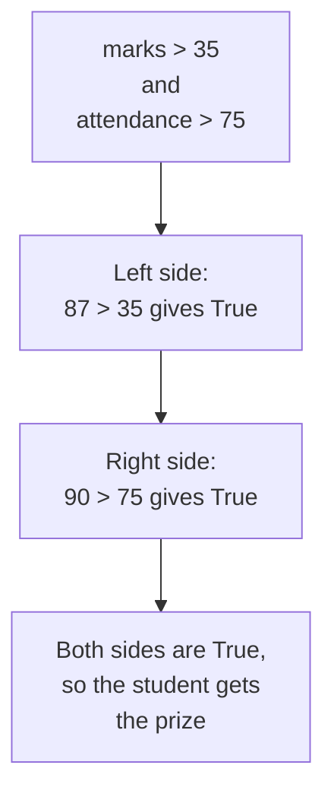
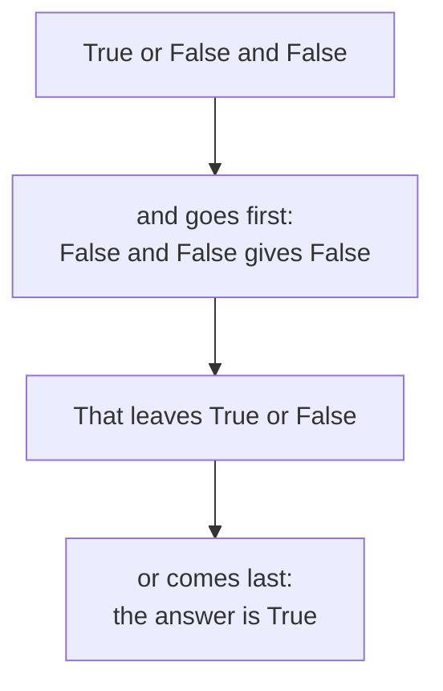

# Logical Operators

A comparison answers one question. Real programs often need two questions answered together. Is the mark above the pass mark, and is the attendance high enough? A **logical operator** joins two or more `True` or `False` values and produces a single `True` or `False` answer.

Python has three of them: `and`, `or` and `not`. They are written as words, in small letters, not as symbols.

## The Logical AND Operator

`and` is strict. It looks at the value on its left and the value on its right, and it gives `True` only when both of them are `True`. If even one side is `False`, the whole answer is `False`.

Think of a prize given to a student who scores above 35 and attends above 75 percent of classes. Both must hold.

```python
marks = 87
attendance = 90
print(marks > 35 and attendance > 75)
```

**Output:**

```
True
```

Python did not read that line as one long question. It worked out each side separately, then joined the two answers:



Now change the attendance and run the same line again:

```python
marks = 87
attendance = 40
print(marks > 35 and attendance > 75)
```

**Output:**

```
False
```

The marks are still fine, so the left side is `True`. But `40 > 75` is `False`. One `False` side is enough to pull the whole answer down to `False`, and the student misses the prize. That is what makes `and` strict.

## The Logical OR Operator

`or` is generous. It also looks at both sides, but it gives `True` when at least one of them is `True`. Both sides being `True` is fine as well. The only way to get `False` from `or` is for both sides to be `False`.

Think of a school trip open to students of class 9 or class 10. A student needs to match only one of the two.

```python
student_class = 9
print(student_class == 9 or student_class == 10)
```

**Output:**

```
True
```

The left side is `True`, because the class is 9. The right side is `False`, because the class is not 10. `or` needed only one `True`, so the student may go on the trip.

```python
student_class = 7
print(student_class == 9 or student_class == 10)
```

**Output:**

```
False
```

Class 7 is neither 9 nor 10. Both sides came out `False`, and that is the one case where `or` gives `False`.

## The Logical NOT Operator

`not` is different from the other two. It works on a single value instead of joining two, and its job is to reverse that value. A `True` becomes `False`. A `False` becomes `True`.

It is the programming form of the word "not" in English. "The student passed" and "the student did not pass" are opposite statements, and exactly one of them is true.

```python
passed = True
print(not passed)
```

**Output:**

```
False
```

`passed` holds `True`, so `not passed` gives `False`, which is the answer to "did the student fail?".

`not` can sit in front of a comparison as well. The comparison is worked out first, and `not` then reverses whatever it produced:

```python
marks = 87
print(not marks < 35)
```

**Output:**

```
True
```

`marks < 35` asked whether the student is below the pass mark, and gave `False`. `not` reversed that into `True`, which reads as "not below the pass mark".

## Order of Evaluation

A single line can hold comparisons and logical operators together. Python does not read such a line from left to right. It follows a fixed order:

1. Comparisons `==` `!=` `>` `<` `>=` `<=`
2. `not`
3. `and`
4. `or`

Comparisons come first, and there is a reason for it. A logical operator can only work on `True` or `False` values, so every comparison in the line has to be turned into one of those before `and` or `or` has anything to join.

After that, `and` is settled before `or`. This is the same idea as multiplication before addition in maths. In `2 + 3 * 4`, the `*` grabs its two numbers first. In the same way, `and` grabs the values on either side of it first, and `or` gets whatever is left.

Take one line as an example:

```python
print(True or False and False)
```

**Output:**

```
True
```

The answer is `True`, even though the line ends with two `False` values. Python worked through it in two steps:



Reading the same line from left to right would have given a different answer. `True or False` would be `True`, and `True and False` would be `False`. That reading is wrong, because it ignores the order Python actually follows.

Brackets exist for exactly this situation. Whatever sits inside a bracket is worked out before anything outside it:

```python
print((True or False) and False)
```

**Output:**

```
False
```

The bracket forced the `or` to go first. `True or False` gave `True`, and then `True and False` gave `False`. The three values never changed. Only the order changed, and the answer flipped.

So when a line mixes `and` with `or`, put brackets around the part you want done first. Even when the order would already be correct, the brackets show your reader what you meant, and they save you from having to remember the list above.

## Incomplete Comparisons

One mistake appears again and again. In English we say "if the mark is above 35 and below 90". Written that way in Python, the line fails:

```python
marks = 87
print(marks > 35 and < 90)
```

**Output:**

```
SyntaxError: invalid syntax
```

`and` joins two complete comparisons, and `< 90` on its own is not one. The variable has to be named on both sides:

```python
marks = 87
print(marks > 35 and marks < 90)
```

**Output:**

```
True
```

Read each side of an `and` or an `or` on its own. If a side cannot stand alone as a full comparison, the line is incomplete.

## Further Reading

- **The three operators with truth tables** — https://www.pythontutorial.net/python-basics/python-logical-operators/
- **All Python operators in one place** — https://www.programiz.com/python-programming/operators

You can now build a full question out of several smaller ones. Next, you will plan a program before writing it, by breaking a problem into steps and drawing those steps out.
