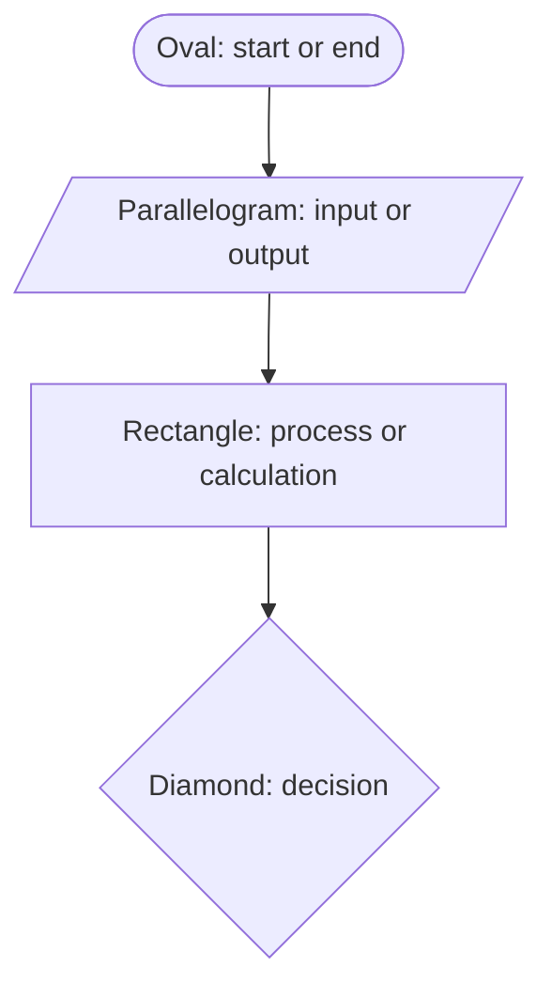
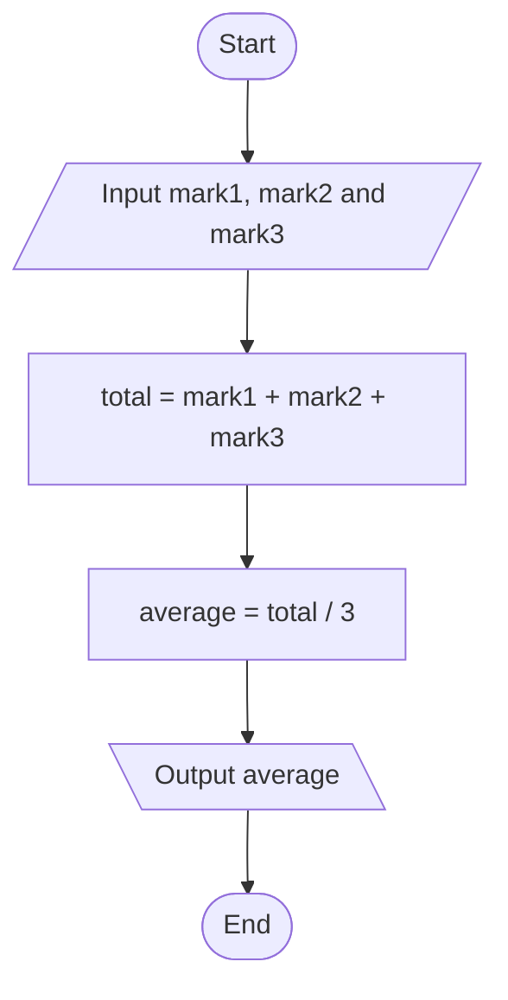
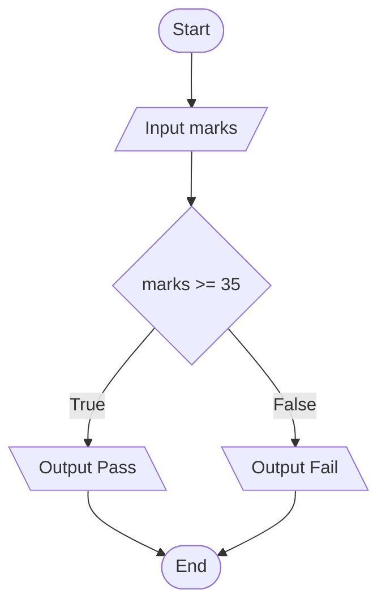

# Decomposition, Pseudocode and Flowcharts

A program is easier to write when you know what you are writing before you start. Three tools help with that, and none of them needs a computer. You break the problem into steps, write those steps in plain English, and draw them as a picture.

Take one problem and carry it through all three: a program that finds the average of a student's three subject marks.

## Decomposition

**Decomposition** means splitting one large problem into small steps, each simple enough to do on its own.

"Find the average of three marks" sounds like one task, and that is why it is hard to start. Nobody knows what the first line of code should be. Split it up and the difficulty disappears:

1. Get the three marks from the student.
2. Add the three marks together.
3. Divide the total by three.
4. Show the answer.

Now look at each step next to what Python already gives you:

| Step | The Python tool for it |
|---|---|
| Get the three marks | `input` |
| Add them together | `+` |
| Divide the total by three | `/` |
| Show the answer | `print` |

Every step matches a tool from an earlier topic. Nothing new is needed, and there is nothing left to invent. That is what a finished decomposition looks like.

A large problem cannot be started. A list of small steps can.

## Pseudocode

**Pseudocode** is the same list of steps, written in short lines that look a little like code. No computer runs it. It exists so the thinking is finished before the typing begins.

A few words are used by convention, in capitals, so the shape of the plan is easy to see:

- `START` and `END` mark the beginning and the finish.
- `INPUT` takes a value from the person.
- `SET` stores a value or works something out.
- `OUTPUT` shows a value on the screen.

The four steps become this:

```
START
INPUT mark1
INPUT mark2
INPUT mark3
SET total = mark1 + mark2 + mark3
SET average = total / 3
OUTPUT average
END
```

Read it beside Python and you will see the family resemblance:

| Pseudocode | Python |
|---|---|
| `INPUT mark1` | `mark1 = int(input("First mark: "))` |
| `SET total = mark1 + mark2 + mark3` | `total = mark1 + mark2 + mark3` |
| `OUTPUT average` | `print("Average:", average)` |
| `START` and `END` | nothing, the file itself begins and ends |

The pseudocode is shorter because it leaves out everything Python fusses about. No brackets, no quotation marks, no `int`. A student who has never seen Python could still read the plan and say what the program does. That is exactly what pseudocode is for.

## Flowchart Symbols

A **flowchart** is the same plan drawn as a diagram. Each kind of step has its own shape, and the shapes are standard everywhere, so anyone can read your chart.

| Shape | Used for | In Python |
|---|---|---|
| Oval | the start and the end | the first and last line of the file |
| Parallelogram | input and output | `input` and `print` |
| Rectangle | a process or a calculation | a line that stores or works something out, using `=` |
| Diamond | a decision | a comparison such as `marks >= 35` |
| Arrow | the direction the steps run in | the order the lines run, top to bottom |



The arrows matter as much as the shapes. Python runs a file from top to bottom, and the arrows are how a flowchart says the same thing.

## The Completed Flowchart

Here are the same seven lines of pseudocode drawn out:



Compare this with the pseudocode above. The steps are identical and in the same order. Only the form has changed.

Pseudocode suits a plan you want to write quickly for yourself. A flowchart suits a plan you want to show someone else, or one with paths that split.

## From Plan to Code

Now the plan turns into Python, one pseudocode line at a time:

```python
mark1 = int(input("First mark: "))
mark2 = int(input("Second mark: "))
mark3 = int(input("Third mark: "))
total = mark1 + mark2 + mark3
average = total / 3
print("Average:", average)
```

**Output:**

```
First mark: 80
Second mark: 90
Third mark: 70
Average: 80.0
```

Every line of the plan became one line of code. `INPUT` became `int(input(...))`, because a typed mark arrives as text and has to be converted first. `SET` became an ordinary `=`. `OUTPUT` became `print`.

The answer shows as `80.0` rather than `80`, because `/` always produces a decimal number.

Notice what did not happen while writing this code. There was no pausing to work out what came next, because that had already been settled on paper. Those few minutes of planning are why the code went down in one pass.

## The Decision Symbol

One shape in the table has not been used yet. The diamond holds a question, and it is the only shape with two arrows leaving it, one for `True` and one for `False`.

A program that prints whether a student passed looks like this:



The path splits at the diamond and the two paths join again at the end. The question inside it, `marks >= 35`, is an ordinary comparison of the kind you wrote in the last two topics, and it produces `True` or `False` exactly as it did there.

So you can already plan this program, and you can already write the comparison. What you cannot do yet is make Python take one path and skip the other. That is the one missing tool, and it is where the next topic begins.

## Further Reading

- **Decomposition and computational thinking** — https://openstax.org/books/introduction-computer-science/pages/2-1-computational-thinking
- **Pseudocode and flowcharts for beginners** — https://www.codecademy.com/article/pseudocode-and-flowchart-complete-beginners-guide

You can now plan a program on paper before writing a line of it. Next, you will teach a program to choose between two paths, and the diamond above will finally have Python behind it.
