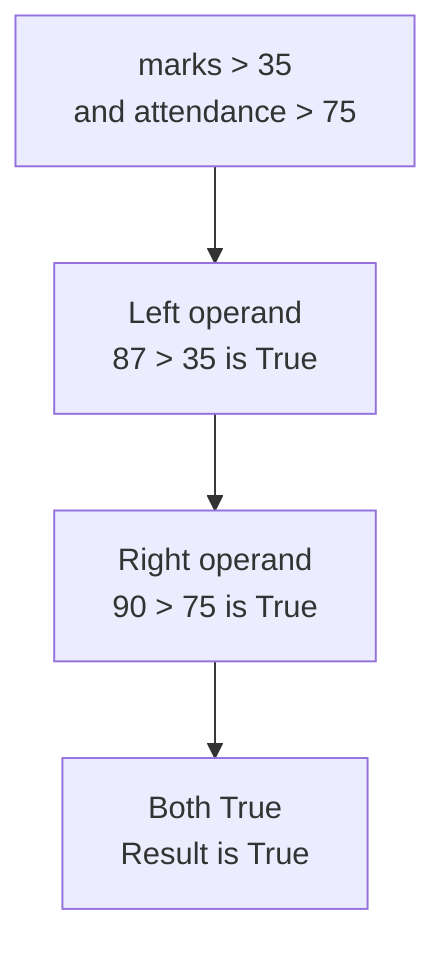
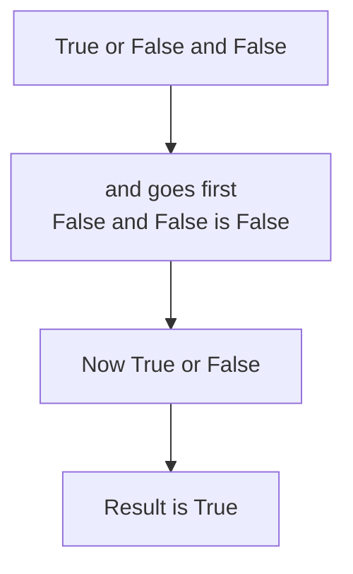

# Logical Operators

This is the third category of operators. A comparison expression produces one Boolean value. Real programs often need several of them combined into one. A **logical operator**, also called a Boolean operator, takes Boolean operands and returns a single Boolean value.

Python has three: `and`, `or` and `not`. They are keywords written as words in lower case, not as symbols.

## The Three Logical Operators

| Operator | Name | Example | Result |
|---|---|---|---|
| `and` | logical AND | `True and False` | `False` |
| `or` | logical OR | `True or False` | `True` |
| `not` | logical NOT | `not True` | `False` |

`and` and `or` are binary operators, taking one operand on each side. `not` is a unary operator, taking a single operand on its right.

## The Logical AND Operator

The `and` operator is strict. It returns `True` only when both of its operands are `True`. If either operand is `False`, the result is `False`.

Think of a prize given to a student who scores above 35 and attends above 75 percent of classes. Both conditions must hold.

```python
marks = 87
attendance = 90
print(marks > 35 and attendance > 75)
```

**Output:**

```
True
```

Python did not read that line as one long question. It evaluated each comparison separately, then combined the two Boolean results:



Now change the attendance and run the same expression again:

```python
marks = 87
attendance = 40
print(marks > 35 and attendance > 75)
```

**Output:**

```
False
```

The marks are still fine, so the left operand is `True`. But `40 > 75` is `False`. One `False` operand is enough to make the whole result `False`, and the student misses the prize. That is what makes `and` strict.

## The Logical OR Operator

The `or` operator is generous. It returns `True` when at least one operand is `True`. Both being `True` is fine as well. `or` returns `False` only when both operands are `False`.

Think of a school trip open to students of class 9 or class 10. A student needs to match only one of the two.

```python
student_class = 9
print(student_class == 9 or student_class == 10)
```

**Output:**

```
True
```

The left operand is `True`, because the class is 9. The right operand is `False`, because the class is not 10. `or` needed only one `True`, so the student may go on the trip.

```python
student_class = 7
print(student_class == 9 or student_class == 10)
```

**Output:**

```
False
```

Class 7 is neither 9 nor 10. Both operands evaluated to `False`, and that is the one case where `or` returns `False`.

## The Logical NOT Operator

The `not` operator takes a single operand and reverses the Boolean value it is given. `True` becomes `False`, and `False` becomes `True`.

It is the programming form of the word "not" in English. "The student passed" and "the student did not pass" are opposite statements, and exactly one of them is true.

```python
passed = True
print(not passed)
```

**Output:**

```
False
```

`passed` holds `True`, so `not passed` returns `False`, which answers "did the student fail?".

`not` can also take a comparison expression as its operand. The comparison is evaluated first, and `not` then reverses the result:

```python
marks = 87
print(not marks < 35)
```

**Output:**

```
True
```

`marks < 35` asked whether the student is below the pass mark and returned `False`. `not` reversed that into `True`, which reads as "not below the pass mark".

## Truth Table Reference

A **truth table** lists every possible combination of operands and the result for each. Here `a` and `b` stand for any two Boolean values.

| `a` | `b` | `a and b` | `a or b` |
|---|---|---|---|
| `True` | `True` | `True` | `True` |
| `True` | `False` | `False` | `True` |
| `False` | `True` | `False` | `True` |
| `False` | `False` | `False` | `False` |

`not` takes one operand, so its truth table needs one input column:

| `a` | `not a` |
|---|---|
| `True` | `False` |
| `False` | `True` |

Read the `and` column downwards and you will see one `True` in four rows. Read the `or` column and you will see three. That is the whole difference between the two operators.

## Operator Precedence

A single expression can hold comparison and logical operators together. Python does not evaluate it from left to right. It follows a fixed **operator precedence**:

1. Comparison operators `==` `!=` `>` `<` `>=` `<=`
2. `not`
3. `and`
4. `or`

Comparison operators come first, and there is a reason. A logical operator can only work on Boolean operands, so every comparison has to be evaluated into `True` or `False` before `and` or `or` has anything to combine.

After that, `and` is settled before `or`. This is the same idea as multiplication before addition in arithmetic. In `2 + 3 * 4`, the `*` takes its two operands first. In the same way, `and` takes the operands on either side of it first, and `or` gets whatever is left.

Take one expression as an example:

```python
print(True or False and False)
```

**Output:**

```
True
```

The result is `True`, even though the expression ends with two `False` values:



Reading the same expression from left to right would give a different answer. `True or False` would be `True`, and `True and False` would be `False`. That reading is wrong, because it ignores the precedence Python actually follows.

Parentheses sit above everything on the list, so whatever is inside them is evaluated first:

```python
print((True or False) and False)
```

**Output:**

```
False
```

The parentheses forced the `or` to be evaluated first. `True or False` gave `True`, and then `True and False` gave `False`. The three operands never changed. Only the order changed, and the result flipped.

So when an expression mixes `and` with `or`, put parentheses around the part you want evaluated first. Even where precedence would already be correct, they show your reader what you meant.

## Incomplete Comparison Expressions

One mistake appears again and again. In English we say "if the mark is above 35 and below 90". Written that way in Python, the line fails:

```python
marks = 87
print(marks > 35 and < 90)
```

**Output:**

```
SyntaxError: invalid syntax
```

`SyntaxError` means Python could not read the line as valid Python at all. The `and` operator needs a complete expression on each side, and `< 90` is not one, because it has no left operand. The variable must appear on both sides:

```python
marks = 87
print(marks > 35 and marks < 90)
```

**Output:**

```
True
```

Read each side of an `and` or an `or` on its own. If a side cannot stand alone as a complete comparison expression, the line is incomplete.

## Further Reading

- **The three operators with truth tables** — https://www.pythontutorial.net/python-basics/python-logical-operators/
- **Python operators reference** — https://www.programiz.com/python-programming/operators

You can now build one Boolean result out of several. Next, you will look at the operators that store a value in a variable, including the seven that change a value based on what it already holds.
