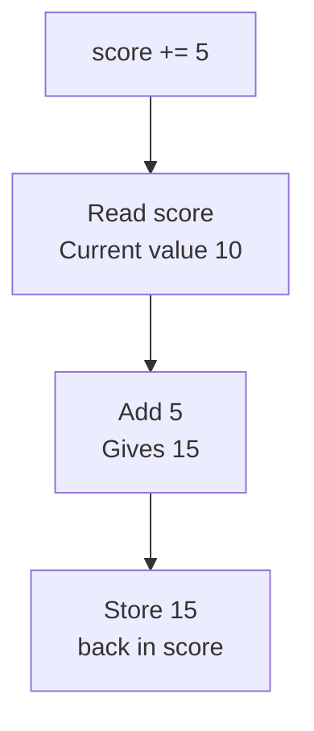

# Assignment Operators

This is the fourth category of operators. An **assignment operator** stores a value in a variable. You have used one since your first program, and Python has seven more that combine an operation with the storing.

## The Eight Assignment Operators

| Operator | Name | Example | Same as |
|---|---|---|---|
| `=` | assignment | `x = 5` | — |
| `+=` | addition assignment | `x += 5` | `x = x + 5` |
| `-=` | subtraction assignment | `x -= 5` | `x = x - 5` |
| `*=` | multiplication assignment | `x *= 5` | `x = x * 5` |
| `/=` | division assignment | `x /= 5` | `x = x / 5` |
| `//=` | floor division assignment | `x //= 5` | `x = x // 5` |
| `%=` | modulus assignment | `x %= 5` | `x = x % 5` |
| `**=` | exponentiation assignment | `x **= 5` | `x = x ** 5` |

The seven after the first are called **compound assignment operators**, because each one is an arithmetic operator and an assignment joined together.

## The Assignment Operator

The `=` operator stores the value on its right into the name on its left:

```python
score = 10
print(score)
```

**Output:**

```
10
```

The right side is always evaluated first, and only the resulting value is stored:

```python
score = 4 + 6
print(score)
```

**Output:**

```
10
```

The expression `4 + 6` was evaluated to `10`, and `10` went into `score`. The expression itself is not kept.

## Compound Assignment Operators

Programs often need to change a value based on what it already holds. Adding five to a score means reading the score, adding five, and storing the answer back in the same variable.

Written the long way, that is one line:

```python
score = 10
score = score + 5
print(score)
```

**Output:**

```
15
```

Read `score = score + 5` from the right. `score + 5` is evaluated using the current value, giving `15`, and that result replaces what `score` held.

The `+=` operator does exactly the same work in fewer characters:

```python
score = 10
score += 5
print(score)
```

**Output:**

```
15
```



The other six work the same way, each with its own arithmetic operator:

```python
total = 100
total -= 20
total *= 2
print(total)
```

**Output:**

```
160
```

Each line changed `total` and handed the new value to the next line. `100` became `80`, and `80` became `160`.

## Division Assignment and Data Types

`/=` uses the division operator, and division always returns a `float`. So `/=` changes the type of the variable, even when the numbers divide exactly:

```python
total = 10
total /= 2
print(total)
```

**Output:**

```
5.0
```

The variable held an `int` before that line and holds a `float` after it. Use `//=` instead when the value must stay a whole number:

```python
total = 10
total //= 2
print(total)
```

**Output:**

```
5
```

## Compound Assignment with Strings

The `+=` operator works on strings as well, where `+` performs concatenation rather than addition:

```python
message = "Good"
message += " morning"
print(message)
```

**Output:**

```
Good morning
```

`" morning"` was joined to the end of what `message` held. The space at the start of the second string is deliberate, since concatenation adds nothing of its own.

The other six compound operators are arithmetic only, so they do not apply to strings.

## Further Reading

- **All operator categories with examples** — https://www.geeksforgeeks.org/python/python-operators/
- **Python operators reference** — https://www.programiz.com/python-programming/operators

You now know all four of the operator categories used in everyday programs. Next, you will check whether a value is present inside another, which takes one operator rather than a comparison for every possibility.
