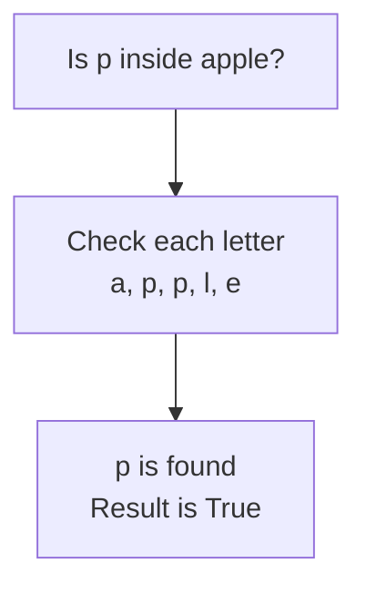

# Membership Operators

This is the fifth category of operators. A **membership operator** checks whether a value is present inside a **sequence**, which is any value made up of smaller parts in order. It returns a Boolean.

Python has two: `in` and `not in`. Both are keywords written as words in lower case.

A string is a sequence, since it is made of characters in order, so strings are what these operators can search today.

## The in Operator

`in` returns `True` when the value is found inside the sequence, and `False` when it is not.

```python
word = "apple"
print("p" in word)
print("z" in word)
```

**Output:**

```
True
False
```

The letter `p` appears in `apple`, so the first result is `True`. There is no `z` anywhere in the word, so the second is `False`.

Python searches through the sequence one part at a time and stops as soon as it finds a match:



## The not in Operator

`not in` asks the opposite question. It returns `True` when the value is absent:

```python
word = "apple"
print("z" not in word)
print("p" not in word)
```

**Output:**

```
True
False
```

There is no `z`, so `not in` returned `True`. There is a `p`, so it returned `False`.

Exactly one of `in` and `not in` is always `True` for the same pair of operands. Use whichever reads more naturally in the sentence you are writing.

## Searching for a Group of Characters

The left operand does not have to be a single character. A whole string can be searched for, and it is found only when those characters appear together, in that order:

```python
word = "apple"
print("app" in word)
print("ale" in word)
```

**Output:**

```
True
False
```

`app` sits at the start of `apple`, so the first result is `True`. The letters of `ale` all appear in the word, but not next to each other, so the second is `False`.

## Case Sensitivity

Searching is **case-sensitive**, exactly as comparison is. A capital letter and a small letter are different characters:

```python
word = "apple"
print("A" in word)
print("a" in word)
```

**Output:**

```
False
True
```

There is no capital `A` in `apple`, so the first result is `False`.

This matters when the value being searched came from the person using the program, since you cannot control how they typed it.

## Where These Are Used

Membership operators become far more useful with **lists**, which hold a collection of separate values rather than the characters of one word. Searching a list of student names for one name is a single `in` expression, and that is where these operators return.

## Further Reading

- **All operator categories with examples** — https://www.geeksforgeeks.org/python/python-operators/

Both of these operators return a Boolean, like the comparison and logical operators before them. One category from the table is left, and it works closer to the machine than anything so far.
