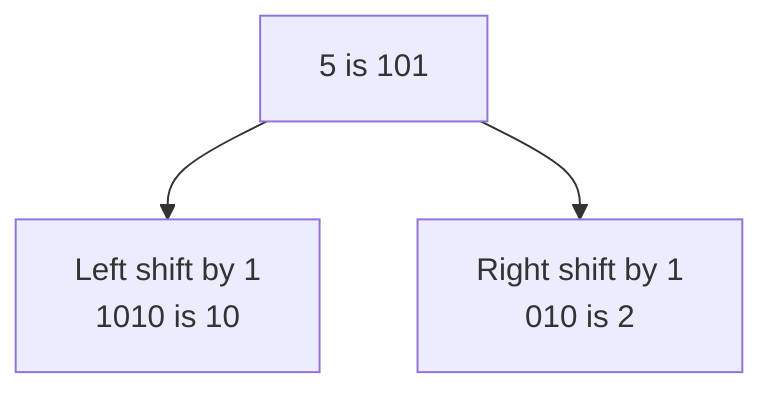

# Bitwise Operators

This is the last category in the operator table. A **bitwise operator** works on a number one binary digit at a time, rather than on the number as a whole.

A single binary digit is called a **bit**. Python has six bitwise operators.

## Bits and Place Values

The first topic explained that a computer stores everything using two signals, written as 1 and 0. A whole number is stored as a row of bits, and each position in that row stands for a value, doubling from right to left.

| Place value | 4 | 2 | 1 |
|---|---|---|---|
| `5` | 1 | 0 | 1 |
| `3` | 0 | 1 | 1 |

Read a row and add the place values wherever a 1 sits. For 5 that is 4 + 1. For 3 it is 2 + 1.

The built-in `bin()` function shows this form:

```python
print(bin(5))
print(bin(3))
```

**Output:**

```
0b101
0b11
```

The `0b` at the front marks the value as binary. The digits after it are the bits. Python does not print leading zeros, so 3 shows as `11` rather than `011`.

## The Six Bitwise Operators

| Operator | Name | Operands |
|---|---|---|
| `&` | bitwise AND | two |
| `\|` | bitwise OR | two |
| `^` | bitwise XOR | two |
| `~` | bitwise NOT | one |
| `<<` | left shift | two |
| `>>` | right shift | two |

The first three compare two numbers position by position. `~` inverts a single number. The two shift operators move a number's bits along by a stated number of places.

## The Bitwise AND Operator

The `&` operator compares the two numbers one position at a time. It puts a 1 in the result only where **both** numbers have a 1. Every other position becomes 0.

```python
print(5 & 3)
```

**Output:**

```
1
```

| Place value | 4 | 2 | 1 |
|---|---|---|---|
| `5` | 1 | 0 | 1 |
| `3` | 0 | 1 | 1 |
| `5 & 3` | 0 | 0 | 1 |

Only the 1s position has a 1 in both rows. The 4s position has one in 5 but not in 3, and the 2s position the other way round, so both become 0. The result is `001`, which is 1.

## The Bitwise OR Operator

The `|` operator puts a 1 in the result where **either** number has a 1, or where both do. A position becomes 0 only when neither number has a 1 there.

```python
print(5 | 3)
```

**Output:**

```
7
```

| Place value | 4 | 2 | 1 |
|---|---|---|---|
| `5` | 1 | 0 | 1 |
| `3` | 0 | 1 | 1 |
| `5 \| 3` | 1 | 1 | 1 |

Every position has a 1 in at least one of the two rows, so every position becomes 1. The result is `111`, which is 4 + 2 + 1 = 7.

## The Bitwise XOR Operator

The `^` operator puts a 1 in the result where **exactly one** of the two numbers has a 1. Where both have a 1, the position becomes 0. XOR is short for exclusive OR, and the word exclusive is what separates it from `|`.

```python
print(5 ^ 3)
```

**Output:**

```
6
```

| Place value | 4 | 2 | 1 |
|---|---|---|---|
| `5` | 1 | 0 | 1 |
| `3` | 0 | 1 | 1 |
| `5 ^ 3` | 1 | 1 | 0 |

The 4s and 2s positions each have a 1 in one row only, so both become 1. The 1s position has a 1 in both rows, so `^` drops it to 0. The result is `110`, which is 4 + 2 = 6.

Compare this with the `|` result above. The two operators differ in one position only, the one where both numbers had a 1.

## The Bitwise NOT Operator

The `~` operator takes a single number and inverts every bit, turning each 1 into a 0 and each 0 into a 1. It is also called the complement operator.

```python
print(~5)
print(~0)
```

**Output:**

```
-6
-1
```

The results are negative, and there is a rule that always holds:

```
~n gives -n - 1
```

So `~5` gives `-6`, and `~0` gives `-1`.

Why inverting bits produces a negative number depends on the method Python uses to store negative values, and that method is beyond this course. The rule above is what you need, and it never varies.

## The Left Shift Operator

The `<<` operator moves every bit up by the number of places given on its right. Empty positions on the right are filled with 0.

```python
print(5 << 1)
```

**Output:**

```
10
```

| Place value | 8 | 4 | 2 | 1 |
|---|---|---|---|---|
| `5` | 0 | 1 | 0 | 1 |
| `5 << 1` | 1 | 0 | 1 | 0 |

Each 1 moved one position to the left. Since each position is worth double the one before it, the number doubled. The result is `1010`, which is 8 + 2 = 10.

Shifting by more places multiplies further. Each place doubles the value again:

```python
print(5 << 2)
```

**Output:**

```
20
```

## The Right Shift Operator

The `>>` operator moves every bit down by the number of places given on its right. Bits that fall off the right-hand end are discarded.

```python
print(5 >> 1)
```

**Output:**

```
2
```

| Place value | 4 | 2 | 1 |
|---|---|---|---|
| `5` | 1 | 0 | 1 |
| `5 >> 1` | 0 | 1 | 0 |

Each 1 moved one position to the right, and the 1 in the 1s position fell off the end. The result is `010`, which is 2.

Shifting right by one halves the number, and anything left over is discarded rather than rounded, exactly as floor division discards it. Half of 5 is 2.5, and `5 >> 1` gives 2.



## Where These Are Used

Ordinary programs rarely need bitwise operators. They matter in a narrow set of tasks, such as controlling hardware, working with colours stored as single numbers, or packing several small values into one number to save space.

Three of the symbols return later, on a data type called a set, where `&`, `|` and `^` combine collections of values instead of bits. The meaning carries across. `&` keeps what is in both, `|` keeps what is in either, and `^` keeps what is in exactly one.

## Further Reading

- **Bitwise operators explained** — https://realpython.com/python-bitwise-operators/

Every operator in the table has now been covered. Next, you will plan a program before writing it, by breaking a problem into steps and drawing those steps out.
