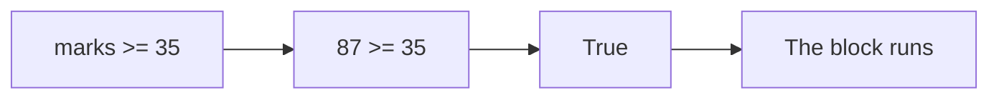
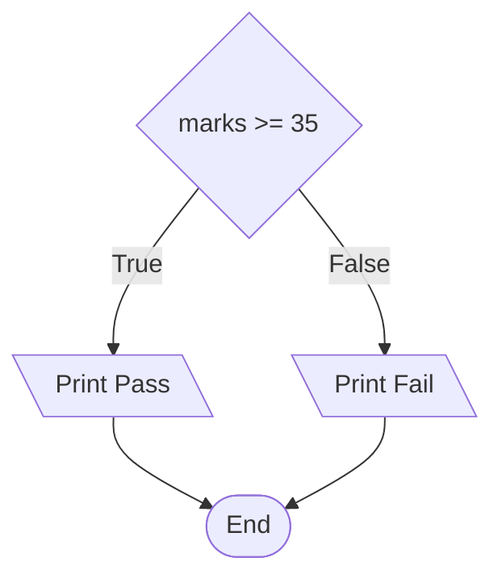
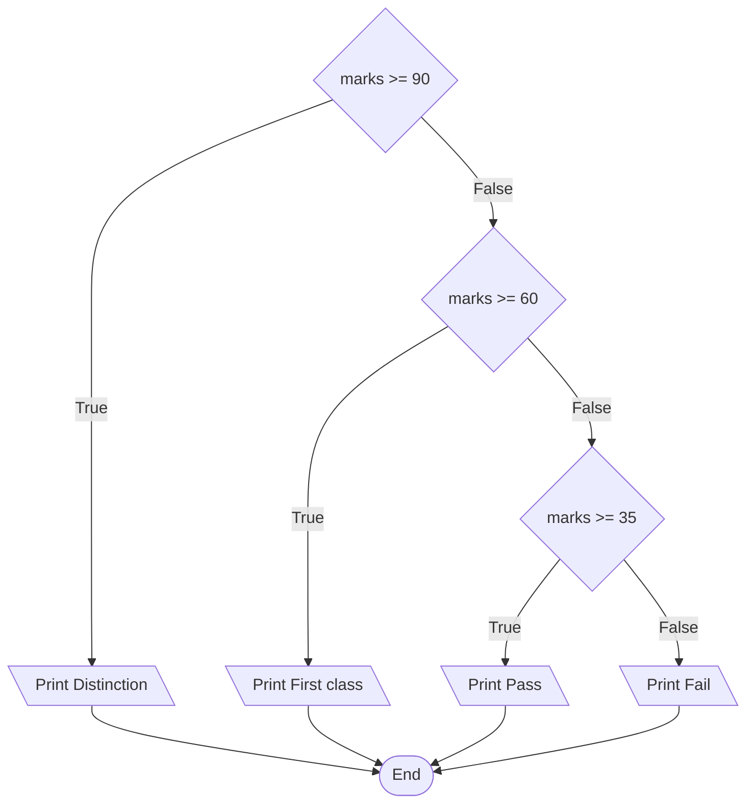

# Conditional Statements

Every condition you have written so far only produced a value. `marks >= 35` returned `True` or `False`, and the program carried on regardless. A **conditional statement** uses that result to decide which lines of code run and which are skipped.

The `if` does not create the condition or work out a new kind of value. It simply tells Python to act on the result of the condition.

## The if Statement

The `if` statement runs a block of code only when its condition is `True`.

```python
marks = 87
if marks >= 35:
    print("Pass")
```

**Output:**

```
Pass
```

Read that the way Python does. The condition is evaluated first, and its value decides the rest:



Three things make up the statement:

- the keyword `if`, followed by a condition
- a colon `:` at the end of the line
- one or more indented statements below it, which run only when the condition is `True`

Change the mark and the indented line is skipped entirely:

```python
marks = 20
if marks >= 35:
    print("Pass")
```

**Output:**

```

```

Nothing was printed. The condition was `False`, so Python passed over the indented line without running it.


## Blocks and Indentation

The indented statements under an `if` are called a **block**. A block can hold as many statements as you need, as long as every one of them is indented by the same amount:

```python
marks = 87
if marks >= 35:
    print("Pass")
    print("Well done")
print("Result printed")
```

**Output:**

```
Pass
Well done
Result printed
```

The first two lines are indented, so both belong to the block and both ran. The third line is not indented, so it is outside the block. It runs whatever the condition decided.

Indentation is not decoration in Python. It is the only thing that marks where a block starts and ends. Leave it out and the program will not run at all:

```python
marks = 87
if marks >= 35:
print("Pass")
```

**Output:**

```
IndentationError: expected an indented block after 'if' statement on line 2
```

`IndentationError` is the name Python gives this error, and the message names the line that needed a block.

Use four spaces for one level of indentation. This is the standard Python convention and is what the Python community recommends. Python itself does not demand exactly four. What matters is that statements belonging to the same block use the same indentation level. Four spaces is simply the amount everyone agrees on, and most code editors can be set to insert it when you press Tab.

## The else Clause

An `if` on its own does one thing or nothing. Adding an `else` clause gives a second block, which runs when the condition is `False`:

```python
marks = 20
if marks >= 35:
    print("Pass")
else:
    print("Fail")
```

**Output:**

```
Fail
```

The condition was `False`, so the `if` block was skipped and the `else` block ran instead.

In an `if`/`else` statement, exactly one of the two blocks runs. Never both, never neither.



The `else` keyword takes no condition of its own. It simply catches everything the `if` did not.

## The elif Clause

Two paths are often not enough. A mark might deserve a grade rather than a pass or a fail, and that needs several conditions tested in turn.

The `elif` clause does this. The name is short for "else if", and you can use as many as you need. That gives three keywords, each with one job:

| Keyword | What it does |
| --- | --- |
| `if` | Starts the decision and tests the first condition |
| `elif` | Tests another condition, but only if every condition above it was `False` |
| `else` | Runs when none of the conditions above it were `True`, and tests nothing itself |

```python
marks = 72
if marks >= 90:
    print("Distinction")
elif marks >= 60:
    print("First class")
elif marks >= 35:
    print("Pass")
else:
    print("Fail")
```

**Output:**

```
First class
```

Python worked down the chain and stopped at the first condition that was `True`:



`72 >= 90` was `False`, so Python moved to the next condition. `72 >= 60` was `True`, so that block ran and the chain ended there. The remaining `elif` and the `else` were never tested, even though `72 >= 35` is also `True`.

Only the first matching block runs. Everything below it is skipped.

A chain is built to three rules:

- The `if` comes first, and there is exactly one.
- Any number of `elif` clauses may follow it.
- The `else` is optional and must come last.

Since only the first match runs, the order of the conditions matters:

```python
marks = 95
if marks >= 35:
    print("Pass")
elif marks >= 90:
    print("Distinction")
```

**Output:**

```
Pass
```

A mark of 95 deserves a distinction. It matched `marks >= 35` first, the chain ended there, and the `elif` below was never tested. Python reported no error, because the code is valid. Only the order is wrong.

Swapping the two conditions fixes it:

```python
marks = 95
if marks >= 90:
    print("Distinction")
elif marks >= 35:
    print("Pass")
```

**Output:**

```
Distinction
```

Put the more specific condition first. `marks >= 90` is the more specific of the two, because fewer marks satisfy it. Every mark that passes it also passes `marks >= 35`, so testing the general condition first leaves the specific one unreachable.

## Further Reading

- **if, elif and else with worked examples** — https://www.programiz.com/python-programming/if-elif-else
- **Official Python guide to control flow** — https://docs.python.org/3/tutorial/controlflow.html

Every condition here has been a single comparison. Next, you will place one conditional statement inside another, so that a second decision depends on the answer to the first.
