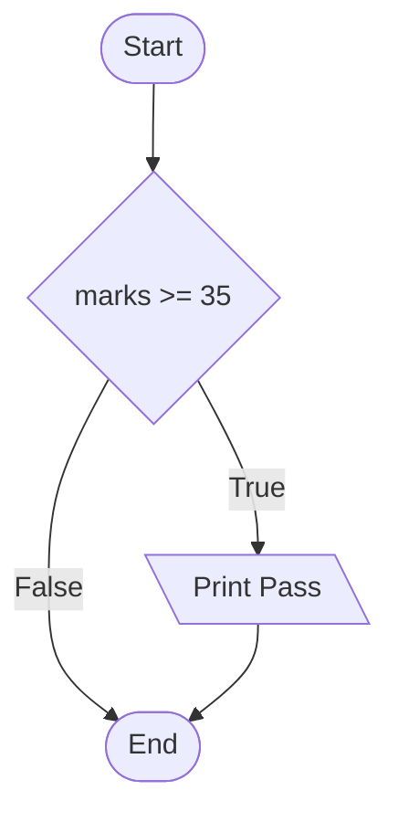
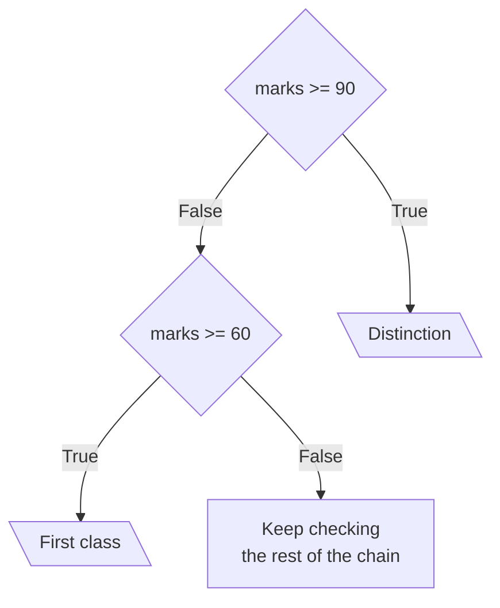

# Conditional Statements

Every condition you have written so far only produced a value. `marks >= 35` returned `True` or `False`, and the program carried on regardless. A **conditional statement** uses that value to decide which lines of code run and which are skipped.

This is the flowchart diamond from the last topic, finally written in Python.

## The if Statement

The `if` statement runs a block of code only when its condition is `True`.

```python
marks = 87
if marks >= 35:
    print("Pass")
```

**Output:**

```
Pass
```

Three things make up that statement:

- the keyword `if`, followed by a condition
- a colon `:` at the end of the line
- one or more indented lines below it, which run only if the condition is `True`

Change the mark and the indented line is skipped entirely:

```python
marks = 20
if marks >= 35:
    print("Pass")
```

**Output:**

```

```

Nothing was printed. The condition was `False`, so Python passed over the indented line without running it.



## Blocks and Indentation

The indented lines under an `if` are called a **block**. A block can hold as many lines as you need, as long as every line is indented by the same amount:

```python
marks = 87
if marks >= 35:
    print("Pass")
    print("Well done")
print("Result printed")
```

**Output:**

```
Pass
Well done
Result printed
```

The first two lines are indented, so both belong to the block and both ran. The third line is not indented, so it is outside the block. It runs whatever the condition decided.

Indentation is not decoration in Python. It is the only thing that marks where a block starts and ends. Leave it out and the program will not run at all:

```python
marks = 87
if marks >= 35:
print("Pass")
```

**Output:**

```
IndentationError: expected an indented block after 'if' statement on line 2
```

`IndentationError` is the name Python gives this error, and the message names the line that needed a block.

Use four spaces for one level of indentation. That is the accepted amount across Python, and every editor can be set to insert it when you press Tab.

## The else Clause

An `if` on its own does one thing or nothing. Adding an `else` clause gives a second block, which runs when the condition is `False`:

```python
marks = 20
if marks >= 35:
    print("Pass")
else:
    print("Fail")
```

**Output:**

```
Fail
```

The condition was `False`, so the `if` block was skipped and the `else` block ran instead.

Exactly one of the two blocks always runs. Never both, never neither.


The `else` keyword takes no condition of its own. It simply catches everything the `if` did not.

## The elif Clause

Two paths are often not enough. A mark might deserve a grade rather than a pass or a fail, and that needs several conditions tested in turn.

The `elif` clause does this. The name is short for "else if", and you can use as many as you need:

```python
marks = 72
if marks >= 90:
    print("Distinction")
elif marks >= 60:
    print("First class")
elif marks >= 35:
    print("Pass")
else:
    print("Fail")
```

**Output:**

```
First class
```

Python worked down the chain and stopped at the first condition that was `True`:



`72 >= 90` was `False`, so Python moved on. `72 >= 60` was `True`, so that block ran and the whole chain ended there. The remaining `elif` and the `else` were never even tested, although `72 >= 35` is also `True`.

That is the rule to hold on to. Only the first matching block runs, and everything below it is skipped.

Two points on how a chain is built. The `if` must come first, and there can be only one. The `else` must come last, and it is optional. Leave it out and a mark matching nothing at all simply produces no output.

## Order of Conditions

Because only the first match runs, the order of the conditions decides the result. Put them in the wrong order and the program runs perfectly while giving the wrong answer:

```python
marks = 95
if marks >= 35:
    print("Pass")
elif marks >= 90:
    print("Distinction")
```

**Output:**

```
Pass
```

A mark of 95 deserves a distinction. It got `Pass`, because `95 >= 35` was tested first and matched. The `elif` below it never had a chance to run.

Python reported no error here, and that is what makes this dangerous. The code is valid. Only the logic is wrong.

```python
marks = 95
if marks >= 90:
    print("Distinction")
elif marks >= 35:
    print("Pass")
```

**Output:**

```
Distinction
```

The rule that follows is short. When conditions overlap, put the narrowest one first and work outwards. Grades run from the highest mark down, ages from the oldest band down, prices from the largest discount down.

## Further Reading

- **if, elif and else with worked examples** — https://www.programiz.com/python-programming/if-elif-else
- **Official Python guide to control flow** — https://docs.python.org/3/tutorial/controlflow.html

Every condition here has been a single comparison. Next, you will put logical operators inside an `if`, so that one branch can test several things at once.
