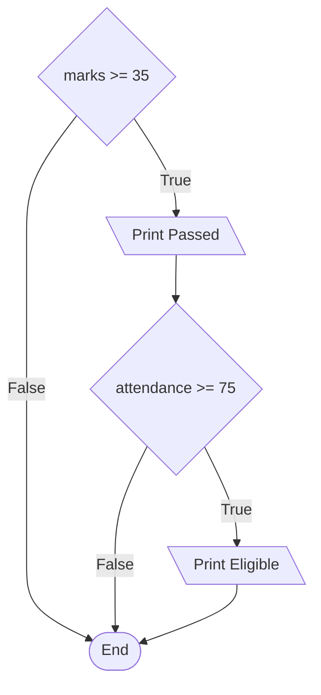

# Nested Conditions

A conditional statement written inside another conditional statement is called a **nested condition**. The inner `if` is then reached only when the outer condition is `True`, which lets a program ask a second question that depends on the answer to the first.

## Levels of Indentation

The inner `if` sits inside the outer block, so its lines are indented one level further:

```python
marks = 87
attendance = 90
if marks >= 35:
    print("Passed the exam")
    if attendance >= 75:
        print("Eligible for the prize")
```

**Output:**

```
Passed the exam
Eligible for the prize
```

The outer condition was `True`, so its block ran. Inside that block, the inner condition was tested and also came out `True`.

Each level adds four more spaces. The indentation is what tells Python which block a line belongs to, so counting levels is how you read nested code:



The inner condition is only ever reached through the outer one. Fail the exam and the attendance is never looked at:

```python
marks = 20
attendance = 90
if marks >= 35:
    print("Passed the exam")
    if attendance >= 75:
        print("Eligible for the prize")
```

**Output:**

```

```

Nothing printed. The outer condition was `False`, so the entire block was skipped, inner condition and all.

## Nesting Against the and Operator

That first example can also be written with `and`, and it is shorter:

```python
marks = 87
attendance = 90
if marks >= 35 and attendance >= 75:
    print("Eligible for the prize")
```

**Output:**

```
Eligible for the prize
```

So which form is right? It depends on whether the outer condition needs its own outcome.

Use `and` when the two tests together lead to one result. There is nothing to say about the marks on their own, so one condition is clearer.

Use nesting when the outer condition has something to do or say by itself:

```python
marks = 20
if marks >= 35:
    print("Passed the exam")
else:
    print("Failed the exam")
    if marks >= 30:
        print("You may sit the retest")
```

**Output:**

```
Failed the exam
You may sit the retest
```

Here the outer `if` reports the result and the nested `if` adds something that only makes sense after a fail. This cannot be flattened into a single `and`, because two separate decisions are being made.

## Nesting Inside else

The example above nests inside an `else` rather than an `if`. Any block can hold a nested condition, and `else` blocks often do, because that is where the special cases collect.

Both blocks may nest at once:

```python
marks = 95
if marks >= 35:
    print("Passed")
    if marks >= 90:
        print("With distinction")
else:
    print("Failed")
    if marks >= 30:
        print("Retest allowed")
```

**Output:**

```
Passed
With distinction
```

Read this by indentation, not by order. The `if` and the `else` are at the outer level. Each holds a `print` and a nested `if` at the inner level.

## Depth and Readability

Nesting works to any depth, but reading it stops working long before Python does:

```python
marks = 87
attendance = 90
fees_paid = True
if marks >= 35:
    if attendance >= 75:
        if fees_paid:
            print("Eligible for the prize")
```

**Output:**

```
Eligible for the prize
```

Three levels deep, and the single line of real work is sixteen spaces from the margin. Nothing here needs separate outcomes, so `and` says it better:

```python
marks = 87
attendance = 90
fees_paid = True
if marks >= 35 and attendance >= 75 and fees_paid:
    print("Eligible for the prize")
```

**Output:**

```
Eligible for the prize
```

Two levels of nesting are usually fine. At three, look for a way to flatten it. Joining conditions with `and` is the simplest way, and functions will give you another.

## Further Reading

- **Official Python guide to control flow** — https://docs.python.org/3/tutorial/controlflow.html

Nesting decides which conditions get tested at all. Next, you will see what Python does when a condition is not `True` or `False` but a number, a piece of text, or nothing at all.
