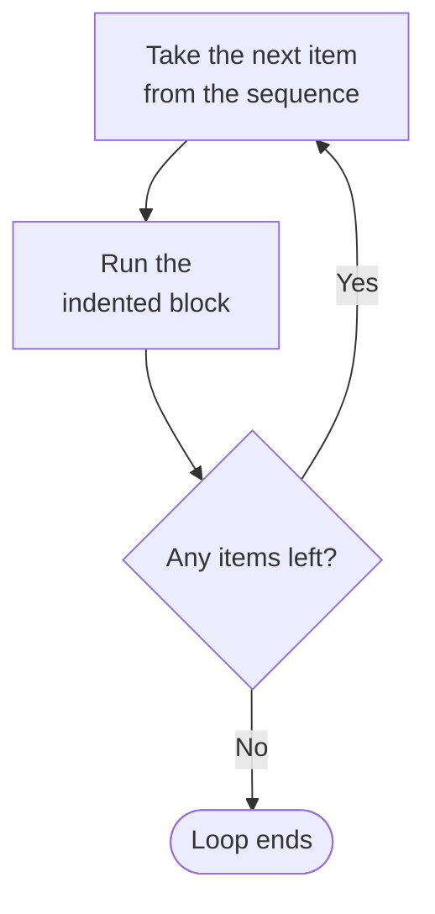

# For Loop

Suppose a class has fifty students and every one of them needs a welcome message. Written out by hand, the program starts like this:

```python
print("Welcome, Student 1")
print("Welcome, Student 2")
print("Welcome, Student 3")
```

Forty-seven more lines follow. Every line is the same instruction with one number changed. Typing it is slow, a single mistyped number is easy to miss, and changing the wording later means editing fifty lines.

A **loop** solves this. It lets you write the instruction once and tell Python to repeat it.

## Syntax of a for Loop

A `for` loop walks through a **sequence** one item at a time, running its block once for each item. You have already seen one common sequence: a string, where the characters appear in order.

Every `for` loop is written in the same form:

```
for variable in sequence:
    statements
```

Four parts make it up:

- the keyword `for`
- a **loop variable**, which holds one item at a time
- the keyword `in`, followed by the sequence to walk through
- a colon `:`, then an indented block

The colon and the indented block work exactly as they did in an `if` statement. The difference is what controls the block. An `if` decides whether the block runs. A `for` decides how many times it runs.

Here is that form filled in. The word `"cat"` is a string of three characters, so the loop runs three times:

```python
for letter in "cat":
    print(letter)
```

**Output:**

```
c
a
t
```

One `print` statement produced three lines. Before each run of the block, Python put the next character into `letter`:

```
letter = "c"   →   run the block
letter = "a"   →   run the block
letter = "t"   →   run the block
no more characters   →   loop ends
```

Each pass through the block is called an **iteration**. This loop ran three iterations, one for each character.



The loop stops on its own when Python reaches the end of the sequence. You do not have to write a separate condition to tell it when to stop.

## The Loop Variable

The loop variable is an ordinary variable. You choose its name, and Python puts the next item into it before each iteration.

Here is the same loop with the variable renamed:

```python
for character in "cat":
    print(character)
```

**Output:**

```
c
a
t
```

Identical output. Nothing about the name `letter` was special, and nothing about `character` is either. Choose a name that says what the item is, exactly as you would for any other variable.

You will often see `i` used as a loop variable in other people's code. It is short for index, and it is a variable name like any other, not a Python keyword. A longer name is clearer while you are learning.

## The range Function

A string is one kind of sequence. The welcome-message problem needs something else: a loop that runs a set number of times.

The `range()` function produces a sequence of numbers for exactly this purpose:

```python
for number in range(5):
    print(number)
```

**Output:**

```
0
1
2
3
4
```

`range(5)` produced five numbers, and it started at `0`, so it ended at `4`.

This catches almost everyone the first time. The value you give `range()` is where it **stops**, and the stop value itself is not included. `range(5)` gives five numbers: `0`, `1`, `2`, `3`, `4`.

Read it as "five numbers starting from zero", not "up to five".

## Start, Stop and Step Values

Counting from zero is not always what you want. Give `range()` two values and the first becomes the starting point:

```python
for number in range(1, 6):
    print(number)
```

**Output:**

```
1
2
3
4
5
```

Python works through the values one at a time:

```
number = 1   →   run the block
number = 2   →   run the block
number = 3   →   run the block
number = 4   →   run the block
number = 5   →   run the block
no more values   →   loop ends
```

That is enough to solve the problem this topic opened with:

```python
for number in range(1, 6):
    print("Welcome, Student", number)
```

**Output:**

```
Welcome, Student 1
Welcome, Student 2
Welcome, Student 3
Welcome, Student 4
Welcome, Student 5
```

Five students in two lines of code. For all fifty, change the `6` to `51`. The same two lines handle every student.

A third value sets the **step**, which is how much the count moves each time:

```python
for number in range(2, 10, 2):
    print(number)
```

**Output:**

```
2
4
6
8
```

The count started at `2`, moved up in twos, and stopped before `10`.

So `range()` takes one, two or three values:

| Form | Meaning | Example | Numbers produced |
| --- | --- | --- | --- |
| `range(stop)` | from `0` up to but not including `stop` | `range(5)` | 0, 1, 2, 3, 4 |
| `range(start, stop)` | from `start` up to but not including `stop` | `range(1, 6)` | 1, 2, 3, 4, 5 |
| `range(start, stop, step)` | as above, moving by `step` each time | `range(2, 10, 2)` | 2, 4, 6, 8 |

In all three forms, the stop value is excluded. That is the one rule about `range()` worth memorising.

## Further Reading

- **Official Python guide to control flow** — https://docs.python.org/3/tutorial/controlflow.html

A `for` loop repeats once for every item in a sequence, so the number of iterations is settled before the loop begins. Next, you will write a loop for the times when that number is not known in advance.
