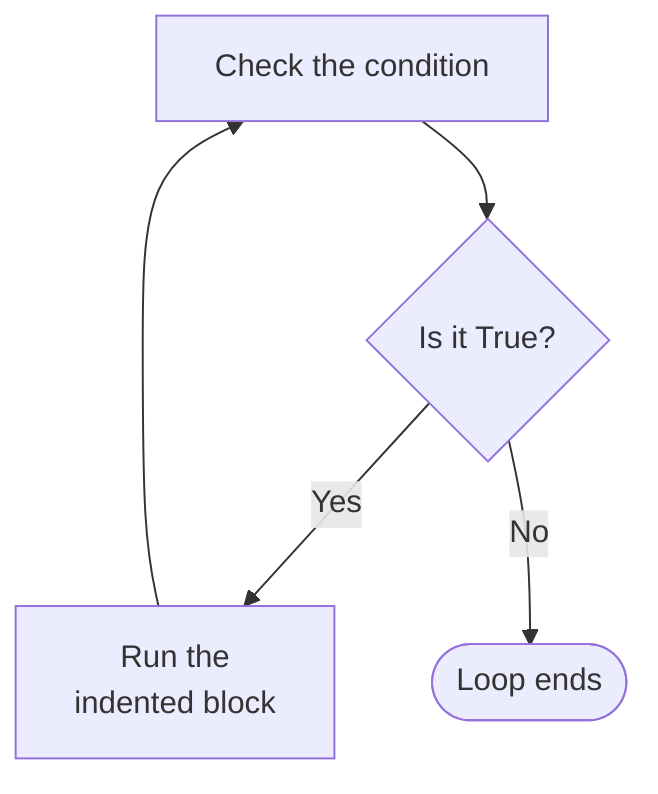

# Repeating Work with `while` Loops

A `for` loop works through a sequence one item at a time. It stops when there are no more items to process.

Some problems are not like that. Suppose a program asks for a password and must keep asking until the right one is typed. The person might get it right on the first attempt, or the fourth, or the tenth. There is no sequence to walk through.

## The while Loop

A `while` loop repeats its block as long as a condition remains `True`.

```python
count = 1
while count <= 3:
    print(count)
    count += 1
```

**Output:**

```
1
2
3
```

The parts are the same shape as an `if`:

- the keyword `while`, followed by a condition
- a colon `:`, then an indented block

The difference is what happens after the block finishes. An `if` moves on. A `while` goes back and tests the condition again:



That single arrow going back is the whole idea. `if` checks once. `while` checks again after every iteration.

Follow the loop above value by value:

```
count = 1   →   1 <= 3 is True    →   print 1, count becomes 2
count = 2   →   2 <= 3 is True    →   print 2, count becomes 3
count = 3   →   3 <= 3 is True    →   print 3, count becomes 4
count = 4   →   4 <= 3 is False   →   loop ends
```

The condition was tested four times and the block ran three times. The last test is what stops the loop.

## Solving the Password Problem

Now the problem this topic opened with:

```python
password = ""
while password != "python123":
    password = input("Enter password: ")
print("Access granted")
```

**Output:**

```
Enter password: hello
Enter password: python123
Access granted
```

The condition is tested before the first iteration, so `password` has to exist by then. It starts as an empty string, which does not match the expected password, so the condition is `True` and the loop runs.

Each iteration replaces `password` with whatever was typed. When the typed value matches, the condition becomes `False` and the loop ends. The `print` after it is outside the block, so it runs once, after the loop is over.

Nothing in this program says how many attempts to allow, because nothing needs to. The condition decides.

## Zero, One or Many Iterations

A `while` loop tests its condition **before** each iteration, including the first. If the condition is already `False`, the block never runs at all:

```python
count = 10
while count < 5:
    print(count)
```

**Output:**

```

```

Nothing printed. `10 < 5` was `False` on the very first test, so Python skipped the block and moved past the loop.

This is worth knowing. A `while` loop can run many times, once, or not at all, and which of those happens is decided by the condition, not by the loop.

## Updating the Condition

A `while` loop keeps going as long as its condition is `True`. So something inside the block has to change, or the condition can never become `False`.

Here is the earlier loop with one line removed:

```python
count = 1
while count <= 3:
    print(count)
```

**Output:**

```
1
1
1
1
1
...
```

The output continues without stopping.

Nothing changes `count`, so every test asks the same question and receives the same answer:

```
1 <= 3 is True
1 <= 3 is True
1 <= 3 is True
```

A loop that can never end is called an **infinite loop**. It is not an error, so Python reports nothing. The program simply never finishes.

To stop one, press **Ctrl+C** in the terminal. That interrupts the running program and returns you to the command line.

The fix is the line that was removed:

```python
count = 1
while count <= 3:
    print(count)
    count += 1
```

**Output:**

```
1
2
3
```

`count += 1` changes the value that controls this particular loop. In other `while` loops, a different variable or event may change the condition. The password loop above has no counter at all, and what ends it is the person typing the right word.

A variable used this way, to keep track of how many iterations have run, is called a **counter**.

Before running any `while` loop, check two things. Can the condition become `False`, and does something in the block move it in that direction?

## Choosing Between for and while

Both loops repeat a block, and either can often be made to do the job. The question is which one fits the problem.

| Loop | Suits |
| --- | --- |
| `for` | walking through a sequence, or repeating a known number of times |
| `while` | repeating as long as a condition remains `True` |

Printing a welcome for fifty students is a `for` loop, because you have a sequence of fifty student numbers to process. Asking for a password is a `while` loop, because the loop ends when the condition changes, and the number of attempts is not known in advance.

Treat this as a guideline rather than a rule. Where both would work, pick the one that reads more clearly.

## Further Reading

- **Official Python guide to control flow** — https://docs.python.org/3/tutorial/controlflow.html

Both loops so far have run their blocks from start to finish. Next, you will learn how to leave a loop early, skip a single iteration, and place one loop inside another.
