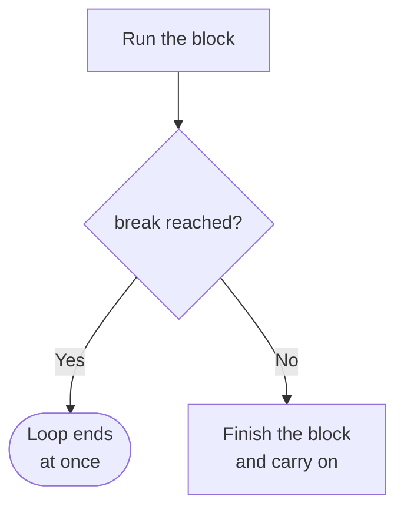
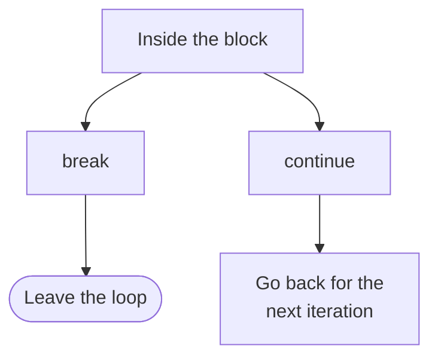

# Control Statements

A `for` loop ends when its sequence runs out, and a `while` loop ends when its condition becomes `False`. Two statements override that stopping point from inside the block. `break` ends a loop early, and `continue` skips the rest of one iteration.

## The break Statement

`break` ends the loop immediately. Nothing else in the block runs, and no further iterations happen.

```python
for number in range(10):
    if number == 5:
        break
    print(number)
```

**Output:**

```
0
1
2
3
4
```

`range(10)` had ten numbers, and only five were printed. On the iteration where `number` became `5`, the condition was `True`, `break` ran, and the loop ended there:

```
number = 0   →   not 5   →   print 0
number = 1   →   not 5   →   print 1
number = 2   →   not 5   →   print 2
number = 3   →   not 5   →   print 3
number = 4   →   not 5   →   print 4
number = 5   →   is 5    →   break, loop ends
```

Notice that `5` was never printed. `break` ran before the `print` line was reached, and the four remaining numbers were never visited.



## Using break to Exit a while Loop

`break` works in a `while` loop too, and it gives a second way to write a password check:

```python
while True:
    password = input("Enter password: ")
    if password == "python123":
        break
print("Access granted")
```

**Output:**

```
Enter password: hello
Enter password: python123
Access granted
```

The condition here is simply `True`, so the loop has no normal stopping condition. The `break` provides the stopping point instead. This pattern is intentional and is useful when the decision to stop belongs inside the loop.

A test written in the loop condition and a test written inside the block are both correct. Use whichever reads more clearly. If you write `while True`, make certain a `break` can be reached.

## The continue Statement

`continue` skips the rest of the current iteration and starts the next iteration. The loop itself carries on.

```python
for number in range(5):
    if number == 2:
        continue
    print(number)
```

**Output:**

```
0
1
3
4
```

Four numbers printed out of five. `2` is missing, because on that iteration `continue` ran and jumped past the `print` line:

```
number = 0   →   not 2   →   print 0
number = 1   →   not 2   →   print 1
number = 2   →   is 2    →   continue, skip to the next iteration
number = 3   →   not 2   →   print 3
number = 4   →   not 2   →   print 4
```

The loop did not end at `2`. It simply skipped what was left of that one iteration.

## Comparison of break and continue

The two are easy to confuse, and the difference is what happens to the loop:

| Statement | Effect on the current iteration | Effect on the loop |
| --- | --- | --- |
| `break` | stops the current iteration | ends the loop |
| `continue` | skips the rest of the current iteration | moves to the next iteration |

Both prevent the remaining statements in the current iteration from running. Only `break` ends the loop.



## Loop Control in a Nested Loop

`break` and `continue` act on the nearest loop that contains them, and have no effect on any loop outside it.

```python
for row in range(3):
    for seat in range(2):
        if seat == 1:
            break
        print(row, seat)
```

**Output:**

```
0 0
1 0
2 0
```

The `break` is inside the inner loop, so it ended the inner loop on every outer iteration. The outer loop was unaffected and still ran all three of its own iterations.

`continue` behaves the same way, skipping one iteration of the inner loop only:

```python
for row in range(3):
    for seat in range(3):
        if seat == 1:
            continue
        print(row, seat)
```

**Output:**

```
0 0
0 2
1 0
1 2
2 0
2 2
```

Seat `1` is missing from every row, and every row still appears. The inner loop skipped one iteration and carried on, and the outer loop was never affected.

`break` exits only the loop it is inside. If you need to leave several nested loops at once, restructure the code rather than introducing a complicated workaround.

## Further Reading

- **Official Python guide to control flow** — https://docs.python.org/3/tutorial/controlflow.html

You can now start a loop, end it early, skip an iteration, and nest one inside another. Next, you will use two loops together to print patterns on the screen.