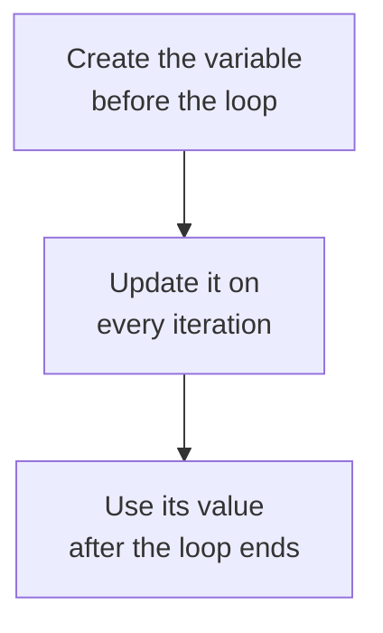

# Loop Patterns

Loops are often used to work something out from many values. How many students passed. What the total of all the marks is. Whether any student scored full marks.

Each question needs a variable whose value is carried from one iteration to the next, because no single pass through the loop can answer it on its own.

Such a variable is always handled the same way:

- give it a starting value before the loop
- update it inside the loop
- read it after the loop has finished



Three patterns follow this shape. A **counter** answers how many, an **accumulator** answers what the total is, and a **flag** answers whether something happened at all.

## The Counter Pattern

A **counter** records how many times something happened. It starts at `0` and goes up by one whenever the thing occurs.

Counting the multiples of 3 between 1 and 20:

```python
count = 0
for number in range(1, 21):
    if number % 3 == 0:
        count += 1
print("Multiples of 3:", count)
```

**Output:**

```
Multiples of 3: 6
```

Three things are worth noticing.

`count = 0` sits outside the loop. Put it inside and it would reset to zero on every iteration, leaving `1` at the end.

`count += 1` is inside the `if`, not the loop, so only multiples of 3 are counted.

`print` sits outside the loop, so it runs once with the final value. Inside, it would print six times with a growing number.

## The Accumulator Pattern

An **accumulator** builds up a running total. It starts at `0` and has a value added to it on each iteration.

Adding the numbers 1 to 5:

```python
total = 0
for number in range(1, 6):
    total += number
print("Total:", total)
```

**Output:**

```
Total: 15
```

Follow the variable as the loop runs:

```
start          total = 0
number = 1     total = 0 + 1 = 1
number = 2     total = 1 + 2 = 3
number = 3     total = 3 + 3 = 6
number = 4     total = 6 + 4 = 10
number = 5     total = 10 + 5 = 15
```

Each iteration reads the previous total and replaces it with a larger one. `+=` makes this pattern convenient: it adds the new value to the total and stores the result back in the same variable.

A counter always adds `1`. An accumulator adds whatever value it is given. Otherwise they are the same idea.

## Counting and Accumulating Together

An average needs both. The total comes from an accumulator, and the number of values from a counter:

```python
count = 0
total = 0
for number in range(1, 5):
    count += 1
    total += number
average = total / count
print("Count:", count)
print("Total:", total)
print("Average:", average)
```

**Output:**

```
Count: 4
Total: 10
Average: 2.5
```

Both variables are created before the loop and both are updated inside it. The division happens after the loop because `total` and `count` are complete only after all the values have been processed.

The average shows as `2.5` rather than `2`, because the division operator always returns a `float`.

## The Flag Pattern

A **flag** records whether something happened at all. It holds a Boolean value. In this pattern, the flag starts as `False` and changes to `True` when the event occurs.

Checking whether a word contains the letter `a`:

```python
found = False
for letter in "cat":
    if letter == "a":
        found = True
print("Found:", found)
```

**Output:**

```
Found: True
```

The same code on a word without an `a`:

```python
found = False
for letter in "dog":
    if letter == "a":
        found = True
print("Found:", found)
```

**Output:**

```
Found: False
```

No letter matched `a`, so the assignment `found = True` never ran. The flag therefore kept its starting value, `False`, which means "not yet found".

A flag is checked after the loop, and it answers a question no single iteration can answer. One iteration knows only about its own letter. Only the flag knows whether any letter matched.

If the question were "how many letters matched?", you would use a counter instead. The flag is only interested in whether at least one match occurred.

## Comparison of the Three Patterns

| Pattern | Starts as | Updated with | Answers |
| --- | --- | --- | --- |
| Counter | `0` | `+= 1` | how many |
| Accumulator | `0` | `+= value` | what the total is |
| Flag | `False` | `= True` | whether at least one occurred |

Recognise these three patterns and many loops become easier to read, because you can quickly see what each variable is tracking.

## Further Reading

- **Official Python guide to control flow** — https://docs.python.org/3/tutorial/controlflow.html

That completes loops. You can now repeat work, control when a loop stops, and track what happens across its iterations.

One problem remains. Every program so far has been a single list of instructions, read from top to bottom. The average calculation above works, but needing it a second time means writing all five lines again. Next, you will give a block of code a name, so you can run that same work again without writing the instructions from scratch.
