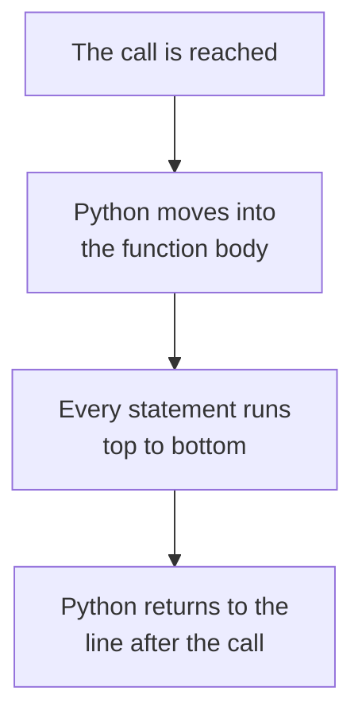

# Functions

Every program so far has been one list of statements, read from top to bottom. When the same work is needed twice, it has to be typed twice.

Here is a program that checks whether two students have passed:

```python
marks = int(input("Marks: "))
if marks >= 35:
    print("Pass")
else:
    print("Fail")

marks = int(input("Marks: "))
if marks >= 35:
    print("Pass")
else:
    print("Fail")
```

**Output:**

```
Marks: 87
Pass
Marks: 20
Fail
```

The same five lines appear twice. For thirty students they would appear thirty times. Changing the pass mark from 35 to 40 would mean editing thirty copies, and one missed copy would leave the program using two different pass marks.

A **function** is a named block of code that performs a task. It is written once and runs whenever its name is used.

## Built-in and User-Defined Functions

You have been using functions since your first program. `print()`, `input()`, `int()`, `float()`, `str()` and `range()` are all functions.

```python
age = int(input("Age: "))
print(age)
```

**Output:**

```
Age: 12
12
```

Each has a name, and writing that name with brackets ran the code stored under it. You never wrote the steps inside `int()`.

These are **built-in functions**. They come with Python, already written.

A **user-defined function** is one you write yourself. Once defined, it works the same way: write the name, add brackets, and the code runs.

## Syntax of a User-Defined Function

A function is defined with the `def` keyword. The rules are these:

- The first line starts with `def`, followed by the function name.
- The name follows the same rules as a variable name, so `lower_case` with underscores.
- Brackets `()` come after the name.
- The line ends with a colon `:`.
- The statements belonging to the function are indented below it, by four spaces.

The shape is always this:

```
def function_name():
    statements
```

The indented statements are called the **function body**. The colon and the indented block are the same arrangement used by `if` and by `for`.

Here is the smallest function that does something:

```python
def print_result():
    print("Pass")
```

**Output:**

```

```

Nothing was printed. There is a `print` statement in the code, and it produced no output.

Python read the body and stored it under the name `print_result`. That is all a definition does.

## Definition and Call

Two separate things are needed to get output from a function, and they are easy to confuse.

| | What it looks like | What it does |
| --- | --- | --- |
| Definition | `def print_result():` with an indented body | Stores the body under a name. Runs nothing. |
| Call | `print_result()` | Runs the stored body now. |

A definition is written once. A call can be written as many times as needed. The definition ends with a colon and owns an indented block. The call is a plain statement with no colon and no block.

Writing a definition and expecting output is the most common mistake in this topic.

## Calling a Function

To run the body, write the function name followed by brackets. This is called **calling** the function.

```python
def print_result():
    print("Pass")

print_result()
```

**Output:**

```
Pass
```

Three things happened at the line `print_result()`:

1. Python left that line and moved into the function body.
2. Every statement in the body ran, from top to bottom.
3. Python returned to the line straight after the call.



The call is not indented, so it is not part of the body. The body says what to do, and the call says do it now.

## Calling a Function Several Times

One definition serves any number of calls:

```python
def print_result():
    print("Pass")

print_result()
print_result()
```

**Output:**

```
Pass
Pass
```

One `print` statement, two lines of output. The body ran in full, then again in full.

Now the program from the start of this topic, written as a function:

```python
def check_result():
    marks = int(input("Marks: "))
    if marks >= 35:
        print("Pass")
    else:
        print("Fail")

check_result()
check_result()
```

**Output:**

```
Marks: 87
Pass
Marks: 20
Fail
```

Same output as before, different code. The five lines are written once and used twice. The pass mark appears in one place, so changing `35` to `40` changes every call.

A function can also be called inside a loop:

```python
def check_result():
    marks = int(input("Marks: "))
    if marks >= 35:
        print("Pass")
    else:
        print("Fail")

for student in range(3):
    check_result()
```

**Output:**

```
Marks: 87
Pass
Marks: 20
Fail
Marks: 45
Pass
```

Three iterations, three full runs of the body. Thirty students needs `range(30)` and nothing else changes.

## Defining Before Calling

Python reads a file from top to bottom, so the definition must be read before the call is reached.

```python
print("Result checker")
check_result()

def check_result():
    print("Pass")
```

**Output:**

```
Result checker
NameError: name 'check_result' is not defined
```

The first line ran. Then Python reached `check_result()` and stopped, because it had not yet read the `def` line. At that moment the name did not exist.

`NameError` is the same error raised when a variable is used before it is assigned. A function name is a name like any other, created at the moment Python reaches its definition.

This is why definitions are written near the top of a file, above the code that calls them.

## Variables Inside a Function

A function body can create variables of its own:

```python
def print_result():
    pass_mark = 35
    print("Pass mark is", pass_mark)

print_result()
```

**Output:**

```
Pass mark is 35
```

`pass_mark` was created inside the body and used on the next line, exactly as a variable behaves anywhere else.

One thing is different. A variable created inside a function exists only while that function is running. Once the call ends, the name is gone:

```python
def print_result():
    pass_mark = 35
    print("Pass mark is", pass_mark)

print_result()
print(pass_mark)
```

**Output:**

```
Pass mark is 35
NameError: name 'pass_mark' is not defined
```

The function printed its line and finished. The `print` after it failed, because `pass_mark` no longer existed.

This is useful rather than limiting. A function can name its variables freely without clashing with names used elsewhere in the program. The rules behind it are covered in the topic on variable scope.

## The pass Statement

A function body cannot be empty. Python needs at least one statement after the colon:

```python
def check_result():

print("Checked")
```

**Output:**

```
IndentationError: expected an indented block after function definition on line 1
```

The message names line 1, where the `def` is, because that is the line whose body is missing.

The `pass` statement fills the gap. It is a statement that does nothing, and that is its only purpose:

```python
def check_result():
    pass

check_result()
print("Checked")
```

**Output:**

```
Checked
```

The call ran the body, the body did nothing, and the program carried on.

This is useful while a program is being built. `check_result` can be defined with `pass`, and the loop that calls it thirty times can be written and run straight away. The body is filled in once the rest of the program works.

## Docstrings

A **docstring** is a string written as the first statement of a function body, stating what the function does. It is written in triple quotes:

```python
def check_result():
    """Ask for a mark and print whether it is a pass."""
    marks = int(input("Marks: "))
    if marks >= 35:
        print("Pass")
    else:
        print("Fail")

print(check_result.__doc__)
```

**Output:**

```
Ask for a mark and print whether it is a pass.
```

Nothing called the function here, so no mark was asked for. The docstring was read straight from the function, because Python stores it under the name `__doc__`. Typing `help(check_result)` displays the same text.

A docstring is not a comment, and the two differ in two ways. Python discards a comment and keeps a docstring, which is why a docstring can be read by a program or a tool. And a comment explains a line to whoever edits the function, while a docstring tells whoever calls it what it does, so they never need to read the body.

Write the first line as one short statement beginning with a verb. For a longer description, leave a blank line after that line and continue below it.

## Further Reading

- **Functions with worked examples** — https://www.programiz.com/python-programming/function
- **Official Python guide to defining functions** — https://docs.python.org/3/tutorial/controlflow.html

So far the brackets after a function name have always been empty.

Next, you will learn what goes inside them, so the same function can work with different values each time it is called.
