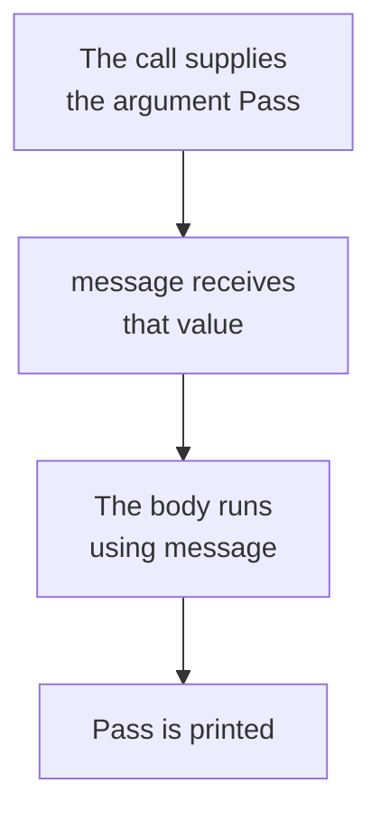

# Parameters and Arguments

A function often needs to be told what to work with, and the brackets are where it is told. When the brackets are empty, every call to the function does exactly the same thing. When a name is written inside them, each call can give the function a different value to work with.

> **A parameter is a variable named inside the brackets of a function definition, standing for a value the function expects to be given.**
>
> **An argument is the actual value supplied to the function when it is called.**
>
> The parameter belongs to the definition and the argument belongs to the call. When the function runs, each parameter receives the value of its argument.

## Syntax of a Parameter

The parameter is written between the brackets of the `def` line:

```
def function_name(parameter):
    statements
```

Inside the body, the parameter is used like any other variable.

```python
def print_result(message):
    print(message)

print_result("Pass")
print_result("Fail")
```

**Output:**

```
Pass
Fail
```

One function, two different outputs.

`message` is the parameter. `"Pass"` and `"Fail"` are the arguments. At the first call, `message` held `"Pass"`. At the second call, the same name held `"Fail"`.



The parameter name is chosen by you, exactly as a variable name is. `message`, `text` and `word` would all work.

## Passing a Variable as an Argument

An argument does not have to be typed into the call. It can be a variable:

```python
def check_result(marks):
    if marks >= 35:
        print("Pass")
    else:
        print("Fail")

student_marks = 45
check_result(student_marks)
```

**Output:**

```
Pass
```

The value `45` is passed to the function, and the parameter `marks` receives that value. The function never asked for input, and it never needed to know where the value came from.

Any expression can be an argument, because Python evaluates it before the call is made. `check_result(40 + 5)` works the same way.

## Multiple Parameters

A function can take more than one parameter, separated by commas:

```python
def check_result(name, marks):
    if marks >= 35:
        print(name, "has passed")
    else:
        print(name, "has failed")

check_result("Asha", 87)
check_result("Ravi", 20)
```

**Output:**

```
Asha has passed
Ravi has failed
```

Two parameters, two arguments at each call. `name` took the first argument and `marks` took the second.

## Positional Arguments

Arguments given in this way are called positional arguments.

> **A positional argument is an argument matched to a parameter by its position in the call.** The first argument is assigned to the first parameter, the second to the second, and so on, so the arguments must be written in the same order as the parameters.

```python
def check_result(name, marks):
    print(name, marks)

check_result("Asha", 87)
```

**Output:**

```
Asha 87
```

Think of the call as this:

```
name  ← "Asha"
marks ← 87
```

With positional arguments, Python matches arguments to parameters by their position. Swap the arguments and the call becomes this:

```
name  ← 87
marks ← "Asha"
```

Python accepts it:

```python
def check_result(name, marks):
    print(name, "scored", marks)

check_result(87, "Asha")
```

**Output:**

```
87 scored Asha
```

No error appeared. The code is valid and the output is nonsense.

The number of arguments must match. Give too few and Python stops:

```python
def check_result(name, marks):
    print(name, "scored", marks)

check_result("Asha")
```

**Output:**

```
TypeError: check_result() missing 1 required positional argument: 'marks'
```

Give too many and it stops as well:

```python
def check_result(name, marks):
    print(name, "scored", marks)

check_result("Asha", 87, 90)
```

**Output:**

```
TypeError: check_result() takes 2 positional arguments but 3 were given
```

Here, Python raises a `TypeError` because the number of arguments in the call does not match the parameters required by the function.

## Keyword Arguments

> **A keyword argument is an argument passed by naming its parameter explicitly, in the form `parameter=value`.** Because each argument names the parameter it is meant for, keyword arguments may be written in any order.

At the call it looks like this:

```python
def check_result(name, marks):
    print(name, "scored", marks)

check_result(marks=87, name="Asha")
```

**Output:**

```
Asha scored 87
```

The arguments are in the wrong order and the output is still correct. Each one named its own parameter, so position no longer mattered.

Keyword arguments are useful when naming the parameters makes a function call easier to understand. A call written as `create_user(name="Asha", age=20)` says more to a reader than `create_user("Asha", 20)`.

Positional and keyword arguments can be mixed. Python requires positional arguments to come before keyword arguments in a function call:

```python
def check_result(name, marks):
    print(name, "scored", marks)

check_result(name="Asha", 87)
```

**Output:**

```
SyntaxError: positional argument follows keyword argument
```

Written the other way round, it works:

```python
def check_result(name, marks):
    print(name, "scored", marks)

check_result("Asha", marks=87)
```

**Output:**

```
Asha scored 87
```

## Default Parameter Values

A parameter can be given a value to fall back on, written with `=` in the definition. That makes the argument optional:

```python
def greet(name, message="Welcome"):
    print(message, name)

greet("Asha")
greet("Ravi", "Good morning")
```

**Output:**

```
Welcome Asha
Good morning Ravi
```

The `message="Welcome"` in the definition means this:

```
Use "Welcome" if the caller does not provide a value for message.
```

The first call passed one argument, so `name` received `"Asha"` and `message` used its default value `"Welcome"`. The second call supplied a value for `message`, so that value replaced the default.

> **A default parameter value is a value given to a parameter in the function definition, used when the caller supplies no argument for that parameter.** It makes that argument optional, and every parameter carrying a default must be written after the parameters that have none.

Break that ordering rule and Python refuses the definition:

```python
def greet(message="Welcome", name):
    print(message, name)
```

**Output:**

```
SyntaxError: parameter without a default follows parameter with a default
```

A parameter with a default value must come after parameters without default values. Otherwise, Python could not unambiguously match positional arguments to the parameters.

## Parameters Are Local to the Function

A parameter cannot be used outside the function it belongs to:

```python
def check_result(student_marks):
    print("Inside:", student_marks)

check_result(87)
print(student_marks)
```

**Output:**

```
Inside: 87
NameError: name 'student_marks' is not defined
```

The parameter `student_marks` belongs to the function's local scope. When `check_result(87)` runs, the parameter is created for that function call and receives `87`.

After the function call finishes, `student_marks` cannot be accessed from outside the function.

You will learn more about this in **Variable Scope**.

## Parameters and Arguments Compared

| | Where it is written | What it is |
| --- | --- | --- |
| Parameter | in the `def` line, inside the brackets | a name waiting for a value |
| Argument | in the call, inside the brackets | the value actually supplied |

The definition declares what a function needs. The call supplies it.

## Further Reading

- **Function arguments with worked examples** — https://www.programiz.com/python-programming/function-argument
- **Official Python guide to defining functions** — https://docs.python.org/3/tutorial/controlflow.html

A function can now be given any values it needs. What it cannot do is hand a result back, so every function so far has had to print its answer itself.

Next, you will learn how a function returns a value to the line that called it.
