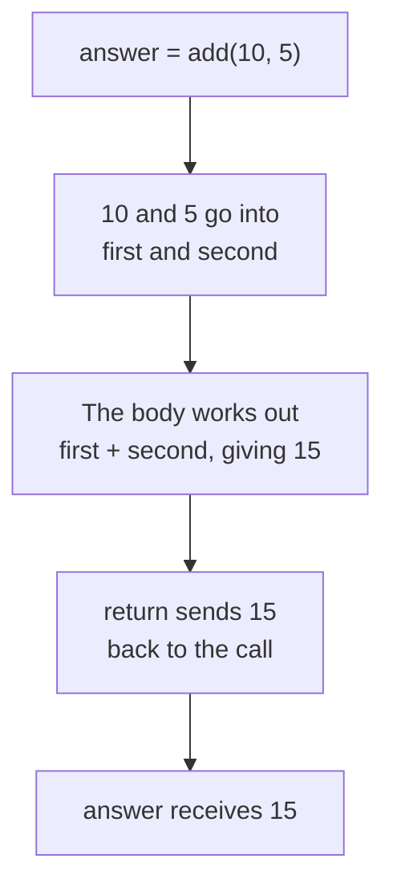

# The return Statement

A function can receive values through parameters. But so far, our functions have only printed their results. They have not returned a useful value that the rest of the program can use.

Here is a function that adds two numbers:

```python
def add(first, second):
    print(first + second)

add(10, 5)
```

**Output:**

```
15
```

The answer appears on screen, and that is all it does. The program cannot use the `15` for anything else.

Try to store it:

```python
def add(first, second):
    print(first + second)

answer = add(10, 5)
print(answer)
```

**Output:**

```
15
None
```

Two lines of output. The `15` came from the `print` inside the function. `answer` holds `None`, a special value that represents the absence of a value.

The function printed the result instead of handing it over. Printing puts a value on the screen. It does not give the value to the program.

## Syntax of the return Statement

The `return` statement sends a value back to the line that called the function.

```
def function_name(parameters):
    return value
```

```python
def add(first, second):
    return first + second

answer = add(10, 5)
print(answer)
```

**Output:**

```
15
```

One line of output now. The function no longer prints anything. It worked out `15` and returned it, the call took that value, and `answer` stored it.



Follow the value. It goes in as arguments, gets worked out inside the body, and comes back out through `return`. The variable on the left of the `=` receives it.

So after `add(10, 5)` returns, this line:

```python
answer = add(10, 5)
```

is effectively:

```python
answer = 15
```

Python does not literally rewrite your code. This is a way to understand what value the function call produces.

## Using a Returned Value

A call that returns a value can be used anywhere a value can be used:

```python
def add(first, second):
    return first + second

print(add(10, 5))
print(add(10, 5) * 2)
total = add(10, 5) + add(3, 2)
print(total)
```

**Output:**

```
15
30
20
```

The first line printed the returned value directly, with no variable. The second multiplied it. The third called the function twice and added the two results together.

This is what makes a returned value different from a printed one. It can be stored, printed, calculated with, or passed to another function.

For example:

```python
def calculate_total(price, quantity):
    return price * quantity

total = calculate_total(50, 3)

if total > 100:
    print("Free delivery")

print(total)
```

**Output:**

```
Free delivery
150
```

Because the function returned `150`, the rest of the program could make another decision using that value.

## Difference Between print and return

`print()` sends a value to the screen. The program does not keep it.

`return` sends a value back to the caller. The program keeps it, and nothing appears on screen unless it is printed:

```python
def add(first, second):
    return first + second

print(add(10, 5))
```

**Output:**

```
15
```

The function returned `15` and the `print` outside it put that on screen.

If the result is needed elsewhere in the program, return it. If the function's job is to show something to the user, print it.

## Execution Stops at return

`return` does two things. It sends the value back, and it ends the function immediately.

```python
def add(first, second):
    return first + second
    print("This line never runs")

print(add(10, 5))
```

**Output:**

```
15
```

The `print` inside the function produced nothing. `return` had already ended the function before that line was reached.

## Returning from a Condition

A function can hold several `return` statements. The first one reached is the one that runs:

```python
def get_result(marks):
    if marks >= 35:
        return "Pass"
    return "Fail"

print(get_result(87))
print(get_result(20))
```

**Output:**

```
Pass
Fail
```

With `87`, the condition was `True`, so the function returned `"Pass"` and ended there. The last line was never reached.

With `20`, the condition was `False`, so the `if` block was skipped and the function carried on to the last line and returned `"Fail"`.

An `else` is not needed in this example because `return` already ends the function when the condition is true. If the condition is false, Python skips the `return` and continues with the next statement.

## Functions Without a return Statement

If a function reaches the end without executing a `return` statement, Python automatically returns `None`.

**`None`** is a special Python value that represents the absence of a value. It is written with a capital `N` and no quotation marks.

```python
def show(marks):
    print(marks)

result = show(87)
print(result)
print(type(result))
```

**Output:**

```
87
None
<class 'NoneType'>
```

The function printed `87`. It had no `return` statement, so the call gave back `None`, and that is what `result` holds. `NoneType` is the data type of `None`.

This explains the `None` that appeared at the start of this topic. A function that reaches the end without returning a value returns `None`.

## The Bare return Statement

`return` can be written on its own, with no value after it. The function ends at once and returns `None`.

```python
def check(marks):
    if marks < 0:
        return
    print("Marks:", marks)

check(-5)
check(87)
```

**Output:**

```
Marks: 87
```

The first call passed `-5`. The condition was `True`, `return` ran, and the function ended before reaching the `print`.

The second call passed `87`. The condition was `False`, so the function carried on and printed the line.

A bare `return` is useful when a function needs to stop early without returning a value.

## Further Reading

- **The return statement with worked examples** — https://www.programiz.com/python-programming/function
- **Official Python guide to defining functions** — https://docs.python.org/3/tutorial/controlflow.html

A function can now take values and return a result. But the definition does not yet tell a reader what types of values the parameters or return value are expected to have.

Next, you will learn how to add type hints to a function definition.
