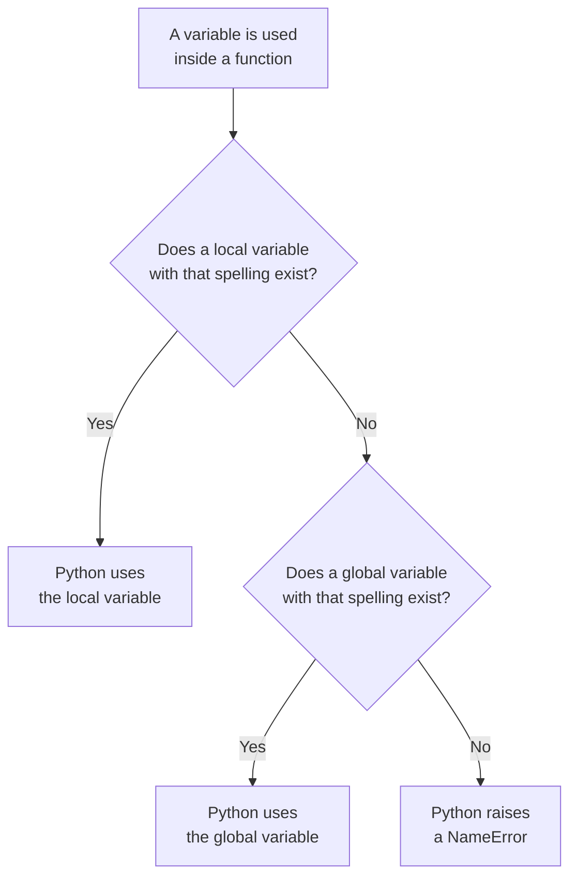

# Variable Scope

A function can create variables inside its body. Those variables are normally local to the function and cannot be accessed directly from outside it.

```python
def show_total():
    total = 150
    print(total)

show_total()
print(total)
```

The first `print()` produces:

```
150
```

The second `print()` causes a `NameError`, because `total` is not available outside the function.

The variable `total` was created inside `show_total()`, so it belongs to that function's local scope. Where a variable can be used depends on where it is created in the program.

> **Scope is the region of a program in which a variable can be accessed.** Where a variable is created determines the scope in which it belongs.

Python has two scopes that a program creates directly:

- **Local scope**, which belongs to a function
- **Global scope**, which belongs to the file

A variable created inside a function belongs to local scope. A variable created outside every function belongs to global scope.

## Local Scope

> **Local scope is the scope of a function call.** It contains the variables defined inside that function, including its parameters. These variables can normally be accessed only while that function is executing.

Local scope is what allows two functions to use the same variable name without interfering with each other:

```python
def first_function():
    message = "from first"
    print(message)

def second_function():
    message = "from second"
    print(message)

first_function()
second_function()
```

**Output:**

```
from first
from second
```

Both functions define a variable called `message`. These are two separate local variables, so changing one does not affect the other.

This allows each function to choose simple variable names such as `message`, `total` or `count` without interfering with variables inside another function.

## Global Scope

> **Global scope is the scope of the file itself, containing every variable defined outside all functions.** A variable in global scope may be accessed anywhere in that file, including from inside a function, provided no local variable of the same name hides it.

```python
pass_mark = 35

def check(marks):
    if marks >= pass_mark:
        print("Pass")
    else:
        print("Fail")

check(87)
print(pass_mark)
```

**Output:**

```
Pass
35
```

`pass_mark` was created outside every function, which places it in global scope. The function read it without being given it as an argument, and the `print()` at the end read it as well.

This is how a fixed value that several functions need is shared. The pass mark is written once, and every function that refers to it uses the same value.

Access between the two scopes runs one way only:

```python
pass_mark = 35

def check(marks):
    grade = "Pass"
    print(pass_mark)

check(87)
print(grade)
```

The line `print(pass_mark)` inside the function succeeds, because a function can read a global variable. The line `print(grade)` outside the function raises a `NameError`, because code outside a function cannot read a local variable.

## Variable Lookup

When a variable is used inside a function, Python looks for it in two places, in a fixed order. It searches the function's local scope first. Only if the variable is not found there does it search global scope.



So when a local variable and a global variable share the same name, the local one is found first and the global one is never reached:

```python
total = 100

def show_total():
    total = 50
    print("Inside:", total)

show_total()
print("Outside:", total)
```

**Output:**

```
Inside: 50
Outside: 100
```

Two separate variables exist here, both named `total`. The assignment inside the function created a local variable rather than altering the global one, so the global `total` still held `100` when the function ended.

## Assignment Inside a Function

Reading a global variable inside a function works, as the pass mark example showed. Assigning to one behaves differently, and the difference is worth understanding rather than memorising.

```python
count = 10

def increase():
    count = count + 1
    print(count)

increase()
```

The function raises an `UnboundLocalError` because `count` is treated as a local variable but is read before it has been given a value.

Because `count` is assigned inside `increase()`, Python treats it as local throughout that function. So the right side tries to read the local `count` before it has a value.

The global `count` is not used here.

## The global Keyword

> **The `global` keyword declares that a variable inside a function refers to the global variable rather than to a new local one.** It is written before the variable is used, and it allows an assignment inside the function to change the value held in global scope.

```python
count = 10

def increase():
    global count
    count = count + 1
    print(count)

increase()
print(count)
```

**Output:**

```
11
11
```

The assignment changed the global `count`, and that change remained after the function ended, which is why both lines print `11`.

`global` is seldom the right choice, because a reader of the call cannot see that a value elsewhere in the program has changed. The same work is better done with a parameter and a return value:

```python
count = 10

def increase(current):
    return current + 1

count = increase(count)
print(count)
```

**Output:**

```
11
```

The function receives the current value and returns the updated one. The assignment sits outside the function, where a reader can see it, so the change to `count` is stated in the program rather than hidden inside a call.

## Summary of the Two Scopes

| A local variable | A global variable |
| --- | --- |
| Is created inside a function | Is created outside every function |
| Includes the function's parameters | Includes every variable written at the top level of the file |
| Can be read inside that function | Can be read anywhere in the file |
| Cannot be read outside that function | Can be read inside a function, unless a local variable shares its name |
| Is created by any assignment inside the function | Needs the `global` keyword before a function can assign to it |

## Further Reading

- **Variable scope with worked examples** — https://www.programiz.com/python-programming/global-local-nonlocal-variables
- **Official Python guide to scopes** — https://docs.python.org/3/tutorial/classes.html

A function can now take values, return a result, and keep its local variables separate from the rest of the program.

Next, you will learn what Python prints when a program stops with an error, and how to read that message to find the line responsible.
