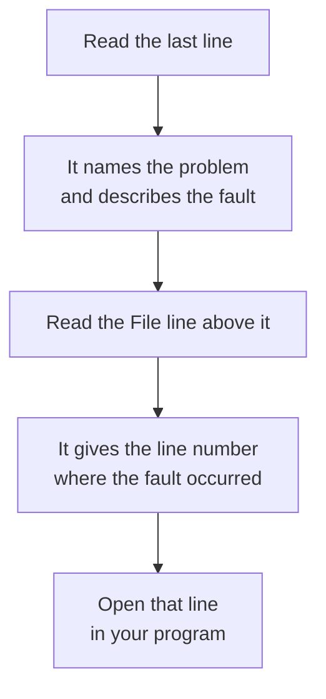

# Errors and Tracebacks

When Python stops a program because of a problem, it gives you a report showing what went wrong and where Python detected it.

```python
print("Starting")
marks = int("hello")
print("Finished")
```

**Output:**

```
Starting
Traceback (most recent call last):
  File "marks.py", line 2, in <module>
    marks = int("hello")
            ^^^^^^^^^^^^
ValueError: invalid literal for int() with base 10: 'hello'
```

The first line ran and printed `Starting`. The second line failed, so `Finished` was never printed. The block after `Starting` is the report Python produced about the problem.

> **A traceback is Python's report about a problem that stopped the program.** It tells you what went wrong, where it happened, and the lines that led to it.

## Parts of a Traceback

A traceback gives you several useful pieces of information:

```
Traceback (most recent call last):        the report begins
  File "marks.py", line 2, in <module>    file and location
    marks = int("hello")                  the relevant line
ValueError: invalid literal for ...       what went wrong
```

`File "marks.py", line 2` names the file and the line number. `in <module>` means Python is executing that line in the main body of the file, rather than inside a function.

The last line is the one to read first. It gives the name of the problem before the colon and the description after it. Here the name is `ValueError`, and the description says that the text `'hello'` could not be read as a whole number.

The `^^^^` marks highlight the part of the line Python was evaluating when the problem occurred. This can help you quickly locate the expression involved.

## Reading a Traceback

Read the last line first, then the location above it.



The last line tells you what kind of problem occurred and describes it. The `File` line tells you where to look. Those two together give you a strong starting point for finding the fault.

## Syntax Errors and Runtime Errors

Not every fault stops a program in the same way. Some are found before the program starts at all.

> **A syntax error is a fault in the way the code is written, which Python detects before running the program.** Nothing in the file runs, including lines that would otherwise have worked.

> **A runtime error is a fault that occurs while the program is running.** The lines before it run normally, and the program stops at the point where the fault occurs.

A missing bracket is a syntax error:

```python
print("Result"
print("Done")
```

**Output:**

```
  File "report.py", line 1
    print("Result"
         ^
SyntaxError: '(' was never closed
```

Neither line printed anything. Python read the file, found that the bracket opened on line 1 was never closed, and refused to run any of it.

Notice what this report does not have. There is no `Traceback (most recent call last):` line at the top, because no lines were ever run and so there is no sequence of calls to report.

The `ValueError` at the start of this topic was a runtime error. `Starting` was printed before the program stopped, which tells you the program did run.

## Tracebacks Through Functions

When the fault occurs inside a function, the traceback lists every call that led there.

```python
def find_average(total, count):
    return total / count

def show_report(total, count):
    average = find_average(total, count)
    print(average)

show_report(240, 0)
```

**Output:**

```
Traceback (most recent call last):
  File "report.py", line 8, in <module>
    show_report(240, 0)
  File "report.py", line 5, in show_report
    average = find_average(total, count)
  File "report.py", line 2, in find_average
    return total / count
           ~~~~~~^~~~~~~
ZeroDivisionError: division by zero
```

Three `File` lines now, one for each step. Read them from the bottom upwards:

- Line 2, inside `find_average`, is where the program actually stopped.
- Line 5, inside `show_report`, is the line that called `find_average`.
- Line 8, in the main body, is the line that called `show_report`.

`most recent call last` means the most recent function call is shown closest to the bottom, where the program finally stopped. The call that started everything is at the top.

Both ends matter when fixing the fault. The bottom line shows where the program stopped. The top line shows where the call that started this chain was made. Here, tracing the values from `show_report(240, 0)` leads you to the `0` used as the divisor.

## Common Problem Names

The name before the colon narrows the search before you read anything else.

| Name | Happens when |
| --- | --- |
| `SyntaxError` | the code is not written correctly, so Python cannot run it |
| `IndentationError` | indentation does not follow Python's block structure |
| `NameError` | a name is used that has not been defined |
| `TypeError` | an operation is applied to a value of an inappropriate type |
| `ValueError` | the value is not suitable for the operation |
| `ZeroDivisionError` | a division or modulus operation uses zero as the divisor |
| `UnboundLocalError` | a local name is read before it has been given a value |

Two of these are worth comparing directly, because they are easily confused.

A `NameError` means Python does not recognise the name at all:

```python
marks = 87
print(mark)
```

**Output:**

```
Traceback (most recent call last):
  File "marks.py", line 2, in <module>
    print(mark)
          ^^^^
NameError: name 'mark' is not defined. Did you mean: 'marks'?
```

A `NameError` often happens because of a misspelled or undefined name. Python may suggest a similar name when it finds one.

A `TypeError` means the name is fine, but the value it holds cannot be used that way:

```python
age = 20
print("Age: " + age)
```

**Output:**

```
Traceback (most recent call last):
  File "profile.py", line 2, in <module>
    print("Age: " + age)
          ~~~~~~~~^~~~~
TypeError: can only concatenate str (not "int") to str
```

The description names both types involved, which is the quickest way to see that a conversion is missing.

## One Important Word: Exception

You have seen names such as `ValueError`, `TypeError` and `ZeroDivisionError` throughout this topic.

> **An exception is a problem Python detects while the program is running.** Each kind has a name, and that name states what sort of problem occurred.

For example:

```python
marks = int("hello")
```

Python cannot convert `"hello"` into an integer, so it raises a `ValueError`. If nothing handles that exception, Python stops the program and prints a traceback.

So the relationship is simple. The exception is the problem Python detected. The traceback is the report Python gives you when that problem stops the program.

## Further Reading

- **Errors and exceptions explained** — https://www.programiz.com/python-programming/exceptions
- **Official Python guide to errors and exceptions** — https://docs.python.org/3/tutorial/errors.html

You now know how to read a traceback and find where a problem occurred.

But what if you don't want the program to stop?

What if a person types `hello` when the program expects marks? Instead of showing a traceback and ending the program, you could show a message and ask them to try again.

Next, you will learn how to **catch an exception** and decide what the program should do instead of stopping.
