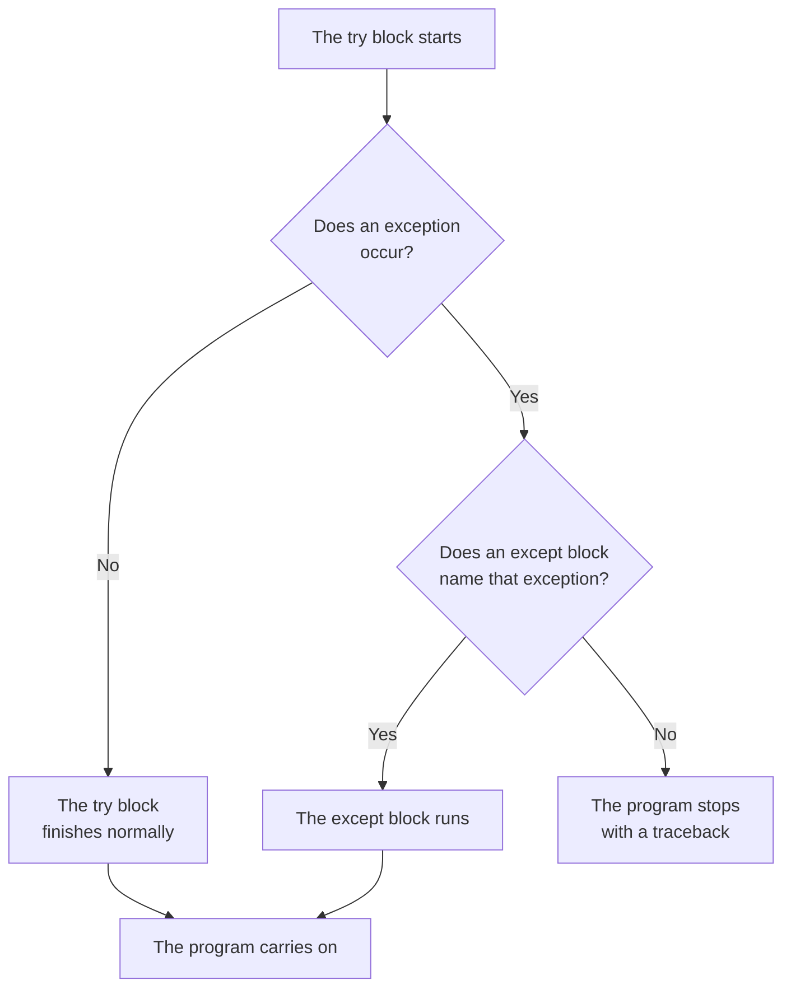

# Exception Handling

A traceback tells you where a problem occurred, which is useful when the problem is in your code. But sometimes the code is correct and the problem is simply the value someone entered.

```python
marks = int(input("Marks: "))
print("You entered", marks)
```

**Output:**

```
Marks: hello
Traceback (most recent call last):
  File "marks.py", line 1, in <module>
    marks = int(input("Marks: "))
            ^^^^^^^^^^^^^^^^^^^^^
ValueError: invalid literal for int() with base 10: 'hello'
```

The line is written correctly. The problem is the value entered: `"hello"` cannot be converted to an integer.

> **Exception handling means catching an exception and telling the program what to do instead of stopping.** The code that might fail goes in a `try` block. The code that runs if it fails goes in an `except` block.

## Syntax of try and except

The `try` block holds the statements that might raise an exception. The `except` block names an exception and holds the statements to run if that exception occurs.

```
try:
    statements that might fail
except ExceptionName:
    statements to run if it fails
```

Here is the same conversion, now inside a `try` block:

```python
try:
    marks = int(input("Marks: "))
    print("You entered", marks)
except ValueError:
    print("That is not a whole number")
```

**Output:**

```
Marks: hello
That is not a whole number
```

No traceback. The `int()` call raised a `ValueError`, Python found an `except` block naming that exception, and ran it instead of stopping.

When nothing goes wrong, the `except` block is skipped:

**Output:**

```
Marks: 87
You entered 87
```

The `try` block ran to the end, so there was no exception to catch.

## Errors and Exceptions

You have seen both words. They mean different things.

> **An error is a problem or fault in a program.** It may come from incorrectly written code, or from something that happens while the program runs.

> **An exception is a problem Python detects while the program is running.** A program can catch an exception and decide how to respond.

The difference that matters is timing.

| Syntax error | Exception |
| --- | --- |
| Python cannot read the code, so the program never starts. | The code is written correctly and the program runs until the problem occurs. |
| The code has to be corrected before anything will run. | A `try` block can catch it and let the program continue. |
| A missing bracket produces a `SyntaxError`. | Converting `"hello"` with `int()` produces a `ValueError`. |

An exception does not always mean the code is wrong. It may be caused by a value the program was given, or it may show a mistake in the program. So when an exception appears, first find out what caused it. Then decide whether the program should handle it or whether the code needs correcting.

## Control Flow of try and except



Two things follow from this.

When an exception occurs, the rest of the `try` block is skipped. Python goes straight to the `except` block, so any statement after the failing line never runs.

After the `except` block has run, the program carries on:

```python
try:
    marks = int("hello")
except ValueError:
    print("Conversion failed")

print("The program carries on")
```

**Output:**

```
Conversion failed
The program carries on
```

The last line is outside both blocks, so it runs whether the conversion succeeds or fails.

## Catching the Right Exception

An `except` block only catches the exception it names. Any other exception is not caught, and the program stops.

```python
try:
    result = 10 / 0
except ValueError:
    print("Caught it")
```

**Output:**

```
Traceback (most recent call last):
  File "divide.py", line 2, in <module>
    result = 10 / 0
             ~~~^~~
ZeroDivisionError: division by zero
```

The `except` block named `ValueError`, and the problem was a `ZeroDivisionError`. Nothing caught it, so the program stopped as it would have with no `try` at all.

This is why the name matters. Read the traceback first to find out which name to write.

## Handling Several Exceptions

One `try` block can have several `except` blocks, each naming a different exception. Python runs the first one whose name matches.

```python
def divide(first, second):
    try:
        return first / second
    except ZeroDivisionError:
        print("Cannot divide by zero")
    except TypeError:
        print("Both values must be numbers")

print(divide(10, 2))
print(divide(10, 0))
print(divide(10, "two"))
```

**Output:**

```
5.0
Cannot divide by zero
None
Both values must be numbers
None
```

Three calls, three different paths.

The first divided cleanly and returned `5.0`.

The second raised `ZeroDivisionError`. The `except` block printed its message, and that block has no `return`, so the function returned `None`, which the outer `print()` displayed.

The third passed a string as the divisor, which raised `TypeError`. The same thing happened, with the second message.

## The else Block

An `else` block runs only when the `try` block finished without raising an exception.

```python
try:
    marks = int("87")
except ValueError:
    print("Not a whole number")
else:
    print("Converted successfully:", marks)
```

**Output:**

```
Converted successfully: 87
```

The conversion worked, so the `except` block was skipped and the `else` block ran.

Statements that depend on the `try` block succeeding belong in `else`. Keeping the `try` block limited to the statements that might fail makes it clear which code you are handling.

## The finally Block

> **A `finally` block runs whether or not an exception occurred.** It runs after the `try` block and after any matching `except` or `else` block. Use it for work that must happen whether or not the operation succeeds.

```python
try:
    marks = int("hello")
except ValueError:
    print("Not a whole number")
finally:
    print("Check complete")
```

**Output:**

```
Not a whole number
Check complete
```

The conversion failed, the `except` block ran, and `finally` ran after it. If the conversion had succeeded, the `except` block would have been skipped and `finally` would still have run.

## Repeating Until the Input Is Valid

Catching the exception is only half the answer. A program that asks for a number usually needs to keep asking until it gets one, which means putting `try` inside a loop.

```python
while True:
    try:
        marks = int(input("Marks: "))
        break
    except ValueError:
        print("Please type a whole number")

print("Marks recorded:", marks)
```

**Output:**

```
Marks: hello
Please type a whole number
Marks: 87
Marks recorded: 87
```

The first entry raised a `ValueError`, so `break` was never reached and the loop went round again. The second entry converted successfully, `break` ended the loop, and the program carried on.

This is a common pattern for repeatedly asking for a valid number. It is worth remembering as a whole.

## The Four Blocks Together

| Block | Runs when |
| --- | --- |
| `try` | the program reaches it; it holds statements that might fail |
| `except` | a matching exception occurs in the `try` block |
| `else` | the `try` block finishes without an exception |
| `finally` | after the `try` and any matching `except` or `else`, whether or not an exception occurred |

A `try` block must be followed by at least one `except` or a `finally` block. `else` is optional.

## Further Reading

- **Exception handling with worked examples** — https://www.programiz.com/python-programming/exception-handling
- **Official Python guide to errors and exceptions** — https://docs.python.org/3/tutorial/errors.html

A program can also run to the end with no exception at all and still give the wrong answer, and finding a fault of that kind is called debugging.
