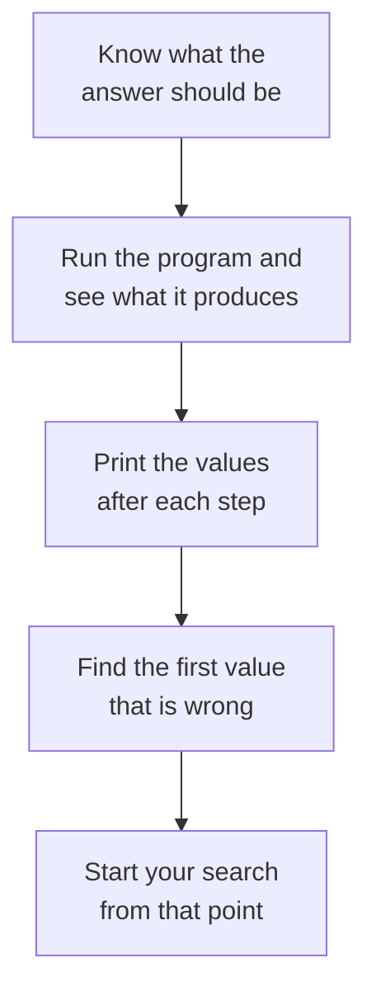

# Debugging

A program can run from start to finish, raise no exception, and still be wrong.

```python
def find_average(first, second, third):
    total = first + second + third
    return total / 2

print(find_average(80, 90, 70))
```

**Output:**

```
120.0
```

No traceback appeared, because every line is written correctly. The average of 80, 90 and 70 is 80, and the program said 120.

> **A logic error is a fault that produces a wrong result without stopping the program.** Python cannot detect it, because the code does exactly what it was written to do.

> **Debugging is the process of finding and fixing problems in a program.** It starts with understanding what the program should do.

## Expected and Actual Results

Debugging cannot begin until you know what the right answer is.

Here the expected result is 80 and the actual result is 120. That gap is what tells you a fault exists. Without it, the program looks perfectly reasonable.

So the first step is always the same. Work out the correct answer yourself, then run the program and compare.

## Printing Values Along the Way

The `print()` function is the simplest way to see what a program is really working with. Put one after each step and the values become visible.

```python
def find_average(first, second, third):
    total = first + second + third
    print("total is", total)
    average = total / 2
    print("average is", average)
    return average

print(find_average(80, 90, 70))
```

**Output:**

```
total is 240
average is 120.0
120.0
```

The total of `240` is correct. The average of `120.0` is not.

That narrows the search to the division. The total should be divided by `3`, the number of marks, and the code divides by `2`.

```python
def find_average(first, second, third):
    total = first + second + third
    return total / 3

print(find_average(80, 90, 70))
```

**Output:**

```
80.0
```



The fourth step saves the most time. Every value printed before the wrong one is behaving as expected, so you can focus your search from that point onward.

## Narrowing Down by Halves

Printing after every line is slow in a long program. Printing once in the middle is faster.

If you place a `print()` around the middle of a long program, you can often eliminate a large part of the code from your search. If the value there is correct, the fault is likely to be later. If it is wrong, the fault may be earlier.

Repeat on the half that remains, and a long program narrows to a small number of lines in a few steps.

## Checking the Type of a Value

Some faults are caused by a value being the wrong type rather than the wrong number. The `type()` function shows what a value actually is.

```python
marks = input("Marks: ")
print("marks is", marks)
print("type is", type(marks))
```

**Output:**

```
Marks: 87
marks is 87
type is <class 'str'>
```

The value prints as `87` and looks like a number. It is a string, because `input()` always returns a string.

Whenever a value behaves in a way you cannot explain, checking its type can help reveal the problem.

## Checking Values at the Boundary

A program can be correct for most values and wrong for one. The value at the edge of a condition is where this usually happens.

```python
def check(marks):
    if marks > 35:
        return "Pass"
    return "Fail"

print(check(34))
print(check(35))
print(check(36))
```

**Output:**

```
Fail
Fail
Pass
```

The results for 34 and 36 are correct. The result for 35 is not. If 35 is the pass mark, the condition should be `>=` rather than `>`.

Testing only the middle of a range hides faults of this kind, so test the edge values as well.

## Following a Loop One Iteration at a Time

A fault inside a loop is hard to see, because only the final result is visible.

```python
total = 0
for number in range(1, 5):
    total = number
print(total)
```

**Output:**

```
4
```

The total of 1, 2, 3 and 4 is 10, and the program printed 4. A `print()` inside the loop shows what happens on each iteration.

```python
total = 0
for number in range(1, 5):
    total = number
    print("number:", number, "total:", total)
print("final:", total)
```

**Output:**

```
number: 1 total: 1
number: 2 total: 2
number: 3 total: 3
number: 4 total: 4
final: 4
```

`total` never grows. It holds whatever `number` last held, because the line replaces the total instead of adding to it. It should be `total = total + number`.

```python
total = 0
for number in range(1, 5):
    total = total + number
print(total)
```

**Output:**

```
10
```

One `print()` inside the loop turned an invisible fault into an obvious one.

## A Method for Debugging

The steps are the same whatever the program.

1. Decide what the correct result should be.
2. Run the program and compare the two results.
3. Print values at each step, or at the middle of a long program.
4. Find the first value that differs from what you expected.
5. Look at the code that produced it.
6. Correct the fault and run the program again.

The last step matters as much as the rest. A correction is not finished until the program has been run and the result checked.

## Removing Debugging Statements

Every `print()` added while debugging is there for you, not for the person using the program. Remove them once the fault is corrected, or the output fills up with values nobody else needs to see.

## Further Reading

- **Debugging techniques for beginners** — https://realpython.com/python-debugging-pdb/
- **Official Python guide to errors and exceptions** — https://docs.python.org/3/tutorial/errors.html

That completes functions, errors and debugging. You can write a function, pass values to it, take a result back, read a traceback, handle an exception, and find a fault that produces no error at all.

Next, you will learn how to store many values under one name, which is what a program needs before it can work with a whole class of students at once.
