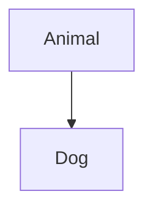
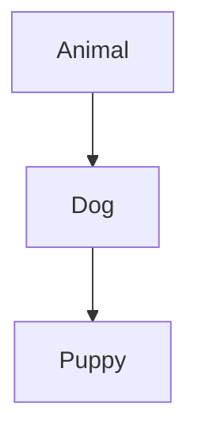
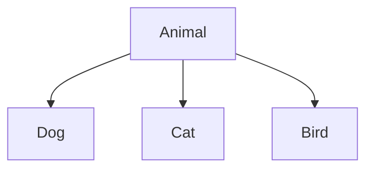
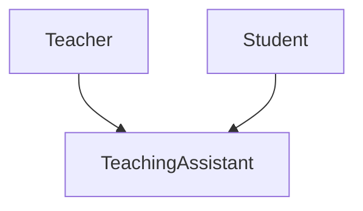
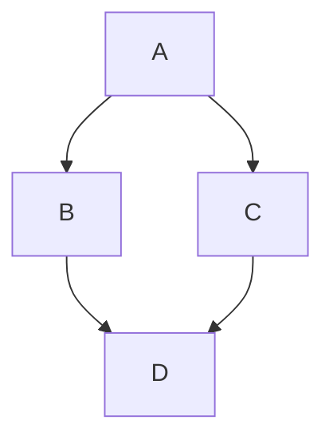
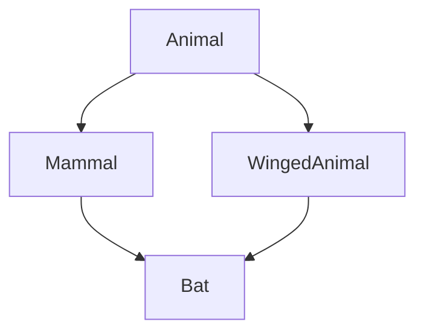

# Types of Inheritance

Hierarchies take a small number of recognisable shapes. Each has a name, and the names come up often enough to be worth knowing.

## Single Inheritance

One child, one parent. This is every example so far.



```python
class Animal:
    def eat(self):
        print("Eating")

class Dog(Animal):
    def bark(self):
        print("Woof")

pet = Dog()
pet.eat()
pet.bark()
```

**Output:**

```
Eating
Woof
```

The commonest shape, and the one to prefer.

## Multilevel Inheritance

A child that is itself a parent — a chain.



```python
class Animal:
    def eat(self):
        print("Eating")

class Dog(Animal):
    def bark(self):
        print("Woof")

class Puppy(Dog):
    def weep(self):
        print("Yip")

pet = Puppy()
pet.eat()
pet.bark()
pet.weep()
```

**Output:**

```
Eating
Woof
Yip
```

`Puppy` inherits from `Dog`, which inherits from `Animal`, so a Puppy has all three sets of methods. The lookup simply continues up the chain until it finds a match.

Chains get hard to follow quickly. Finding where a method is actually defined means checking each level, and a change near the top reaches everything below it. Two or three levels is usually the practical limit.

## Hierarchical Inheritance

One parent, several children.



```python
class Animal:
    def __init__(self, name):
        self.name = name

    def eat(self):
        print(f"{self.name} is eating")

class Dog(Animal):
    def speak(self):
        print("Woof")

class Cat(Animal):
    def speak(self):
        print("Meow")

class Bird(Animal):
    def speak(self):
        print("Tweet")

for pet in [Dog("Rex"), Cat("Whiskers"), Bird("Tweety")]:
    pet.eat()
    pet.speak()
```

**Output:**

```
Rex is eating
Woof
Whiskers is eating
Meow
Tweety is eating
Tweet
```

Shared behaviour in the parent, differences in the children. This is inheritance working as intended, and it is the shape that makes the next chapter's subject possible.

## Multiple Inheritance

One child, several parents. Python allows it; many languages do not.



```python
class Teacher:
    def teach(self):
        print("Teaching a class")

class Student:
    def study(self):
        print("Studying for an exam")

class TeachingAssistant(Teacher, Student):
    pass

person = TeachingAssistant()
person.teach()
person.study()
```

**Output:**

```
Teaching a class
Studying for an exam
```

Both parents are listed in the brackets, and the child gets everything from both.

The question this raises is what happens when both parents define the same method.

## The Diamond Problem

When two parents share a grandparent, the hierarchy forms a diamond:



If `B` and `C` both define `show()`, which one does `D` get?

```python
class A:
    def show(self):
        print("A")

class B(A):
    def show(self):
        print("B")

class C(A):
    def show(self):
        print("C")

class D(B, C):
    pass

D().show()
```

**Output:**

```
B
```

`B` wins, because it is listed first in `class D(B, C)`. Order in the brackets is significant.

## The Method Resolution Order

The rule behind that answer is the **method resolution order**, or **MRO**: the single sequence of classes Python searches, computed once per class.

```python
print([cls.__name__ for cls in D.__mro__])
```

**Output:**

```
['D', 'B', 'C', 'A', 'object']
```

`D`, then `B`, then `C`, then `A`, then `object`. Every lookup walks this list and stops at the first match, which is why `show()` found `B`'s.

Three rules determine the order:

- a class always comes before any of its parents
- parents stay in the order they were listed
- every class appears exactly once

That third rule is what resolves the diamond. `A` appears once, after both `B` and `C`, rather than being visited twice.

Python refuses to build a class whose MRO cannot satisfy all three:

```python
class A:
    pass

class B(A):
    pass

class Broken(A, B):
    pass
```

**Output:**

```
TypeError: Cannot create a consistent method resolution order (MRO) for bases A, B
```

`A` was listed before `B`, but `B` is a child of `A` and must come first. The two requirements contradict each other, and the error arrives at class definition rather than at some confusing moment later.

## super() and the MRO

This is what the previous chapter meant by `super()` following the search order rather than simply meaning "my parent".

Each class calls `super()`, and Python walks the MRO once:

```python
class Base:
    def __init__(self):
        print("Base init")

class Left(Base):
    def __init__(self):
        print("Left init")
        super().__init__()

class Right(Base):
    def __init__(self):
        print("Right init")
        super().__init__()

class Bottom(Left, Right):
    def __init__(self):
        print("Bottom init")
        super().__init__()

Bottom()
```

**Output:**

```
Bottom init
Left init
Right init
Base init
```

`Base` ran once. Note what `super()` did inside `Left`: it went to `Right`, not to `Base`. `Left`'s parent is `Base`, but the next class after `Left` in `Bottom`'s MRO is `Right`:

```python
print([cls.__name__ for cls in Bottom.__mro__])
```

**Output:**

```
['Bottom', 'Left', 'Right', 'Base', 'object']
```

Each class hands on to the next in the list, wherever that leads, and every class is initialised exactly once.

Hard-coded parent calls cannot do this:

```python
class Base:
    def __init__(self):
        print("Base init")

class Left(Base):
    def __init__(self):
        print("Left init")
        Base.__init__(self)

class Right(Base):
    def __init__(self):
        print("Right init")
        Base.__init__(self)

class Bottom(Left, Right):
    def __init__(self):
        print("Bottom init")
        Left.__init__(self)
        Right.__init__(self)

Bottom()
```

**Output:**

```
Bottom init
Left init
Base init
Right init
Base init
```

`Base` was initialised twice. Anything it does — opening a file, incrementing a counter, allocating a resource — happened twice too. This is the concrete reason `super()` is preferred, and it only shows up once a hierarchy has more than one parent.

## Hybrid Inheritance

Any combination of the above. The diamond is itself a hybrid: hierarchical at the top, multiple at the bottom.



The name describes a shape rather than a feature. There is no separate syntax, and the MRO rules handle it like any other.

## Summary

| Type | Shape |
| --- | --- |
| Single | one parent, one child |
| Multilevel | a chain of parents and children |
| Hierarchical | one parent, several children |
| Multiple | one child, several parents |
| Hybrid | a combination of the above |

## A Note on Restraint

Multiple inheritance is powerful and easy to misuse. A class with several parents is harder to reason about, its MRO may surprise you, and a method's origin can be genuinely difficult to locate.

Where it is used well, it is usually for **mixins** — small classes that add one capability and hold no state of their own, combined with a single real parent:

```python
class JSONMixin:
    def to_json(self):
        return str(self.__dict__)

class Animal:
    def __init__(self, name):
        self.name = name

class Dog(Animal, JSONMixin):
    pass

print(Dog("Rex").to_json())
```

**Output:**

```
{'name': 'Rex'}
```

`JSONMixin` inherits from nothing, defines one method, and adds a capability to any class it is mixed into. That pattern stays comprehensible.

Prefer single inheritance. When a class seems to need two parents, check whether one of them should be an attribute instead.

## Further Reading

- **Official Python guide to multiple inheritance** — https://docs.python.org/3/tutorial/classes.html#multiple-inheritance
- **The method resolution order** — https://docs.python.org/3/howto/mro.html

Hierarchies come in five recognisable shapes, and the MRO settles every lookup by searching one ordered list. Next, using a hierarchy to treat different types uniformly.
