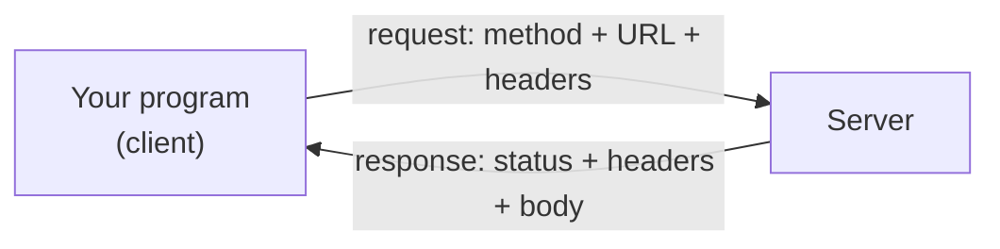

# APIs and HTTP

An **API** — application programming interface — is the set of operations one piece of software offers to another. A list's methods are an API. A module's functions are an API.

This chapter is about **web APIs**: operations offered by a program on another computer, reached over the internet. They are how a program gets live data — weather, exchange rates, a company's own records — instead of only what is on the local disk.

Before calling one, it is worth knowing what is actually happening.

## Request and Response

A web API is a conversation between a **client** (your program) and a **server**. The client sends a **request**; the server sends back a **response**. Nothing else happens — the server does not call back later, and the connection does not stay open.



The rules for that exchange are **HTTP**, the Hypertext Transfer Protocol. A browser loading a page uses it, and so does a Python program fetching data. The difference is only what comes back — HTML for the browser, usually JSON for the program.

**HTTPS** is HTTP over an encrypted connection. Use it for everything; a plain `http://` URL sends everything, including passwords and API keys, readable by anyone on the network.

## The URL

A request is addressed by a URL, and its parts each do a job:

```
https://api.example.com/v1/students?course=CS&limit=10
└─┬─┘   └──────┬──────┘└───┬─────┘ └────────┬────────┘
scheme       host        path          query string
```

- **scheme** — `https`, the protocol.
- **host** — which server to contact.
- **path** — which resource on that server. `/v1/` is a version number, so the API can change without breaking existing callers.
- **query string** — options, after `?`, as `name=value` pairs joined by `&`.

The query string is how filtering, searching and paging are usually requested. You will not normally build it by hand — the library does that from a dictionary.

## Methods

The request carries a **method** saying what to do with the resource:

| Method | Means | Changes data |
| --- | --- | --- |
| `GET` | fetch it | no |
| `POST` | create a new one | yes |
| `PUT` | replace it entirely | yes |
| `PATCH` | update part of it | yes |
| `DELETE` | remove it | yes |

`GET` is the one most beginners need, and it has an important property: it should never change anything. Sending the same `GET` twice is the same as sending it once. That is why a browser can reload a page freely, and why a failed `GET` is safe to retry — a point the error-handling chapter depends on.

`POST` is not safe to retry blindly. Sending it twice may well create two records.

## REST

**REST** is a style of API design rather than a standard. An API described as RESTful generally means:

- URLs identify **things**, named with nouns: `/students`, `/students/42`
- the **method** says what to do with the thing
- the server keeps no memory of previous requests
- data goes back and forth as JSON

So one URL supports several operations:

```
GET    /students        list them
POST   /students        create one
GET    /students/42     fetch one
PUT    /students/42     replace it
DELETE /students/42     delete it
```

Real APIs follow this loosely. Read the documentation rather than assuming.

## Status Codes

Every response carries a three-digit **status code**. The first digit gives the category:

| Range | Meaning | Common examples |
| --- | --- | --- |
| `2xx` | success | `200 OK`, `201 Created`, `204 No Content` |
| `3xx` | redirection | `301 Moved Permanently`, `304 Not Modified` |
| `4xx` | the client got it wrong | `400`, `401`, `403`, `404`, `429` |
| `5xx` | the server got it wrong | `500`, `502`, `503` |

The ones worth recognising:

| Code | Meaning | What to do |
| --- | --- | --- |
| `200 OK` | it worked | carry on |
| `201 Created` | the `POST` created something | carry on |
| `400 Bad Request` | the request was malformed | fix your request |
| `401 Unauthorized` | no valid credentials | check the API key |
| `403 Forbidden` | authenticated, not permitted | check the permissions |
| `404 Not Found` | no such resource | check the URL |
| `429 Too Many Requests` | rate limit exceeded | wait, then retry |
| `500 Internal Server Error` | the server broke | retry; it is not your fault |
| `503 Service Unavailable` | the server is overloaded or down | retry later |

The `4xx` / `5xx` split is the useful one. **A `4xx` means change the request; retrying unchanged will fail identically. A `5xx` means the request was fine and the server failed, so retrying may well work.**

The most important thing about status codes is that **a failed request is still a successful response**. A `404` arrives normally, with a body, and nothing raises an error. Code that does not check the status will happily parse an error page as though it were data.

## Headers

Both requests and responses carry **headers** — name-and-value metadata about the message, separate from the body.

Response headers describe what came back:

```
Content-Type: application/json; charset=utf-8
```

`Content-Type` says what the body is. `application/json` means it can be parsed as JSON; `text/html` means it cannot.

Request headers describe what the client wants or who it is:

| Header | Says |
| --- | --- |
| `Accept` | the format the client wants back |
| `Authorization` | credentials |
| `User-Agent` | what software is making the request |
| `Content-Type` | the format of the body being sent |

`Retry-After` is one to know on a response: when a server returns `429` or `503`, it may use this header to say how many seconds to wait.

## The Body

The body carries the actual data.

A `GET` request normally has no body — everything it needs is in the URL. Its response has one: the requested data, usually JSON.

A `POST` or `PUT` sends a body containing the thing to create or update, again usually JSON, with `Content-Type: application/json` saying so.

A response body of JSON is just text until something parses it. That is why the type mapping from the JSON chapter matters here — `true` becomes `True`, `null` becomes `None`, and the result is ordinary Python dictionaries and lists.

## Authentication

Most useful APIs need to know who is calling. Three approaches are common.

**No authentication** — public data, usually rate-limited by IP address. Fine for learning.

**An API key** — a string obtained by registering, sent with each request. Usually in a header:

```
Authorization: Bearer abc123...
```

Sometimes in the query string, which is worse: URLs get logged, so the key ends up in server logs and browser history.

**OAuth** — the flow behind "sign in with Google". More involved, and what you meet when acting on behalf of a user.

Whatever the scheme, **a key is a password**. Never write one into your source code, because source code gets committed and shared. Put it in an environment variable and read it:

```python
import os

api_key = os.environ.get("WEATHER_API_KEY")
if not api_key:
    print("Set WEATHER_API_KEY before running")
```

**Output:**

```
Set WEATHER_API_KEY before running
```

Committing a key to a public repository is a genuinely common and expensive mistake. Automated scanners find them within minutes.

## Reading an API's Documentation

Before writing any code, an API's documentation should tell you five things:

1. **The base URL** — what every path is appended to.
2. **The endpoints** — paths, methods, and parameters.
3. **Authentication** — whether a key is needed and how to send it.
4. **The response shape** — what the JSON looks like, ideally with an example.
5. **Rate limits** — how many requests are allowed, and over what period.

Good documentation includes a copyable example request. Start from that, get it working unchanged, and only then adapt it.

## Further Reading

- **HTTP overview** — https://developer.mozilla.org/en-US/docs/Web/HTTP/Overview
- **HTTP response status codes** — https://developer.mozilla.org/en-US/docs/Web/HTTP/Status

A client sends a method and a URL, a server returns a status code, headers and a body, and a `4xx` or `5xx` status is still a response rather than an error. Next, making these requests from Python.
