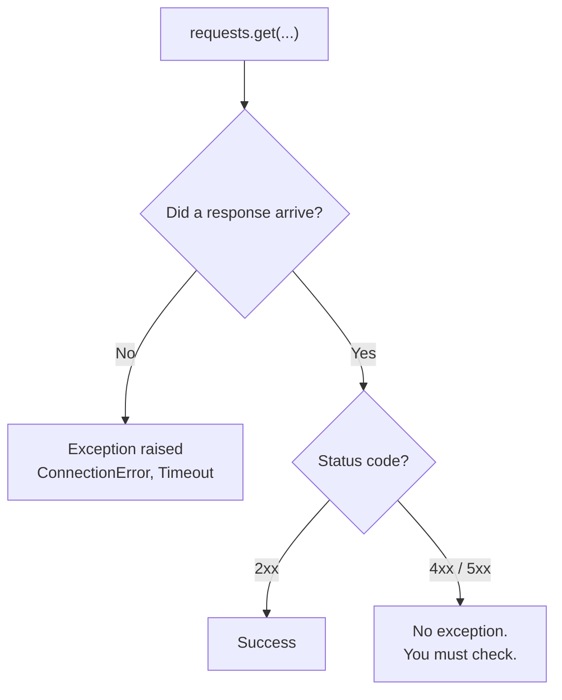

# Handling API Errors

Reading a local file can fail. Calling an API across the internet can fail in far more ways: the network may be down, the server may be overloaded, the address may be wrong, the response may not be what was promised, and you may simply be calling too often.

Code that assumes success works on your machine and fails in use. This chapter is about the difference.

## Two Kinds of Failure

They need handling differently, and confusing them is the usual mistake.

**The request never completed.** No response arrived at all — no network, no such host, the server took too long. `requests` raises an **exception**, so a `try` is needed.

**The server answered, and the answer was no.** A response arrived normally, carrying a `4xx` or `5xx` status. **No exception is raised.** The status must be checked.



## The Exceptions

All of them inherit from `requests.RequestException`:

| Exception | Cause |
| --- | --- |
| `ConnectionError` | no network, DNS failure, connection refused |
| `Timeout` | the server did not answer in time |
| `TooManyRedirects` | the server redirected in a loop |
| `HTTPError` | raised by `raise_for_status()` on a `4xx` or `5xx` |
| `JSONDecodeError` | the body was not valid JSON |
| `RequestException` | the base class for all of the above |

```python
import requests

print(issubclass(requests.ConnectionError, requests.RequestException))
print(issubclass(requests.Timeout, requests.RequestException))
```

**Output:**

```
True
True
```

That hierarchy is what makes `except requests.RequestException` a sound catch-all — it catches every failure from the library and nothing else. A bare `except:` would also swallow your own bugs.

```python
import requests

try:
    requests.get("https://no-such-host-abc123.invalid", timeout=10)
except requests.ConnectionError:
    print("Could not reach the server")
```

**Output:**

```
Could not reach the server
```

## raise_for_status

Checking `response.ok` by hand works. `raise_for_status()` turns a bad status into an exception instead, which lets both kinds of failure be handled in one `try`:

```python
import requests

response = requests.get("https://jsonplaceholder.typicode.com/todos/99999999", timeout=10)

try:
    response.raise_for_status()
except requests.HTTPError as error:
    print("HTTPError:", error)
```

**Output:**

```
HTTPError: 404 Client Error: Not Found for url: https://jsonplaceholder.typicode.com/todos/99999999
```

It does nothing on a `2xx` and raises on anything from `400` upwards. The raised error carries the response, so `error.response.status_code` is available in the handler.

Use `raise_for_status()` when any failure should stop the operation. Use `response.ok` when a `404` is a normal outcome you want to handle without exceptions — checking whether a record exists, for instance.

## Bodies That Are Not JSON

An endpoint returning HTML, or an error page, breaks `json()`:

```python
import requests

response = requests.get("https://example.com", timeout=10)
print(response.status_code)

try:
    response.json()
except requests.exceptions.JSONDecodeError:
    print("The response was not valid JSON")
```

**Output:**

```
200
The response was not valid JSON
```

A `200` and still unparseable. This is why a successful status is not on its own a guarantee — a proxy, a login page or a maintenance notice can all return `200` with a body you cannot use.

When debugging, print `response.headers["Content-Type"]` and the first part of `response.text`. It is usually immediately obvious what arrived.

## A Robust Fetch

Everything together, in a function worth reusing:

```python
import requests

def fetch_json(url, **kwargs):
    try:
        response = requests.get(url, timeout=10, **kwargs)
        response.raise_for_status()
        return response.json()
    except requests.HTTPError as error:
        print(f"Server returned {error.response.status_code}")
    except requests.ConnectionError:
        print("Could not reach the server")
    except requests.Timeout:
        print("The server took too long to respond")
    except requests.exceptions.JSONDecodeError:
        print("The response was not valid JSON")
    except requests.RequestException as error:
        print(f"Request failed: {error}")
    return None

print(fetch_json("https://jsonplaceholder.typicode.com/todos/1"))
print(fetch_json("https://jsonplaceholder.typicode.com/todos/99999999"))
print(fetch_json("https://example.com"))
```

**Output:**

```
{'userId': 1, 'id': 1, 'title': 'delectus aut autem', 'completed': False}
Server returned 404
None
The response was not valid JSON
None
```

Three points of design.

**Specific handlers come before general ones.** `RequestException` is last, because it would otherwise catch everything above it. Python tries the `except` clauses in order.

**The function returns `None` on failure.** The caller checks the result rather than the exception, which keeps call sites simple.

**Each failure gets its own message.** "Could not reach the server" and "Server returned 404" send someone to completely different places. A single "something went wrong" wastes the information the code already had.

## Retrying

Some failures are temporary. A timeout, a dropped connection, a `503` — the same request a second later may well succeed.

Two rules decide what to retry:

**Retry `5xx`, `429`, timeouts and connection errors.** The request was acceptable; the problem is at the other end or in between.

**Do not retry `4xx`.** A `404` will be a `404` however many times you ask. A `401` needs a valid key, not another attempt.

And retry with **exponential backoff** — a delay that doubles each time. Retrying immediately adds load to a server that is already struggling:

```python
import time
import requests

def fetch_with_retry(url, attempts=3):
    delay = 1
    for attempt in range(1, attempts + 1):
        try:
            response = requests.get(url, timeout=10)
            if response.status_code < 500 and response.status_code != 429:
                return response
            print(f"attempt {attempt}: status {response.status_code}, retrying")
        except (requests.ConnectionError, requests.Timeout) as error:
            print(f"attempt {attempt}: {type(error).__name__}, retrying")
        if attempt < attempts:
            time.sleep(delay)
            delay = delay * 2
    print("giving up")
    return None

response = fetch_with_retry("https://httpbin.org/status/500", attempts=2)
print(response)
```

**Output:**

```
attempt 1: status 500, retrying
attempt 2: status 500, retrying
giving up
None
```

Note the `if attempt < attempts` guard. Without it the function sleeps after the final attempt, delaying the failure for no reason.

`https://httpbin.org/status/500` returns whatever status you put in the URL, which makes it useful for testing error handling deliberately rather than waiting for a real failure.

**Always cap the attempts.** A retry loop with no limit turns a server outage into a program that never finishes.

## Rate Limits

APIs limit how often a client may call — perhaps 60 requests a minute, or 1000 a day. Exceeding the limit returns:

```
429 Too Many Requests
```

The response often carries a `Retry-After` header saying how many seconds to wait:

```python
wait = int(response.headers.get("Retry-After", 60))
print(wait)
```

**Output:**

```
5
```

`get()` with a default matters here: the header is optional, and missing it should not crash the program handling the rate limit.

Many APIs also report the current state of your allowance in headers such as `X-RateLimit-Remaining` and `X-RateLimit-Reset`, which lets a program slow down before being cut off.

Four practices keep you inside the limits:

**Pause between requests in a loop.** A `time.sleep(0.5)` between calls is usually enough, and costs nothing compared with being blocked.

**Cache what you fetch.** Data that does not change every minute should be stored and reused. This is the largest reduction available in most programs.

**Ask for more at once.** One request for 100 records beats 100 requests for one, where the API supports it.

**Respect `Retry-After`.** When the server says wait five seconds, waiting four is worse than useless.

## Failing Well

When a request finally cannot succeed, the program still has a choice.

**Use a default.** Cached or fallback data may be better than nothing — a weather app can show the last reading with a note about its age.

**Continue past it.** Processing a hundred records should not stop entirely because one failed. Record the failure, carry on, and report at the end.

**Stop, clearly.** When the data is essential, stop with a message saying what failed and what to do about it.

What to avoid is failing **silently**. An empty result that should have been data, with nothing logged, produces a report of zeroes that looks like an answer.

## Further Reading

- **requests: errors and exceptions** — https://requests.readthedocs.io/en/latest/user/quickstart/#errors-and-exceptions
- **HTTP response status codes** — https://developer.mozilla.org/en-US/docs/Web/HTTP/Status

A failed request raises; a failed *response* does not, and must be checked. Retry the temporary failures with a growing delay, never the `4xx` ones, and always cap the attempts. Next, analysing data once you have it.
