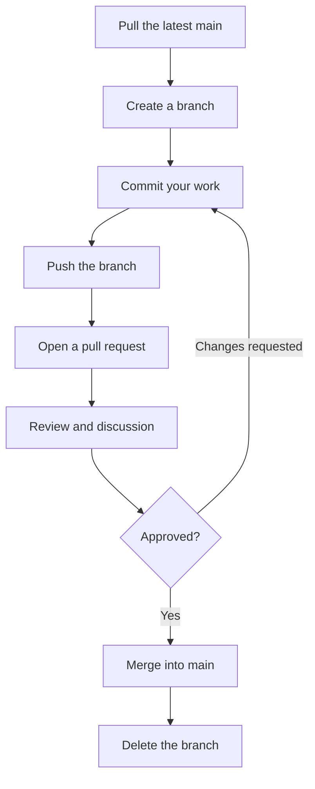

# Branches and Pull Requests

Committing straight to `main` works alone and stops working the moment anything is unfinished. Half-written code sits in the one place everyone else takes their copy from, and an experiment that turns out badly has to be unpicked from real history.

A **branch** is an independent line of commits. Work happens on one, `main` stays working, and the finished result is merged back.

Branches in Git are cheap — a branch is a pointer to a commit, not a copy of the files. Creating one is instant, and switching is nearly so.

## Creating and Switching

```
git branch
```

**Output:**

```
* main
```

The `*` marks the current branch. `git switch -c` creates one and switches to it:

```
git switch -c feature/multiply
```

**Output:**

```
Switched to a new branch 'feature/multiply'
```

```
git branch
```

**Output:**

```
* feature/multiply
  main
```

`git switch -c name` creates and switches; `git switch name` switches to an existing one. Older material uses `git checkout -b` and `git checkout`, which still work — `switch` was introduced because `checkout` does several unrelated jobs.

Commit before switching. Uncommitted changes follow you across branches and cause confusion; `git stash` sets them aside if you must move mid-change.

## Working on a Branch

Add a `multiply` function and commit as usual:

```
git add calculator.py
git commit -m "Add the multiply function"
```

**Output:**

```
[feature/multiply 87bcc13] Add the multiply function
 1 file changed, 4 insertions(+)
```

The branch name is in the output. The commit exists on `feature/multiply` and nowhere else:

```
git log --oneline
```

**Output:**

```
87bcc13 Add the multiply function
f91a271 Add the subtract function
52bb550 Add the add function
```

Switch back and it is gone:

```
git switch main
git log --oneline
```

**Output:**

```
f91a271 Add the subtract function
52bb550 Add the add function
```

The files changed too — `calculator.py` on `main` has no `multiply`. Git rewrote the working directory to match the branch.

This is the isolation that makes branches useful. `main` is exactly as it was, and remains releasable while the feature is half-finished.

## Merging

`git merge` brings a branch's commits into the current one. Run it **from the branch you want to merge into**:

```
git switch main
git merge feature/multiply
```

**Output:**

```
Updating f91a271..87bcc13
Fast-forward
 calculator.py | 4 ++++
 1 file changed, 4 insertions(+)
```

**Fast-forward** means `main` had no new commits of its own, so Git simply moved the `main` pointer forward. No merge commit was needed.

```
git branch -d feature/multiply
```

**Output:**

```
Deleted branch feature/multiply (was 87bcc13).
```

Delete a branch once merged. The commits are safe in `main`; only the label is removed, and leaving old branches around makes `git branch` useless.

`-d` refuses to delete a branch whose work is not merged anywhere, which is a useful safety net. `-D` forces it, and discards the work.

## A Real Merge

When both branches have moved, a fast-forward is impossible. Git creates a **merge commit** with two parents:

```
git merge feature/divide
```

**Output:**

```
Merge made by the 'ort' strategy.
 calculator.py | 4 ++++
 1 file changed, 4 insertions(+)
```

```
git log --oneline --graph
```

**Output:**

```
*   0445b8c Merge branch 'feature/divide'
|\
| * 793bdb8 Add the divide function
* | 2dce6b7 Add a README
|/
* 87bcc13 Add the multiply function
* f91a271 Add the subtract function
* 52bb550 Add the add function
```

The graph shows the history splitting and rejoining. Both lines of work are preserved, and the merge commit records where they came back together.

Git merged both changes automatically because they touched different parts of the project. When they touch the same lines, it cannot, and that is the next chapter.

## Naming Branches

Use a prefix and a description, separated by slashes and hyphens:

```
feature/add-csv-export
fix/off-by-one-in-last-three
docs/update-readme
refactor/extract-report-module
```

The name is the first thing a reviewer reads. `feature/stuff`, `test`, `new` and `anita-branch` say nothing.

## The Feature Branch Workflow

The standard way teams use Git:



Three rules make it work:

- **`main` always works.** Anyone can take it and run it.
- **Nothing reaches `main` without review.** Most teams enforce this in the platform's settings.
- **Branches are short-lived.** A branch open for weeks accumulates conflicts with everything else.

## Pushing a Branch

```
git push -u origin feature/add-csv-export
```

`-u` links the local branch to the remote one, so later pushes are just `git push`. The branch now exists on the remote, where others can see it and a pull request can be opened against it.

Push regularly, not just at the end. A pushed branch survives a lost laptop.

## Pull Requests

A **pull request** — GitHub's name; GitLab calls it a merge request — proposes merging one branch into another. It is a Git operation wrapped in a conversation.

It provides four things a bare `git merge` does not:

- a **description** of what changed and why
- a **diff** of every change, with line-by-line comments
- **automated checks** — tests, linters, formatters — run before anyone reads it
- a **record** of who approved what, kept permanently

Opening one is done in the browser: push the branch, and the platform offers to open a pull request from it.

A good description covers three things:

- **What** changed, in a sentence.
- **Why** — the bug, the requirement, the issue number.
- **How to check it** — what a reviewer should run or look at.

Keep pull requests small. A hundred-line change gets a careful review; a two-thousand-line change gets "looks good to me". If a branch is growing large, split it.

## Review

Comments arrive on specific lines. Some are questions, some are suggestions, some are requests for change. The workflow is to address them with **new commits on the same branch** — pushing updates the pull request automatically.

Do not force-push over a branch under review unless you have said so. It makes the reviewer's earlier comments point at lines that no longer exist.

As a reviewer, look for correctness first, then edge cases and tests, then clarity. Style should already have been handled by the tools. Comment on the code, not the person, and say plainly which comments are blocking and which are suggestions.

As an author, remember that review comments are about the code. Answering them, including disagreeing with reasons, is the normal process.

## After Merging

The platform merges the branch and usually offers to delete it. Then locally:

```
git switch main
git pull
git branch -d feature/add-csv-export
```

Switch back, pull the merged result, and delete the local branch. Skipping the `git pull` is what leads to starting the next branch from stale code.

## Keeping a Branch Current

A branch open while `main` moves on drifts out of date. Bring `main`'s changes in periodically:

```
git switch feature/add-csv-export
git merge main
```

Doing this regularly turns one large painful conflict at the end into several small ones along the way.

`git rebase main` is the alternative: it replays your commits on top of the latest `main`, producing a straight history rather than a merge commit. It is worth learning later, with one rule attached — **never rebase a branch others are working on**, because it rewrites commits they already have.

## Further Reading

- **The Pro Git book on branching** — https://git-scm.com/book/en/v2/Git-Branching-Basic-Branching-and-Merging
- **GitHub pull request documentation** — https://docs.github.com/en/pull-requests

A branch isolates work, `git merge` brings it back, and a pull request adds description, review and automated checks to that merge. Next, what happens when two branches changed the same lines.
